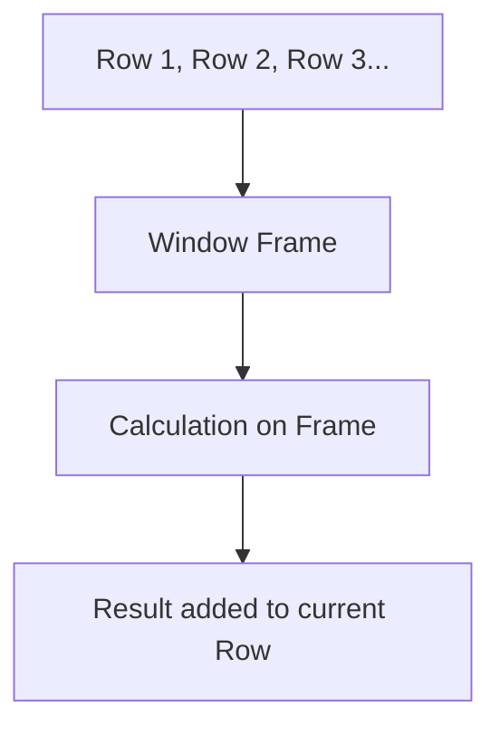

# 🪟 Window Functions: Analyzing Data without Collapsing Rows
> **Objective:** Master complex data analysis like rankings, running totals, and moving averages using OVER(), PARTITION BY, and ORDER BY | **Language:** Hinglish | **Standard:** 2026 Expert Framework

---

## 🧭 1. Beginner-Friendly Hinglish Explanation
Window Functions ka matlab hai "Rows ko summarize karna bina unhe gayab kiye".

- **The Problem:** `GROUP BY` data ko chota kar deta hai (collapse). Agar aapne `SUM` kiya, toh aapko sirf total milega, har row nahi dikhegi.
- **The Solution:** Window functions ek "Khidki" (Window) banate hain data par. Aap total bhi dekh sakte hain aur side mein har row ka individual data bhi.
- **The Core Functions:** 
  1. **ROW_NUMBER():** Har row ko ek number dena (1, 2, 3...).
  2. **RANK():** Same values ko same rank dena (1, 2, 2, 4...).
  3. **SUM() OVER:** Running total nikalna.
  4. **LAG() / LEAD():** Pichli ya agli row ka data dekhna.
- **Intuition:** Ye ek "Running race" ki tarah hai. Har runner apni speed se bhag raha hai (Individual row), par aap side mein screen par ye bhi dekh rahe hain ki "Abhi tak sabse fast kaun hai" (Aggregate).

---

## 🧠 2. Deep Technical Explanation
### 1. Syntax Structure:
`FUNCTION() OVER (PARTITION BY col1 ORDER BY col2 ROWS/RANGE ...)`
- **PARTITION BY:** Data ko dheron (Groups) mein bantna.
- **ORDER BY:** Window ke andar data ka sequence.
- **FRAME Clause:** Window ka size set karna (e.g., "Pichli 3 rows").

### 2. Analytical Functions:
- **RANK vs DENSE_RANK:** Rank 1, 2, 2, 4 (skips). Dense Rank 1, 2, 2, 3 (no skips).
- **LAG(col, 1):** Returns value from the previous row.
- **LEAD(col, 1):** Returns value from the next row.

### 3. Aggregate vs Window:
- **Aggregate:** Reduces 100 rows to 1 row.
- **Window:** Keeps 100 rows, but adds a new column with calculations.

---

## 🏗️ 3. Database Diagrams (The Window Frame)


---

## 💻 4. Query Execution Examples
```sql
-- 1. Running Total (Cumulative Sales)
SELECT date, amount, 
  SUM(amount) OVER (ORDER BY date) AS running_total
FROM sales;

-- 2. Ranking Users by Score per City
SELECT name, city, score,
  RANK() OVER (PARTITION BY city ORDER BY score DESC) AS rank
FROM users;

-- 3. Comparing current price with previous day (LAG)
SELECT date, price,
  LAG(price, 1) OVER (ORDER BY date) AS prev_price,
  price - LAG(price, 1) OVER (ORDER BY date) AS price_diff
FROM stocks;
```

---

## 🌍 5. Real-World Production Examples
- **Stock Market:** Calculating "Moving Averages".
- **E-commerce:** Finding "Top 3 best-selling products in every category".
- **Finance:** "Month-over-Month (MoM) growth".

---

## ❌ 6. Failure Cases
- **Partitioning on high-cardinality columns:** Using `PARTITION BY id` (unique ID) is useless; it creates a window of 1 row.
- **Sorting issues:** Forgetting `ORDER BY` inside `OVER()` for running totals leads to wrong results.
- **Performance:** Window functions on tables with billions of rows can be slow if not indexed correctly.

---

## 🛠️ 7. Debugging Guide
| Problem | Reason | Solution |
| :--- | :--- | :--- |
| **All ranks are 1** | Missing ORDER BY | Ranking needs a sort criteria to work. |
| **LAG returns NULL** | First row | The first row has no previous row. Use `COALESCE(LAG(...), 0)`. |

---

## ⚖️ 8. Tradeoffs
- **Window Function (Powerful/SQL-native)** vs **Application-side logic (Easier to write but slower).**

---

## 🛡️ 9. Security Concerns
- **Data Exposure:** Aggregating sensitive data (like average salary) across partitions can accidentally reveal individual values if the partition size is 1.

---

## 📈 10. Scaling Challenges
- **Memory Pressure:** Window functions often require a full sort of the partition in RAM. **Fix: Use 'Index-based scan' to avoid sorting.**

---

## ✅ 11. Best Practices
- **Use Window Functions for reports instead of multiple self-joins.**
- **Always index the columns used in `PARTITION BY` and `ORDER BY`.**
- **Use `DENSE_RANK` if you don't want gaps in rankings.**

---

## ⚠️ 13. Common Mistakes
- **Confusing `GROUP BY` and `PARTITION BY`.**
- **Applying Window Functions in the `WHERE` clause.** (They can only be used in `SELECT` or `ORDER BY`).

---

## 📝 14. Interview Questions
1. "Difference between RANK, DENSE_RANK, and ROW_NUMBER?"
2. "How do you calculate a 7-day moving average in SQL?"
3. "Can you use a Window Function in a WHERE clause? If not, how to filter?" (Answer: Use a CTE or Subquery).

---

## 🚀 15. Latest 2026 Production Database Patterns
- **Streaming Window Functions:** Processing window calculations on live data streams (e.g., ksqlDB or Apache Flink) for real-time analytics.
- **GPU-Accelerated SQL:** Modern analytical databases (like OmniSci) running window functions on GPUs for $100x$ speed.
漫
