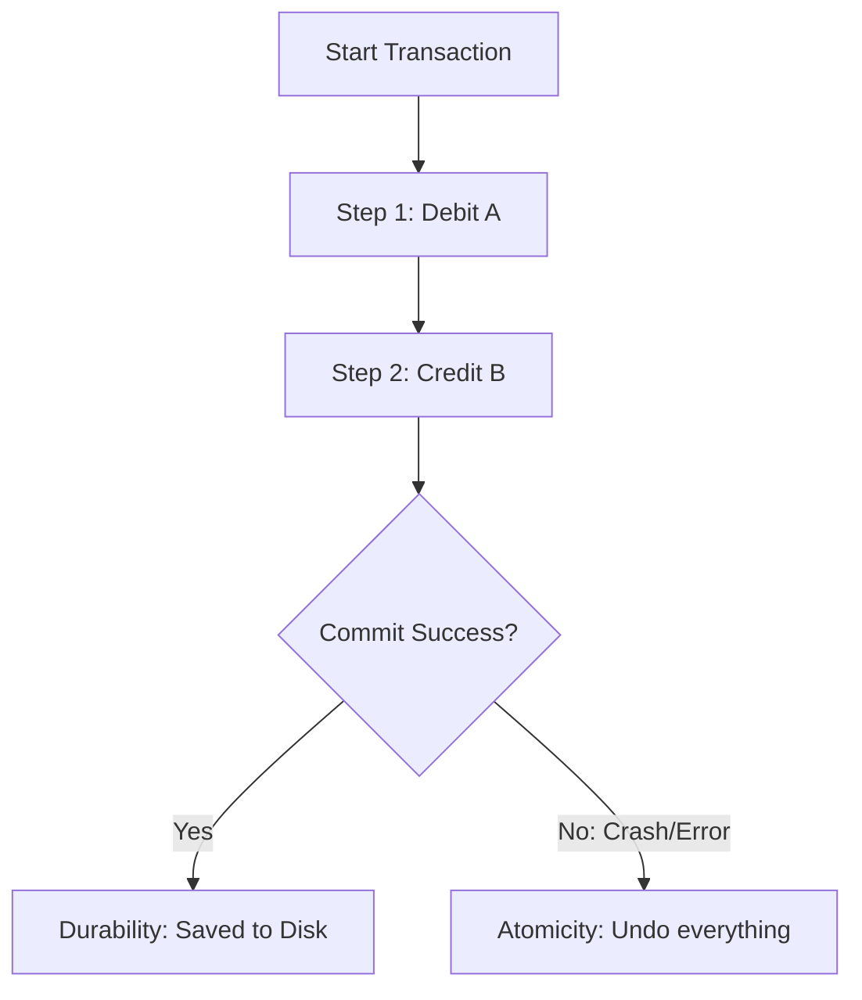

# 🛡️ ACID Properties: The Pillars of Reliability
> **Objective:** Understand the 4 core properties that guarantee database transactions are processed reliably | **Language:** Hinglish | **Standard:** 2026 Expert Framework

---

## 🧭 1. Beginner-Friendly Hinglish Explanation
ACID Properties ka matlab hai "Database ki reliability ke 4 usool (Rules)".

- **The Problem:** Socho aap bank transfer kar rahe hain. Paisa aapke account se kat gaya, par tabhi "Light chali gayi" (Server crash). Ab paisa na aapke paas hai, na receiver ke paas. Ye "Data Loss" hai.
- **The Solution (ACID):** 
  1. **A (Atomicity):** Ya toh pura kaam hoga, ya kuch nahi hoga. "All or Nothing".
  2. **C (Consistency):** Data hamesha rules follow karega. (e.g., Balance negative nahi ho sakta).
  3. **I (Isolation):** Do transfers ek saath ho rahe hain toh wo aapas mein mix nahi honge.
  4. **D (Durability):** Ek baar "Success" ho gaya, toh data hamesha ke liye save hai, bhale hi server crash ho jaye.
- **Intuition:** Ye ek "Contract" ki tarah hai. Database wada karta hai ki in 4 rules ki wajah se aapka data kabhi kharab nahi hoga.

---

## 🧠 2. Deep Technical Explanation
### 1. Atomicity:
A transaction is an indivisible unit of work. If any part of the transaction fails, the entire transaction is rolled back.
- **Mechanism:** Done using **Undo Logs**.

### 2. Consistency:
A transaction must take the database from one valid state to another.
- **Example:** In a transfer of $100, the sum of balances of sender and receiver must be the same before and after the transaction.

### 3. Isolation:
Transactions occur independently without interference. Even if 1,000 transactions run at the same time, the result should be the same as if they ran one-by-one.
- **Mechanism:** Done using **Locks** or **MVCC**.

### 4. Durability:
Once a transaction is committed, it remains committed even in the event of a system failure.
- **Mechanism:** Done using **Redo Logs** or **Write-Ahead Logs (WAL)**.

---

## 🏗️ 3. Database Diagrams (The ACID Workflow)


---

## 💻 4. Query Execution Examples
```sql
-- Demonstrating ACID in SQL
BEGIN; -- Start Transaction

-- Atomicity & Consistency Check
UPDATE accounts SET balance = balance - 100 WHERE id = 1;
UPDATE accounts SET balance = balance + 100 WHERE id = 2;

-- If everything is fine
COMMIT; -- Durability starts here

-- If error happens
ROLLBACK; -- Atomicity ensures data returns to original state
```

---

## 🌍 5. Real-World Production Examples
- **Stock Market:** If you buy a stock, the money must leave your wallet AND the stock must enter your portfolio at the exact same moment.
- **Inventory:** Reducing stock level when an order is placed.

---

## ❌ 6. Failure Cases
- **Dirty Reads:** Transaction A reads data that Transaction B hasn't committed yet. (Isolation failure).
- **Inconsistent State:** System crashes after debitting money but before creditting it. (Atomicity failure).
- **Power Failure:** Data was in RAM but not yet on Disk. (Durability failure).

---

## 🛠️ 7. Debugging Guide
| Problem | Property Violated | Solution |
| :--- | :--- | :--- |
| **Sum of balances changed** | Consistency | Check your business logic and constraints. |
| **Data lost after reboot** | Durability | Check if your DB is flushing the log to disk (fsync). |

---

## ⚖️ 8. Tradeoffs
- **Full ACID (Safe but Slow)** vs **BASE (NoSQL: Fast but Eventually Consistent).**

---

## 🛡️ 9. Security Concerns
- **Isolation Attacks:** Attackers running thousands of parallel requests to find a "Race Condition" where they can spend the same money twice.

---

## 📈 10. Scaling Challenges
- **ACID in Distributed DBs:** Ensuring ACID across 100 servers globally is very hard. **Fix: Use 'Two-Phase Commit (2PC)' or 'Paxos/Raft' algorithms.**

---

## ✅ 11. Best Practices
- **Keep transactions as short as possible.**
- **Use appropriate Isolation Levels.**
- **Always handle exceptions with a ROLLBACK.**
- **Monitor your WAL disk performance.**

---

## ⚠️ 13. Common Mistakes
- **Assuming NoSQL databases always provide full ACID.** (Many don't by default).
- **Mixing non-database actions** (like sending email) inside an ACID transaction.

---

## 📝 14. Interview Questions
1. "Explain ACID with a real-life bank example."
2. "How does a database ensure Durability?" (WAL).
3. "What happens if a transaction is neither committed nor rolled back?" (It usually times out and rolls back).

---

## 🚀 15. Latest 2026 Production Database Patterns
- **Software Transactional Memory (STM):** Managing ACID properties at the memory level for ultra-high-speed real-time databases.
- **Causal Consistency:** A "middle ground" in distributed systems that provides better performance than full ACID while still maintaining a logical order of events.
漫
