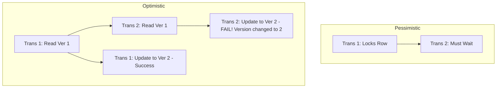

# 🚦 Concurrency Control: Traffic Management for Data
> **Objective:** Understand how databases handle multiple simultaneous users without data corruption | **Language:** Hinglish | **Standard:** 2026 Expert Framework

---

## 🧭 1. Beginner-Friendly Hinglish Explanation
Concurrency Control ka matlab hai "Database ka traffic signal".

- **The Problem:** Socho ek seat bachi hai movie theater mein, aur do log ek hi second par "Book" button dabate hain. Agar koi rule nahi hoga, toh dono ko seat mil jayegi (Double booking).
- **The Solution:** Humein aisi techniques chahiye jo decide karein ki kiski request pehle ayegi aur kiski baad mein.
- **The 2 Main Styles:** 
  1. **Pessimistic Control (Darpok approach):** "Mujhe lagta hai collision hoga". Isliye pehle se hi data ko **LOCK** kar do takki koi dusra use na dekh sake.
  2. **Optimistic Control (Bharosemand approach):** "Collision shayad hi ho". Pehle kaam karne do, aur ant mein check karo ki kya kisi aur ne data badla? Agar haan, toh transaction cancel kar do (Retry).
- **Intuition:** Pessimistic Control ek "Locker" ki tarah hai jiski chabi sirf aapke paas hai. Optimistic Control ek "Google Doc" ki tarah hai jahan sab edit kar rahe hain, par agar conflict hua toh document batata hai.

---

## 🧠 2. Deep Technical Explanation
### 1. Pessimistic Concurrency Control (PCC):
- **Mechanism:** Uses Locks (Shared and Exclusive).
- **Cons:** Can lead to **Deadlocks** and poor performance because everyone is waiting for locks.
- **Best for:** High-contention data (e.g., Inventory counts where conflict is guaranteed).

### 2. Optimistic Concurrency Control (OCC):
- **Mechanism:** Uses **Versioning** (e.g., `version` column). Before updating, check if the version is the same as when you read it.
- **Cons:** High number of rollbacks and retries if there are many conflicts.
- **Best for:** Low-contention data (e.g., User profile updates).

### 3. MVCC (Multi-Version Concurrency Control):
The "Modern Choice" (Postgres/MySQL). Instead of locking, it keeps multiple versions of a row. Readers see an old version, Writers create a new one. (No blocking!).

---

## 🏗️ 3. Database Diagrams (Locking vs Versioning)


---

## 💻 4. Query Execution Examples (Optimistic Pattern)
```sql
-- 1. Read the data
SELECT balance, version FROM accounts WHERE id = 101;
-- Result: balance = 500, version = 5

-- 2. Update with check
UPDATE accounts 
SET balance = balance - 100, version = version + 1
WHERE id = 101 AND version = 5;

-- 3. Check 'Rows Affected' in your code
-- If rows_affected == 0, then someone else updated it. RETRY!
```

---

## 🌍 5. Real-World Production Examples
- **Amazon Add-to-Cart:** Pessimistic locking to ensure stock is accurately decremented.
- **Shopify Product Edit:** Optimistic locking to prevent two staff members from overwriting each other's changes.

---

## ❌ 6. Failure Cases
- **Livelock:** Transaction keeps retrying and failing because of continuous updates from others.
- **Zombie Versions (MVCC):** Too many old versions of rows taking up disk space (Needs VACUUM).
- **Deadlocks in PCC:** Two transactions locking two different rows and then waiting for each other.

---

## 🛠️ 7. Debugging Guide
| Problem | Reason | Solution |
| :--- | :--- | :--- |
| **High Rollback Rate** | OCC on high-contention data | Switch to Pessimistic locking (`SELECT ... FOR UPDATE`). |
| **DB is slow/locked** | PCC on large tables | Switch to MVCC or Optimistic locking. |

---

## ⚖️ 8. Tradeoffs
- **Locking (Safe/Slow/Low Retry)** vs **Versioning (Fast/Risky/High Retry).**

---

## 🛡️ 9. Security Concerns
- **Race Condition Attack:** Attackers sending parallel requests to bypass a "Check-then-Update" logic that doesn't have proper concurrency control.

---

## 📈 10. Scaling Challenges
- **Distributed Locking:** Maintaining a lock across 10 servers is extremely slow. **Fix: Use 'Sagas' or 'Deterministic ordering'.**

---

## ✅ 11. Best Practices
- **Use MVCC (default in modern DBs) for most apps.**
- **Use `SELECT ... FOR UPDATE` for critical financial steps.**
- **Implement a `version` or `updated_at` column for all tables.**
- **Keep transactions short to release locks quickly.**

---

## ⚠️ 13. Common Mistakes
- **Assuming the DB handles all concurrency automatically.** (You need to choose the right strategy).
- **Not handling the "Update Failed" case in your backend code.**

---

## 📝 14. Interview Questions
1. "Difference between Pessimistic and Optimistic Concurrency Control?"
2. "How does MVCC improve performance?"
3. "What is a Race Condition and how do you prevent it in a database?"

---

## 🚀 15. Latest 2026 Production Database Patterns
- **Write Intent Locks:** A new technique in distributed databases (like Google Spanner) that uses "TrueTime" (Atomic clocks) to order transactions without locking the whole database.
- **Conflict-free Replicated Data Types (CRDTs):** Data structures that allow merging changes from multiple users without *any* concurrency control (Used in real-time collaborative apps).
漫
