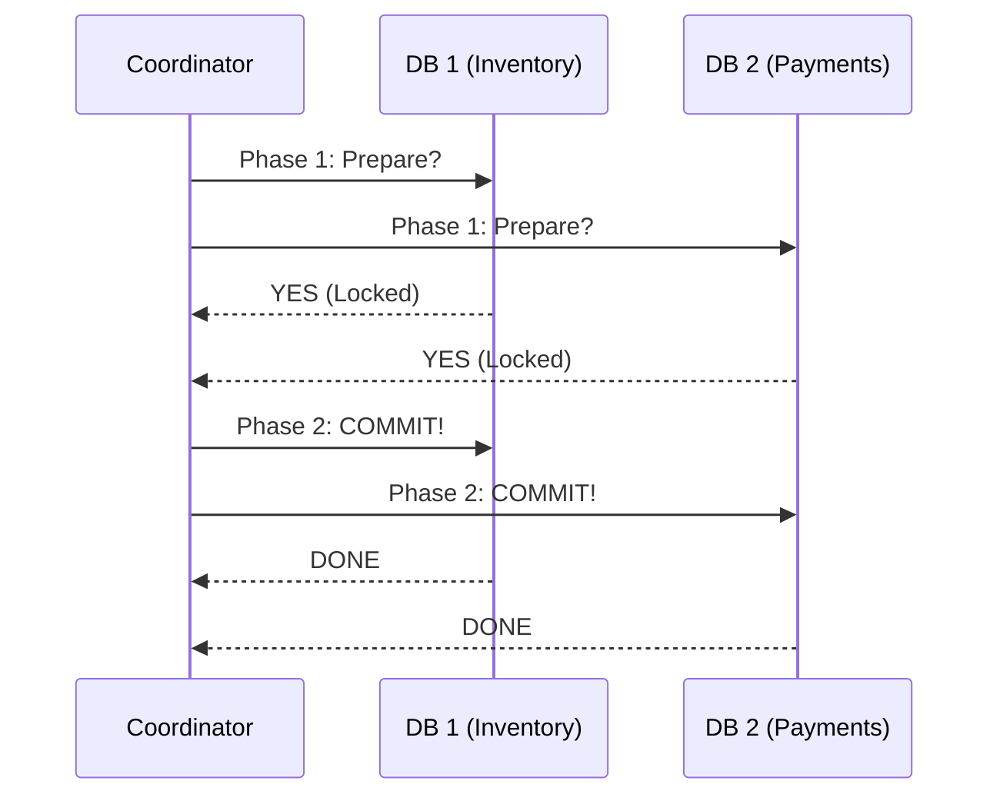

# 🌐 Distributed Transactions: Atomicity Across Servers
> **Objective:** Master how to ensure ACID properties when data is spread across multiple physical databases or microservices | **Language:** Hinglish | **Standard:** 2026 Expert Framework

---

## 🧭 1. Beginner-Friendly Hinglish Explanation
Distributed Transactions ka matlab hai "Multiple databases ke beech mein 'All-or-Nothing' kaam karna".

- **The Problem:** Socho aapki app Microservices use karti hai. "Order Service" (DB 1) order banati hai, aur "Payment Service" (DB 2) paisa katti hai. Agar Order ban gaya par Payment fail ho gaya, toh dono DBs aapas mein out-of-sync ho jayenge.
- **The Solution:** Humein aisi techniques chahiye jo ensure karein ki ya toh dono DBs update hon, ya dono rollback hon.
- **The Core Techniques:** 
  1. **Two-Phase Commit (2PC):** Ek "Boss" (Coordinator) sabse puchta hai "Tayyar ho?" aur phir order deta hai "Save karo". (Reliable par slow).
  2. **Saga Pattern:** Ek kaam karo, agar fail hua toh uska "Compensating Action" (Reversal) chala do. (Fast par complex).
- **Intuition:** Ye ek "Group Wedding" ki tarah hai. Jab tak sab couples "I Do" nahi bol dete, koi bhi shadi legal nahi maani jayegi. Agar ek ne bhi "No" bola, toh sab ruk jayenge.

---

## 🧠 2. Deep Technical Explanation
### 1. Two-Phase Commit (2PC):
- **Phase 1 (Prepare):** Coordinator asks all participants to prepare. They lock resources and log the change to their WAL.
- **Phase 2 (Commit):** If everyone said "YES", Coordinator sends "COMMIT". Otherwise, it sends "ROLLBACK".
- **Major Flaw:** It is a **Blocking Protocol**. If the Coordinator crashes mid-way, all participants stay locked forever until it recovers.

### 2. Three-Phase Commit (3PC):
Introduces a "Pre-commit" phase to avoid the blocking problem, but it is rarely used due to high latency.

### 3. Saga Pattern (Microservices Favorite):
A sequence of local transactions. Each transaction updates its own DB and publishes an event.
- **Choreography:** Services talk to each other via events.
- **Orchestration:** A central service directs the flow.
- **Compensating Transactions:** If Step 2 fails, run "Undo Step 1".

---

## 🏗️ 3. Database Diagrams (The 2PC Workflow)


---

## 💻 4. Query Execution Examples (Saga Pseudo-code)
```javascript
// Saga Pattern in Node.js
async function placeOrderSaga(orderData) {
  try {
    const order = await OrderService.create(orderData); // Step 1
    await PaymentService.charge(order.id, order.total); // Step 2
    await InventoryService.ship(order.id); // Step 3
  } catch (error) {
    // If Step 2 or 3 fails, run compensating actions
    await OrderService.cancel(order.id);
    await PaymentService.refund(order.id);
    console.error("Saga Failed, Rolled back logically");
  }
}
```

---

## 🌍 5. Real-World Production Examples
- **Google Spanner:** Uses 2PC and Paxos to provide global distributed transactions with high performance.
- **Uber:** Uses Sagas to handle ride bookings, driver assignments, and payments across hundreds of microservices.

---

## ❌ 6. Failure Cases
- **Split Brain:** Two coordinators think they are the boss and give conflicting orders.
- **Livelock in Sagas:** The compensating action also fails (e.g., You try to refund, but the Payment Gateway is down). **Fix: Use 'Retries' and 'Dead Letter Queues'.**
- **Data Silos:** One DB commits but the other doesn't, and the log is lost.

---

## 🛠️ 7. Debugging Guide
| Problem | Diagnostic | Solution |
| :--- | :--- | :--- |
| **Dangling Locks** | 2PC Timeout | Check if the coordinator is alive. Manually release locks if safe. |
| **Inconsistent Data** | Saga failure | Trace the events in the log to see which compensating action didn't run. |

---

## ⚖️ 8. Tradeoffs
- **2PC (Strong Consistency / Low Performance)** vs **Saga (Eventual Consistency / High Performance).**

---

## 🛡️ 9. Security Concerns
- **Replay Attacks:** An attacker capturing a "Commit" message and re-sending it to make the database perform the action twice. **Fix: Use 'Idempotency Keys'.**

---

## 📈 10. Scaling Challenges
- **The "CAP Theorem" Conflict:** In a distributed system, you can only have two out of three: **Consistency**, **Availability**, and **Partition Tolerance**. Distributed transactions usually sacrifice Availability for Consistency.

---

## ✅ 11. Best Practices
- **Avoid distributed transactions if possible** (Design services to be independent).
- **Use Sagas for long-running workflows.**
- **Implement Idempotency** everywhere (The ability to run the same request twice without side effects).
- **Use a reliable Message Broker** (Kafka/RabbitMQ) for event-driven sagas.

---

## ⚠️ 13. Common Mistakes
- **Using 2PC across slow internet connections.**
- **Not logging the state of a Saga** (You won't know where it failed).

---

## 📝 14. Interview Questions
1. "How does Two-Phase Commit work?"
2. "Why is the Saga pattern preferred over 2PC in microservices?"
3. "What is an Idempotent operation and why is it critical for distributed systems?"

---

## 🚀 15. Latest 2026 Production Database Patterns
- **Deterministic Concurrency Control (FaunaDB/Calvin):** Pre-ordering transactions so every node knows exactly what to do without needing a 2PC coordinator.
- **TCC (Try-Confirm-Cancel):** A variation of Sagas that reserves resources in the "Try" phase, ensuring that "Confirm" will almost never fail.
漫
