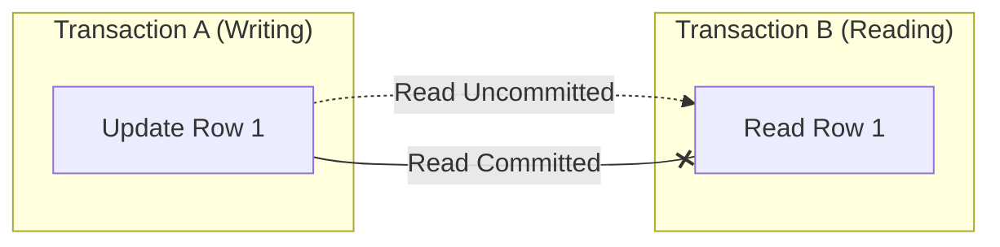

# 🚧 Isolation Levels: Balancing Speed and Accuracy
> **Objective:** Master the 4 standard isolation levels (Read Uncommitted, Read Committed, Repeatable Read, Serializable) to control transaction concurrency | **Language:** Hinglish | **Standard:** 2026 Expert Framework

---

## 🧭 1. Beginner-Friendly Hinglish Explanation
Isolation Levels ka matlab hai "Data ki correctness aur speed ke beech ka balance".

- **The Problem:** Jab hazaaron log ek saath database use karte hain, toh kuch "Ajeeb" cheezein ho sakti hain. 
  - Jaise: Ek ne update kiya par save nahi kiya, par dusre ne use dekh liya (**Dirty Read**). 
  - Ya ek query do baar chali aur dono baar alag result aaya (**Non-repeatable Read**).
- **The Solution:** Humein decide karna padta hai ki humein kitni "Strictness" chahiye.
- **The 4 Levels:** 
  1. **Read Uncommitted:** Sabse fast par sabse ganda (Unsafe).
  2. **Read Committed:** Standard (safe for most cases). 
  3. **Repeatable Read:** Thoda aur strict.
  4. **Serializable:** Sabse slow par 100% correct (Super safe).
- **Intuition:** Ye ek "Privacy Setting" ki tarah hai. Aap decide karte hain ki aapka data dusron ko kab aur kaise dikhega jab aap us par kaam kar rahe hain.

---

## 🧠 2. Deep Technical Explanation
### 1. Concurrency Problems (The Monsters):
- **Dirty Read:** Reading uncommitted changes from another transaction.
- **Non-Repeatable Read:** Reading the same row twice in one transaction and getting different values because someone else updated it.
- **Phantom Read:** Reading a set of rows and finding a "new" row that wasn't there before (someone else inserted it).

### 2. The 4 Isolation Levels:
| Level | Dirty Read | Non-Repeatable Read | Phantom Read | Performance |
| :--- | :--- | :--- | :--- | :--- |
| **Read Uncommitted** | Possible | Possible | Possible | High (Fastest) |
| **Read Committed** | Not Possible | Possible | Possible | Medium-High |
| **Repeatable Read** | Not Possible | Not Possible | Possible | Medium |
| **Serializable** | Not Possible | Not Possible | Not Possible | Low (Slowest) |

### 3. Default Settings:
- **PostgreSQL:** Read Committed.
- **MySQL (InnoDB):** Repeatable Read.

---

## 🏗️ 3. Database Diagrams (Isolation Boundaries)


---

## 💻 4. Query Execution Examples
```sql
-- Checking the current isolation level (Postgres)
SHOW TRANSACTION ISOLATION LEVEL;

-- Setting a specific isolation level for a transaction
BEGIN;
SET TRANSACTION ISOLATION LEVEL SERIALIZABLE;

-- Perform operations
-- ...

COMMIT;
```

---

## 🌍 5. Real-World Production Examples
- **Banking Ledger:** Must use `SERIALIZABLE` or `REPEATABLE READ` for balance transfers to ensure zero errors.
- **Analytics Dashboard:** Can use `READ COMMITTED` because a small change in total count doesn't matter much.

---

## ❌ 6. Failure Cases
- **Serialization Failures:** If you use `SERIALIZABLE` level and another transaction tries to touch the same data, one of them will be killed by the DB with a "could not serialize" error. **Fix: Implement 'Retry Logic' in your application code.**
- **Performance Collapse:** Switching an entire high-traffic DB to `SERIALIZABLE` will cause massive lock waiting and crash the app.

---

## 🛠️ 7. Debugging Guide
| Problem | Level to Use | Solution |
| :--- | :--- | :--- |
| **Sum of money is wrong** | Serializable | Use the strictest level for financial totals. |
| **Report is changing mid-way** | Repeatable Read | Ensure the view of the data remains static during the long report. |

---

## ⚖️ 8. Tradeoffs
- **Concurrency (More people can work at once)** vs **Consistency (Data is 100% correct).**

---

## 🛡️ 9. Security Concerns
- **Race Condition Exploits:** Attackers can parallelize requests to exploit low isolation levels (like Dirty Reads) to double-spend or bypass limits.

---

## 📈 10. Scaling Challenges
- **Lock Contention:** Strict isolation levels require more locks, which don't scale well to multiple database nodes.

---

## ✅ 11. Best Practices
- **Use `READ COMMITTED` as your default.**
- **Use `SERIALIZABLE` only when absolutely necessary** (and handle retries).
- **Keep transactions short** to reduce the time spent in a high-isolation state.

---

## ⚠️ 13. Common Mistakes
- **Assuming all databases have the same default isolation level.**
- **Not handling "Serialization Failure" errors in the backend.**

---

## 📝 14. Interview Questions
1. "Difference between a Non-repeatable Read and a Phantom Read?"
2. "What is a Dirty Read?"
3. "Why don't we use Serializable for every transaction?"

---

## 🚀 15. Latest 2026 Production Database Patterns
- **Snapshot Isolation:** A modern technique used by many DBs (like Postgres and SQL Server) that gives you the consistency of `REPEATABLE READ` without the heavy locking of `SERIALIZABLE`.
- **External Consistency:** New distributed databases (like CockroachDB) that provide "Global Serializable" isolation across the world using atomic clocks.
漫
