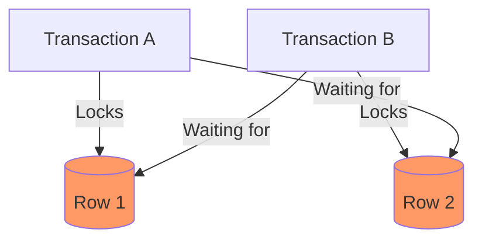

# 🔒 Locks and Deadlocks: Data Protection and Pitfalls
> **Objective:** Master the different types of database locks and learn how to identify and prevent deadlocks | **Language:** Hinglish | **Standard:** 2026 Expert Framework

---

## 🧭 1. Beginner-Friendly Hinglish Explanation
Locks aur Deadlocks ka matlab hai "Data ki kundi (Lock) aur unka phas jana (Deadlock)".

- **Locks:** Jab aap kisi row par kaam kar rahe hain, toh aap nahi chahte ki koi aur use change kare. Isliye aap use "Lock" kar dete hain.
  - **Shared Lock (S):** "Main padh (Read) raha hoon, aap bhi padh sakte hain, par koi badal (Write) nahi sakta".
  - **Exclusive Lock (X):** "Main badal (Write) raha hoon, na koi padh sakta hai, na badal sakta hai".
- **Deadlock:** Ye sabse badi problem hai.
  - Transaction A ne Row 1 lock kiya aur Row 2 ka wait kar raha hai.
  - Transaction B ne Row 2 lock kiya aur Row 1 ka wait kar raha hai.
  - Dono ek dusre ki chabi ka wait kar rahe hain aur hamesha ke liye phas gaye.
- **Intuition:** Locks ek "Public Washroom" ki tarah hain—agar door locked hai, toh aapko wait karna padega. Deadlock ek aisi situation hai jahan do log ek-dusre ke raste mein khade hain aur koi piche hatne ko taiyar nahi hai.

---

## 🧠 2. Deep Technical Explanation
### 1. Lock Granularity:
- **Database Lock:** Whole DB is locked (Migration time).
- **Table Lock:** Whole table is locked.
- **Page Lock:** A block of data (multiple rows) is locked.
- **Row Lock:** Only the specific row is locked (Best for performance).

### 2. Lock Types:
- **Intent Locks (IS, IX):** Indicated that a transaction intends to lock a row at a lower level. Prevents someone from locking the whole table.
- **Update Lock (U):** A hybrid that prevents deadlocks during "Check-then-Update" flows.

### 3. Deadlock Detection:
Modern DBs have a **Deadlock Detector** that runs every few seconds. It identifies the circular wait, kills one transaction (the "Victim"), and lets the other one finish.

---

## 🏗️ 3. Database Diagrams (The Deadlock Cycle)


---

## 💻 4. Query Execution Examples
```sql
-- 1. Explicit Row Lock (Pessimistic)
BEGIN;
SELECT * FROM products WHERE id = 10 FOR UPDATE;
-- This row is now locked with an Exclusive (X) lock.
-- Other transactions will wait at this line.
UPDATE products SET stock = stock - 1 WHERE id = 10;
COMMIT; -- Lock released.

-- 2. Monitoring Locks (Postgres)
SELECT pid, locktype, mode, granted, query 
FROM pg_locks l 
JOIN pg_stat_activity a ON l.pid = a.pid;
```

---

## 🌍 5. Real-World Production Examples
- **Inventory Management:** Locking the `product_stock` row while processing a payment to prevent over-selling.
- **Seat Booking:** Locking `seat_id` while the user is on the payment page.

---

## ❌ 6. Failure Cases
- **Lock Escalation:** If you lock 10,000 rows, the DB might decide to just lock the "Entire Table" to save memory. This crashes performance for everyone else.
- **Long Lock Duration:** Starting a transaction, locking a row, and then waiting for a slow API call. This freezes the DB.
- **Deadlock Victim:** Your backend crashes because the DB killed your transaction to resolve a deadlock. **Fix: Implement 'Retry Logic'.**

---

## 🛠️ 7. Debugging Guide
| Problem | Diagnostic | Solution |
| :--- | :--- | :--- |
| **Queries are hanging** | Lock Contention | Use `pg_stat_activity` to find which PID is holding the lock and for how long. |
| **Deadlock error in logs** | Deadlock Detected | Check the order of updates. Always lock rows in the **same order** (e.g., always lock ID 1 then ID 2). |

---

## ⚖️ 8. Tradeoffs
- **Fine-grained (Row) Lock (High concurrency / High memory)** vs **Coarse-grained (Table) Lock (Low concurrency / Low memory).**

---

## 🛡️ 9. Security Concerns
- **Denial of Service (DoS):** An attacker can start many transactions and lock "Hot Rows" (like the admin settings) to make the app unusable.

---

## 📈 10. Scaling Challenges
- **The "Select for Update" Bottleneck:** In a distributed DB, row locks are very expensive because they must be synchronized across all nodes.

---

## ✅ 11. Best Practices
- **Always update tables in the same order.**
- **Keep transactions as short as possible.**
- **Don't lock more data than you need.**
- **Use `SKIP LOCKED` (Postgres/MySQL 8+)** for background workers to skip rows already being processed.

---

## ⚠️ 13. Common Mistakes
- **Forgetting to COMMIT** and leaving a lock open forever.
- **Using `SELECT *` inside a `FOR UPDATE`** (Locking all columns unnecessarily).

---

## 📝 14. Interview Questions
1. "Difference between a Shared and an Exclusive lock?"
2. "How do you detect and resolve a Deadlock?"
3. "What is Lock Escalation and why is it dangerous?"

---

## 🚀 15. Latest 2026 Production Database Patterns
- **Lock-Free Indexing:** New B-Tree variants (like Bw-Trees) that allow multiple writers to update an index without using traditional locks.
- **Advisory Locks:** Custom locks that developers can create (e.g., `pg_advisory_lock`) to synchronize application-level tasks using the database's locking engine.
漫
