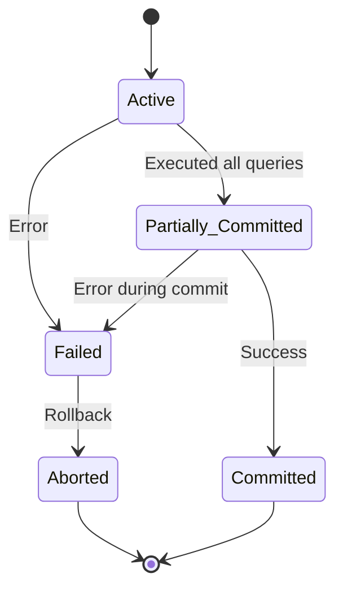

# 🔄 Transactions: Managing Units of Work
> **Objective:** Master how to group multiple SQL statements into a single, atomic transaction using COMMIT and ROLLBACK | **Language:** Hinglish | **Standard:** 2026 Expert Framework

---

## 🧭 1. Beginner-Friendly Hinglish Explanation
Transactions ka matlab hai "Multiple queries ka ek Group".

- **The Problem:** Agar aapko ek order process karna hai, toh aapko:
  1. `Orders` table mein entry karni hai.
  2. `Inventory` table se stock kam karna hai.
  3. `User_Wallet` se balance kam karna hai.
  Agar step 1 aur 2 ho gaye par step 3 fail ho gaya (Paisa nahi kata par order ban gaya), toh company ka nuksan ho jayega.
- **The Solution:** In teeno queries ko ek "Transaction" mein band kar do.
- **The Outcome:** Ya toh teeno queries ek saath "Success" hongi (**COMMIT**), ya agar ek bhi fail hui toh sab kuch pehle jaisa ho jayega (**ROLLBACK**).
- **Intuition:** Ye ek "All-or-Nothing" deal hai. Jaise aap ATM se paise nikalte hain—ya toh paise milenge aur balance katega, ya kuch nahi hoga.

---

## 🧠 2. Deep Technical Explanation
### 1. Transaction Life Cycle:
- **Active:** The initial state.
- **Partially Committed:** After the last statement has been executed.
- **Committed:** Successfully saved to disk.
- **Failed:** When an error occurs.
- **Aborted:** After rolling back to the initial state.

### 2. The Commands:
- `BEGIN` or `START TRANSACTION`: Opens the transaction.
- `COMMIT`: Persists all changes permanently.
- `ROLLBACK`: Reverts all changes back to the start of the transaction.
- `SAVEPOINT`: Creates a "Checkpoint" inside a long transaction so you can rollback partially.

### 3. Explicit vs Implicit Transactions:
- **Implicit (Auto-commit):** Most DBs (like MySQL/Postgres) by default treat every single query as a mini-transaction and commit it immediately.
- **Explicit:** When YOU manually use `BEGIN` and `COMMIT`.

---

## 🏗️ 3. Database Diagrams (The State Machine)


---

## 💻 4. Query Execution Examples
```sql
-- Starting a Transaction
BEGIN;

-- Task 1: Create Order
INSERT INTO orders (id, user_id, total) VALUES (501, 10, 2000.00);

-- Task 2: Deduct Stock
UPDATE products SET stock = stock - 1 WHERE id = 45;

-- Task 3: Deduct Wallet
UPDATE wallets SET balance = balance - 2000.00 WHERE user_id = 10;

-- Final Step: Check if balance is enough
-- (Logic usually in App or Stored Proc)
-- If OK:
COMMIT;

-- If Not OK:
ROLLBACK;
```

---

## 🌍 5. Real-World Production Examples
- **Reservation Systems:** Booking a seat (Seat table) and generating a ticket (Ticket table).
- **Social Media:** Posting a status and incrementing the "Post Count" in the user's profile.

---

## ❌ 6. Failure Cases
- **Long-Running Transactions:** Keeping a transaction open for 10 minutes while waiting for a user to click "Confirm". This locks rows and kills performance.
- **Deadlocks:** Transaction A is waiting for B, and B is waiting for A.
- **Nested Transaction Issues:** Trying to start a `BEGIN` inside another `BEGIN`. (Different DBs handle this differently).

---

## 🛠️ 7. Debugging Guide
| Problem | Reason | Solution |
| :--- | :--- | :--- |
| **Changes not showing** | Forgot to COMMIT | Always check if your code actually sends the `COMMIT` command. |
| **DB is frozen** | Open transaction | Check for "Idle in transaction" processes using `pg_stat_activity` (Postgres). |

---

## ⚖️ 8. Tradeoffs
- **Short Transactions (High performance/Concurrency)** vs **Long Transactions (Easier to manage complex logic but slow).**

---

## 🛡️ 9. Security Concerns
- **Transaction Resource Exhaustion:** An attacker starting millions of transactions but never committing them, causing the DB to run out of memory or connection slots.

---

## 📈 10. Scaling Challenges
- **Write Contention:** Multiple transactions trying to update the same hot row (e.g., "Daily Sales Total"). **Fix: Use 'Batching' or 'Asynchronous updates'.**

---

## ✅ 11. Best Practices
- **Keep transactions short.**
- **Don't perform non-database tasks** (like calling a Stripe API) inside a DB transaction. (Call the API first, then start the DB transaction).
- **Use Savepoints for very complex multi-step processes.**

---

## ⚠️ 13. Common Mistakes
- **Forgetting that a transaction locks data.**
- **Assuming that `COMMIT` is instant** (It involves writing to the WAL disk).

---

## 📝 14. Interview Questions
1. "What is a Savepoint and when would you use it?"
2. "Explain the difference between a Failed and an Aborted transaction."
3. "How do you handle error recovery in transactions using Node.js or Python?"

---

## 🚀 15. Latest 2026 Production Database Patterns
- **Transactional Outbox Pattern:** Ensuring that a DB update and sending a Message Queue event (like Kafka) happen as a single atomic unit.
- **Serverless Transaction Management:** Using databases like **CockroachDB Serverless** that automatically handle retry logic for failed transactions due to contention.
漫
