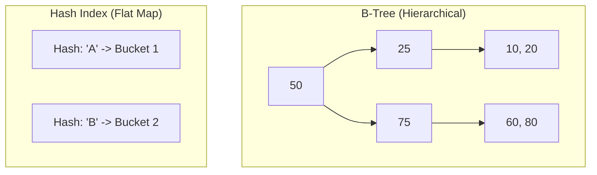

# 🌳 B-Tree and Hash Indexes: The Data Structures
> **Objective:** Understand the internal data structures that power database indexes and when to choose one over the other | **Language:** Hinglish | **Standard:** 2026 Expert Framework

---

## 🧭 1. Beginner-Friendly Hinglish Explanation
B-Tree aur Hash Indexes ka matlab hai "Index banane ke do alag tareeke".

- **B-Tree (Balance Tree):** Ye sabse common hai. Ye data ko ek "Sorte" (sorted) tree structure mein rakhta hai. Ye Range search ke liye best hai (e.g., "Find prices between 500 and 1000").
- **Hash Index:** Ye ek "Key-Value" mapping jaisa hai. Ye sirf Exact match ke liye best hai (e.g., "Find user where id = 101"). Ye ranges nahi samajhta.
- **Intuition:** 
  - **B-Tree** ek dictionary ki tarah hai (sorted), jisme aap "A se D" tak ke saare words dhoondh sakte hain.
  - **Hash Index** ek safe locker ki tarah hai jisme aapko "Chabi" (Key) dalni hai aur sidha saman mil jayega. Par aap ye nahi pooch sakte ki "Lockers 10 to 20 khol do".

---

## 🧠 2. Deep Technical Explanation
### 1. B-Tree (Balanced Tree):
- **Structure:** Multi-level tree where nodes store values and pointers.
- **Time Complexity:** $O(\log N)$ for Search, Insert, and Delete.
- **Why Balanced?** It ensures that the distance from root to leaf is the same for all data, giving consistent performance.
- **Supports:** `=`, `>`, `<`, `BETWEEN`, `IN`, `LIKE 'abc%'`.

### 2. Hash Index:
- **Structure:** Uses a **Hash Function** to turn the key into a bucket address.
- **Time Complexity:** $O(1)$ average case (Instant!).
- **Drawback:** No sorting. Cannot do range scans. High risk of **Hash Collisions** (two keys getting the same bucket).
- **Supports:** Only `=` and `IN`.

---

## 🏗️ 3. Database Diagrams (Tree vs Hash)


---

## 💻 4. Query Execution Examples (Postgres)
```sql
-- 1. Default Index (B-Tree)
CREATE INDEX idx_price ON products(price); -- Works for Range

-- 2. Hash Index (Must specify 'HASH')
CREATE INDEX idx_user_id_hash ON users USING HASH (id); -- Only for Exact Match

-- 3. Comparing Performance
-- B-Tree: SELECT * FROM products WHERE price > 500; (INDEX USED)
-- Hash: SELECT * FROM products WHERE price > 500; (INDEX IGNORED!)
```

---

## 🌍 5. Real-World Production Examples
- **Relational DBs (Postgres/MySQL):** Use B-Tree for almost everything.
- **Redis:** Uses Hash-based structures for instant key-value lookup.
- **In-Memory Tables:** Sometimes use Hash indexes for speed.

---

## ❌ 6. Failure Cases
- **B-Tree Degradation:** If data is inserted in sorted order (e.g., timestamps), the tree can become "Right-heavy", though modern B-Trees self-balance.
- **Hash Collision Storm:** If many keys hash to the same value, the $O(1)$ becomes $O(N)$ as the DB has to scan a list inside the bucket.
- **No Ordering in Hash:** Trying to use `ORDER BY` on a column that only has a Hash index will force a full sort in RAM.

---

## 🛠️ 7. Debugging Guide
| Problem | Reason | Solution |
| :--- | :--- | :--- |
| **Index not used for Range** | It's a Hash Index | Change the index type to B-Tree. |
| **Slow Inserts** | Too many B-Tree levels | Reindex to compact the tree. |

---

## ⚖️ 8. Tradeoffs
- **B-Tree (Flexible/Range-friendly/Standard)** vs **Hash (Ultra-fast/Exact-match only).**

---

## 🛡️ 9. Security Concerns
- **Hash Flooding:** An attacker providing many inputs that cause hash collisions, slowing down the database significantly.

---

## 📈 10. Scaling Challenges
- **B-Tree Locking:** Updating a B-Tree might require locking multiple nodes (page split), which can slow down concurrent writes.

---

## ✅ 11. Best Practices
- **Use B-Tree by default.**
- **Use Hash index only for very large columns** where you only do exact matches (and save space).
- **Index for equality first, then for range** in composite indexes.

---

## ⚠️ 13. Common Mistakes
- **Using Hash indexes for primary keys** if you ever plan to do `id > 100` queries.
- **Thinking B-Tree is always slow.** (It's very fast, $O(\log N)$ is excellent).

---

## 📝 14. Interview Questions
1. "How does a B-Tree maintain its balance?"
2. "Why can't a Hash index handle a 'BETWEEN' query?"
3. "Which index is better for a column with only 5 unique values? B-Tree, Hash, or None?" (Answer: None, usually).

---

## 🚀 15. Latest 2026 Production Database Patterns
- **LSM Trees (Log-Structured Merge-Trees):** Used by NoSQL DBs (Cassandra, RocksDB). Optimized for very high write throughput, eventually merging into a B-tree-like structure.
- **T-Trees:** A memory-optimized tree structure used in in-memory databases like **VoltDB**.
漫
