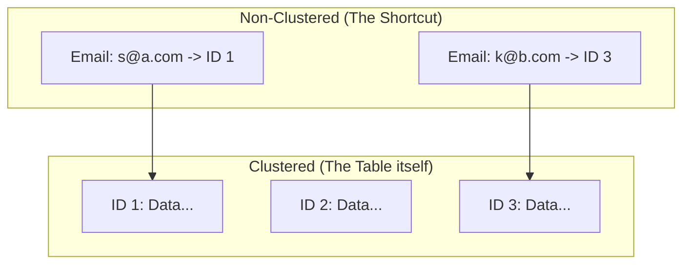

# 📑 Clustered vs Non-Clustered Indexes: Physical vs Logical Order
> **Objective:** Understand how data is physically stored on disk vs how shortcuts are created to find it | **Language:** Hinglish | **Standard:** 2026 Expert Framework

---

## 🧭 1. Beginner-Friendly Hinglish Explanation
Clustered aur Non-Clustered ka matlab hai "Data ka asli storage vs uski index".

- **Clustered Index:** Ye decide karta hai ki data Disk par kis order mein rakha jayega. (e.g., Agar PK `id` hai, toh row #1 ke baad row #2 hi hogi physical disk par). Ek table mein sirf **ek** hi clustered index ho sakta hai.
- **Non-Clustered Index:** Ye ek separate list hai. Ye data ko move nahi karta, sirf "Pointer" (Address) rakhta hai ki asli data kahan hai. Ek table mein bahut saare non-clustered indexes ho sakte hain.
- **Intuition:** 
  - **Clustered Index** ek "Dictionary" ki tarah hai—words khud hi alphabetically arranged hain. Aapko alag se index nahi chahiye.
  - **Non-Clustered Index** ek "Textbook" ke piche wale index ki tarah hai. Book ke chapters sorted nahi hain (Topics random hain), par index batata hai ki kaunsa topic kis page par hai.

---

## 🧠 2. Deep Technical Explanation
### 1. Clustered Index:
- The leaf nodes of a clustered index contain the **actual data rows**.
- By default, the Primary Key is the Clustered Index in most DBs (MySQL/SQL Server).
- **Advantage:** Range searches on the clustered key are incredibly fast because data is physically contiguous.

### 2. Non-Clustered Index:
- The leaf nodes contain a **pointer** to the data (either the Clustered Key or the Row ID).
- Requires a "Double Look-up": Find the address in the index, then go to the table to get the actual row (called a **Bookmark Lookup** or **Key Lookup**).
- **Advantage:** You can have many of these to support different search criteria.

### 3. Difference Table:
| Feature | Clustered | Non-Clustered |
| :--- | :--- | :--- |
| **Data Storage** | Leaf nodes = Data rows | Leaf nodes = Pointers |
| **Count** | Only 1 per table | Multiple (999+ in SQL Server) |
| **Physical Order** | Changes table order | Doesn't change table order |
| **Speed** | Faster Reads | Slower Reads (due to extra lookup) |

---

## 🏗️ 3. Database Diagrams (Storage Layout)


---

## 💻 4. Query Execution Examples (Internal Behavior)
```sql
-- 1. Clustered Lookup (Super Fast)
SELECT * FROM users WHERE id = 101; 
-- DB goes to Clustered Index, finds the row, and stops.

-- 2. Non-Clustered Lookup (Two Steps)
SELECT * FROM users WHERE email = 'sameer@susa.com';
-- Step 1: Search Non-Clustered index for email.
-- Step 2: Get ID (101) from index.
-- Step 3: Use ID 101 to fetch actual row from Clustered Index (Lookup).
```

---

## 🌍 5. Real-World Production Examples
- **SQL Server / MySQL (InnoDB):** The Primary Key is always the Clustered Index.
- **PostgreSQL:** Technically doesn't use Clustered Indexes in the same way (it uses **Heaps** with all indexes being non-clustered), but you can use the `CLUSTER` command to re-order the table once.

---

## ❌ 6. Failure Cases
- **Clustered Index on Random Value (UUID):** If your clustered index is a random string, every `INSERT` will force the DB to move existing rows to make space in the middle. This is called **Page Splitting** and it's very slow. **Fix: Use auto-incrementing integers for Clustered Index.**
- **Wide Clustered Key:** If your clustered key is very large (e.g., a long string), every Non-Clustered index becomes larger too (since they all store the clustered key as a pointer).

---

## 🛠️ 7. Debugging Guide
| Problem | Reason | Solution |
| :--- | :--- | :--- |
| **High Disk I/O on Reads** | Frequent Lookups | Create a **Covering Index** (Include the columns in the Non-Clustered index so the DB doesn't have to go to the Clustered Index). |
| **Inserts are very slow** | Fragmented Clustered Index | Rebuild the clustered index or use sequential IDs. |

---

## ⚖️ 8. Tradeoffs
- **Clustered (Fastest reads / Order-dependent writes)** vs **Non-Clustered (Flexible / Extra overhead).**

---

## 🛡️ 9. Security Concerns
- **Data Locality:** Because clustered data is contiguous, an attacker who can read a block of the disk might get multiple related records (e.g., all orders of one user) easily.

---

## 📈 10. Scaling Challenges
- **Re-clustering large tables:** Changing the clustered index on a 1TB table can take hours and lock the entire table.

---

## ✅ 11. Best Practices
- **Use a sequential, small integer (ID) as your Clustered Index.**
- **Don't change the Clustered Index frequently.**
- **Use Non-Clustered indexes for search filters.**
- **Consider 'Index-Only Scans' to avoid the double lookup.**

---

## ⚠️ 13. Common Mistakes
- **Trying to create multiple clustered indexes.**
- **Clustering on a column that is frequently updated.** (Every update moves the row on disk!).

---

## 📝 14. Interview Questions
1. "Why can a table have only one clustered index?"
2. "What is a 'Key Lookup' and how do you avoid it?"
3. "Is it better to cluster on a UUID or an Integer? Why?"

---

## 🚀 15. Latest 2026 Production Database Patterns
- **Columnar Clustering:** Modern analytical databases (like ClickHouse) cluster data by columns instead of rows, making aggregations on specific columns $1000x$ faster.
- **Z-Order Clustering:** A multidimensional clustering technique that allows fast range searches on multiple columns simultaneously.
漫
