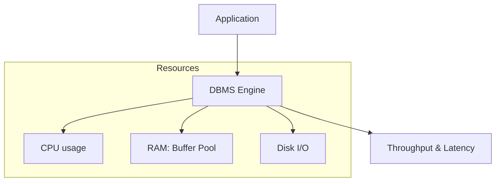

# ⏱️ Database Profiling: Measuring the Impact
> **Objective:** Master the tools and techniques to profile database performance, measure latency, and analyze resource usage | **Language:** Hinglish | **Standard:** 2026 Expert Framework

---

## 🧭 1. Beginner-Friendly Hinglish Explanation
Database Profiling ka matlab hai "Database ka Health Check-up aur Performance Report".

- **The Problem:** Aapne queries optimize kar li, par overall system abhi bhi "Heavy" lag raha hai. Aapko ye nahi pata ki CPU kahan ja raha hai, Disk I/O kitna hai, ya RAM (Buffer Pool) sahi se use ho rahi hai ya nahi.
- **The Solution:** Humein pure system ka "Profile" (Snapshot) lena padega. 
- **The Metrics:** 
  1. **Throughput:** Har second kitne queries handle ho rahi hain.
  2. **Latency:** Har query kitna time le rahi hai.
  3. **I/O Wait:** Database disk se data mangne mein kitna wait kar raha hai.
- **Intuition:** Ye ek "Smart Watch" ki tarah hai. Ye sirf ye nahi batati ki aap kitna bhage (Queries), balki ye bhi batati hai ki aapki heart rate (CPU) kya thi aur kitni oxygen (RAM) use hui.

---

## 🧠 2. Deep Technical Explanation
### 1. System-Level Profiling:
Using OS tools to see how the DB interacts with hardware.
- **`iostat` / `vmstat`:** To check disk and memory bottlenecks.
- **`top` / `htop`:** To see which DB process is consuming the most CPU.

### 2. DB-Level Profiling:
- **`SHOW PROFILE` (MySQL):** Shows where the time was spent for a specific query (e.g., Opening tables, Sending data, Sorting).
- **`pg_stat_bgwriter` (Postgres):** Shows how often data is being written to disk (Checkpoints).
- **Cache Hit Ratio:** `(Hits / (Hits + Misses)) * 100`. If this is below 95%, you have a serious performance problem.

### 3. Connection Profiling:
Analyzing if the DB is spending too much time opening and closing connections. (Solution: Connection Pooling).

---

## 🏗️ 3. Database Diagrams (The Profiling Dashboard)


---

## 💻 4. Query Execution Examples (Postgres Metrics)
```sql
-- 1. Check Buffer Cache Hit Ratio
SELECT 
  sum(heap_blks_hit) / (sum(heap_blks_hit) + sum(heap_blks_read)) AS cache_hit_ratio
FROM pg_statio_user_tables;

-- 2. Check Index Usage vs Sequential Scans
SELECT 
  relname, 
  seq_scan, 
  idx_scan 
FROM pg_stat_user_tables 
WHERE seq_scan > 0 
ORDER BY seq_scan DESC;
```

---

## 🌍 5. Real-World Production Examples
- **Peak Traffic Analysis:** During a Black Friday sale, profiling showed that the DB was bottlenecked by "Disk I/O" because the WAL log was on the same slow disk as the data. **Fix: Move WAL to an NVMe drive.**
- **Capacity Planning:** Profiling the DB over 6 months to decide when to upgrade from 16GB RAM to 64GB.

---

## ❌ 6. Failure Cases
- **Profiling Overhead:** Running very deep profiling (`PERF` or `STRACE`) on a production server can slow it down by $20-30\%$.
- **Ignoring the Network:** The query is fast in the DB (1ms), but the Profiler shows 100ms total. **Fix: The problem is the network latency or large payload size.**
- **Stale Metrics:** Looking at metrics from yesterday instead of real-time during a crash.

---

## 🛠️ 7. Debugging Guide
| Bottleneck | Tool | Action |
| :--- | :--- | :--- |
| **CPU 100%** | `top`, `pg_stat_activity` | Find and kill long-running/unoptimized queries. |
| **Disk I/O 100%** | `iostat` | Check for full table scans or heavy writes. |
| **High Memory** | `vmstat` | Check if the Buffer Pool size is too large for the OS. |

---

## ⚖️ 8. Tradeoffs
- **Real-time Metrics (Instant / High Resource cost)** vs **Periodic Snapshots (Low cost / Might miss spikes).**

---

## 🛡️ 9. Security Concerns
- **Metics Leak:** Performance metrics can reveal internal system structure and traffic patterns to an unauthorized user.

---

## 📈 10. Scaling Challenges
- **Profiling Distributed DBs:** Profiling 10 nodes of a cluster and correlating the data is extremely hard. **Fix: Use 'Distributed Tracing' (Jaeger/Honeycomb).**

---

## ✅ 11. Best Practices
- **Establish a Baseline:** Know what "Normal" performance looks like before a crisis.
- **Use external monitoring** (Prometheus + Grafana).
- **Profile for both Average and Tail (p99) latency.**
- **Check your 'Transaction log' throughput.**

---

## ⚠️ 13. Common Mistakes
- **Only looking at CPU.** (Disk I/O is usually the real killer).
- **Ignoring 'Lock Wait' time.**

---

## 📝 14. Interview Questions
1. "What is a Cache Hit Ratio and why is it important?"
2. "How do you determine if a database is IO-bound or CPU-bound?"
3. "Which metrics would you monitor for a high-traffic production database?"

---

## 🚀 15. Latest 2026 Production Database Patterns
- **eBPF-based Profiling:** Using ultra-low overhead Linux kernel probes (eBPF) to profile DB internals without any performance penalty.
- **Predictive Profiling:** AI systems that analyze DB metrics and predict a "Disk Failure" or "Connection Storm" 30 minutes before it happens.
漫
