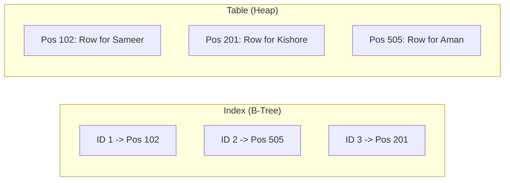

# 📑 Indexes: The Shortcut to Performance
> **Objective:** Master the concept of indexing to speed up data retrieval and understand the cost of over-indexing | **Language:** Hinglish | **Standard:** 2026 Expert Framework

---

## 🧭 1. Beginner-Friendly Hinglish Explanation
Indexes ka matlab hai "Database ki 'Index' table ya shortcut".

- **The Problem:** Socho aapke paas 1000 pages ki book hai aur aapko "Normalization" word dhoondhna hai. Agar aap page-by-page dhoondhenge (**Full Table Scan**), toh bahut time lagega.
- **The Solution:** Book ke piche ek "Index" page hota hai jo batata hai ki kaunsa word kis page par hai. Aap index dekhte hain aur sidha us page par jump karte hain.
- **The Goal:** **Read speed** badhana.
- **The Cost:** Index banane se **Write speed** kam ho jati hai (Insert/Update slow ho jata hai kyunki index ko bhi update karna padta hai) aur Disk space zyada lagti hai.
- **Intuition:** Index ek "Contact List" ki tarah hai. Aap pura phone nahi check karte kisi ka number dhoondhne ke liye, aap sidha "S" alphabet par jate hain aur "Sameer" ka number mil jata hai.

---

## 🧠 2. Deep Technical Explanation
### 1. How it works:
An index is a separate data structure (usually a **B-Tree**) that stores the value of the indexed column and a pointer (RID/Address) to the actual row in the table.

### 2. Types of Indexes:
- **Single-Column Index:** Index on one column (e.g., `id`).
- **Composite Index:** Index on multiple columns (e.g., `first_name, last_name`). Order matters here!
- **Unique Index:** Ensures no duplicate values.
- **Full-Text Index:** For searching words inside large text.

### 3. When to use an Index?
- Columns used in `WHERE` clauses.
- Columns used in `JOIN` conditions.
- Columns used in `ORDER BY` or `GROUP BY`.

---

## 🏗️ 3. Database Diagrams (Index vs Table)


---

## 💻 4. Query Execution Examples
```sql
-- 1. Creating a Basic Index
CREATE INDEX idx_user_email ON users(email);

-- 2. Creating a Composite Index
CREATE INDEX idx_name_city ON users(last_name, city);
-- This index works for:
-- WHERE last_name = 'X'
-- WHERE last_name = 'X' AND city = 'Y'
-- It DOES NOT work for: WHERE city = 'Y' alone!

-- 3. Dropping an Index
DROP INDEX idx_user_email;
```

---

## 🌍 5. Real-World Production Examples
- **Authentication:** The `email` column is almost always indexed and unique to make login instant.
- **E-commerce:** `category_id` and `price` are indexed to power the filters on the website.

---

## ❌ 6. Failure Cases
- **Over-Indexing:** Creating an index for every single column. This makes `INSERT` operations extremely slow and wastes GBs of disk space.
- **Indexing Low-Cardinality Columns:** Indexing a `gender` column (only 2-3 values). The DB engine will usually ignore the index and do a Full Scan anyway.
- **Index Fragmentaton:** After many deletes/updates, the index becomes messy and slow. **Fix: REINDEX.**

---

## 🛠️ 7. Debugging Guide
| Tool | Purpose | Tip |
| :--- | :--- | :--- |
| **EXPLAIN** | See if query uses index. | Look for `Index Scan` (Fast) vs `Seq Scan` (Slow). |
| **Index Stats** | See if index is being used. | In Postgres, check `pg_stat_user_indexes`. If `idx_scan` is 0, delete it! |

---

## ⚖️ 8. Tradeoffs
- **Read Performance (Faster)** vs **Write Performance (Slower)** vs **Disk Space (Higher).**

---

## 🛡️ 9. Security Concerns
- **Index Leaks:** An index on encrypted data might still reveal information about the data distribution (e.g., how many users have the same last name) even if the table rows are encrypted.

---

## 📈 10. Scaling Challenges
- **Large Indexes in RAM:** For maximum speed, indexes should fit in the RAM (Buffer Pool). If your index is 100GB and RAM is 16GB, performance will drop. **Fix: Use 'Partial Indexes'.**

---

## ✅ 11. Best Practices
- **Index foreign keys** (Speeds up Joins).
- **Use Partial Indexes** for common filters (e.g., `CREATE INDEX ... WHERE status = 'active'`).
- **Composite Index Order:** Put the most selective column (one with unique values) first.
- **Monitor unused indexes** and delete them.

---

## ⚠️ 13. Common Mistakes
- **Indexing every column.**
- **Assuming the Primary Key doesn't need an index** (It's indexed automatically!).
- **Using `LIKE '%abc'`** (This breaks B-tree indexes).

---

## 📝 14. Interview Questions
1. "How does an index speed up a query?"
2. "Why is indexing a Boolean column (True/False) usually a bad idea?"
3. "What is a Composite Index and why does the order of columns matter?"

---

## 🚀 15. Latest 2026 Production Database Patterns
- **Covering Indexes:** An index that includes all columns needed for a query, so the DB never has to look at the main table (Heap fetch eliminated).
- **BRIN Indexes:** (Block Range Indexes) for massive time-series data. They are $100x$ smaller than B-trees and very fast for range searches.
漫
