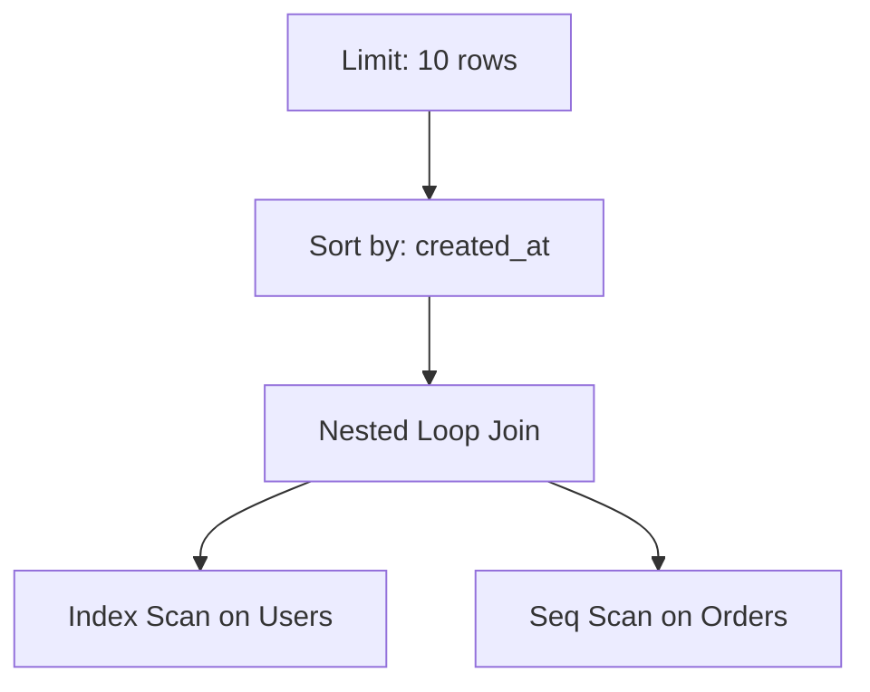

# 🗺️ Query Execution Plans: The Database's Brain
> **Objective:** Master how to use EXPLAIN to see exactly how the database executes your SQL and identify performance bottlenecks | **Language:** Hinglish | **Standard:** 2026 Expert Framework

---

## 🧭 1. Beginner-Friendly Hinglish Explanation
Query Execution Plans ka matlab hai "Database ka planning report".

- **The Problem:** Aapne ek query likhi, par wo 5 second le rahi hai. Aapko kaise pata chalega ki galti kahan hai? Kya wo galat index use kar raha hai? Ya joins slow hain?
- **The Solution:** Humein `EXPLAIN` keyword use karna hota hai. Ye humein batata hai ki database piche kya kar raha hai.
- **The Core Steps:** 
  1. **Seq Scan (Bad):** Database puri table padh raha hai (Like searching a book page-by-page).
  2. **Index Scan (Good):** Database index use karke sidha data par ja raha hai.
  3. **Hash Join / Nested Loop:** Do tables ko kaise connect kiya ja raha hai.
- **Intuition:** Ye "Google Maps" ki tarah hai. Aapne source aur destination diya, aur Maps ne bataya ki "High-way se jao" ya "Galiyon se jao". Execution Plan wahi rasta hai jo DB ne chuna hai.

---

## 🧠 2. Deep Technical Explanation
### 1. The Execution Lifecycle:
1. **Parser:** Checks syntax.
2. **Rewriter:** Handles views and rules.
3. **Optimizer:** Generates multiple plans and chooses the one with the lowest **Cost**.
4. **Executor:** Actually runs the plan.

### 2. Key Terms in EXPLAIN:
- **Cost:** An arbitrary number representing the effort (CPU/IO) needed. (Lower is better).
- **Rows:** Estimated number of rows that will be returned.
- **Width:** Average size of a row in bytes.
- **Actual Time:** (When using `EXPLAIN ANALYZE`) The real time spent.

### 3. Common Operations:
- **Sequential Scan:** Reading the whole heap.
- **Index Only Scan:** Data found entirely in the index.
- **Bitmap Index Scan:** Using an index to find row addresses, sorting them, then fetching from the heap (Efficient for medium data).
- **Nested Loop:** Join technique for small tables.

---

## 🏗️ 3. Database Diagrams (The Plan Tree)


---

## 💻 4. Query Execution Examples (Postgres)
```sql
-- 1. Simple EXPLAIN (Estimated)
EXPLAIN SELECT * FROM users WHERE email = 'test@example.com';

-- 2. EXPLAIN ANALYZE (Execution + Real Timing)
EXPLAIN ANALYZE SELECT u.name, o.amount 
FROM users u 
JOIN orders o ON u.id = o.user_id 
WHERE u.id = 50;

-- Output will show something like:
-- -> Index Scan using users_pkey on users  (cost=0.28..8.29 rows=1 width=32)
```

---

## 🌍 5. Real-World Production Examples
- **Debugging a slow Dashboard:** Using EXPLAIN to find that a join is missing an index on the `tenant_id`.
- **API Performance:** Running EXPLAIN during development to ensure every API query uses an Index Scan.

---

## ❌ 6. Failure Cases
- **Bad Stats:** If the DB hasn't been `ANALYZE`d recently, the Optimizer might choose a slow Seq Scan because it *thinks* the table only has 10 rows when it actually has 10 million.
- **Function on Index:** Using `WHERE LOWER(name) = 'abc'` causes the plan to switch from Index Scan to Seq Scan.
- **Complex Joins:** A query joining 15 tables might take more time "Planning" than "Executing".

---

## 🛠️ 7. Debugging Guide
| Operation | Meaning | Fix |
| :--- | :--- | :--- |
| **Seq Scan** | Full Table Read | Create an Index on the filter column. |
| **External Merge Disk** | Sort was too big for RAM | Increase `work_mem` (Postgres) or add an Index for sorting. |
| **Hash Join** | Large table join | Ensure both join keys are indexed. |

---

## ⚖️ 8. Tradeoffs
- **Execution Time (Real performance)** vs **Planning Time (Time taken to decide the plan).**

---

## 🛡️ 9. Security Concerns
- **Execution Plan Leaks:** In some cases, the Plan can reveal the distribution of data values (e.g., "Most users are in India") even if the user shouldn't know that.

---

## 📈 10. Scaling Challenges
- **Plan Instability:** A plan that works well for 1,000 rows might become a disaster for 1 million rows. **Fix: Use 'Plan Baselines' or 'Hints' to force a specific path.**

---

## ✅ 11. Best Practices
- **Always use `EXPLAIN ANALYZE` on a copy of production data.**
- **Look for the "Highest Cost" node in the plan tree.**
- **Run `ANALYZE` regularly** to keep statistics fresh.
- **Check if 'Rows Estimated' is close to 'Rows Actual'.** (If they differ by $100x$, your stats are bad).

---

## ⚠️ 13. Common Mistakes
- **Running `EXPLAIN ANALYZE` on a DELETE or UPDATE query** (It WILL delete/update the data! Use it inside a transaction that you rollback).
- **Ignoring the planning time.**

---

## 📝 14. Interview Questions
1. "What is the difference between EXPLAIN and EXPLAIN ANALYZE?"
2. "How do you identify a full table scan in an execution plan?"
3. "What causes the optimizer to choose a Seq Scan even if an Index exists?"

---

## 🚀 15. Latest 2026 Production Database Patterns
- **Visual Explainers:** Modern tools like **Dalibo PEV** or **DBeaver's Visual Explain** that turn text-based plans into interactive flowcharts.
- **AI-Based Optimizers:** (Oracle/Amazon Aurora) Databases that learn from past query failures and automatically adjust the execution plan for the next run.
漫
