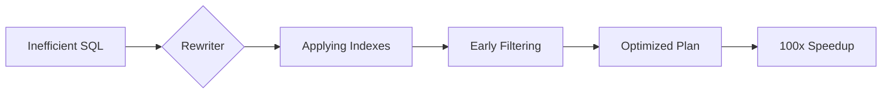

# 🚀 Query Optimization: Tuning for Speed
> **Objective:** Master the art of rewriting and restructuring SQL queries to minimize resource consumption and maximize speed | **Language:** Hinglish | **Standard:** 2026 Expert Framework

---

## 🧭 1. Beginner-Friendly Hinglish Explanation
Query Optimization ka matlab hai "SQL query ko aise badalna ki wo jaldi chale".

- **The Problem:** Ek hi result nikalne ke 10 tareeke ho sakte hain. 
  - Tareeka 1: 10 second leta hai.
  - Tareeka 2: 0.1 second leta hai.
- **The Solution:** Humein wahi "Tareeka 2" dhoondhna hai.
- **The Process:** 
  1. Pehle dekho "Explain Plan" (Diagnosis).
  2. Phir dekho kahan time waste ho raha hai.
  3. Phir Indexes, rewriting, ya Joins ko adjust karo.
- **Intuition:** Ye ek "Shortcut" dhoondhne jaisa hai. Agar aapko ek box mein se "Red Ball" nikalni hai, toh aap pura box khali nahi karte (Full Scan), aap upar se dekh kar sidha haath dalte hain.

---

## 🧠 2. Deep Technical Explanation
### 1. The Golden Rule: Reduce Data Volume Early
The sooner you filter out rows, the less work the database has to do in Joins and Sorts.
- **Bad:** `SELECT * FROM (SELECT * FROM orders) WHERE id = 10;`
- **Good:** `SELECT * FROM orders WHERE id = 10;`

### 2. Common Optimization Techniques:
- **Predicate Pushdown:** Moving filters (`WHERE`) as close to the data source as possible.
- **Using UNION ALL instead of UNION:** `UNION` performs a distinct operation (Sort + Remove Duplicates) which is expensive. If you know data is unique, use `UNION ALL`.
- **Replacing OR with IN:** `WHERE id = 1 OR id = 2` is fine, but for 100 values, `IN (1, 2, ...)` is much more efficient for the optimizer.
- **Exists vs Count:** Use `IF EXISTS (SELECT 1 FROM ...)` instead of `IF (SELECT COUNT(*) FROM ...) > 0`.

### 3. Join Order:
Always try to join the smaller filtered table first. This reduces the number of comparisons in the next join step.

---

## 🏗️ 3. Database Diagrams (Optimization Pipeline)


---

## 💻 4. Query Execution Examples
```sql
-- ❌ Slow (Subquery in SELECT)
SELECT name, 
  (SELECT COUNT(*) FROM orders WHERE user_id = u.id) AS order_count
FROM users u;

-- ✅ Fast (Join and Group By)
SELECT u.name, COUNT(o.id) AS order_count
FROM users u
LEFT JOIN orders o ON u.id = o.user_id
GROUP BY u.id, u.name;

-- ❌ Slow (Wildcard Start)
SELECT * FROM products WHERE name LIKE '%Phone';

-- ✅ Fast (Full Text Search or specific prefix)
SELECT * FROM products WHERE name LIKE 'Phone%';
```

---

## 🌍 5. Real-World Production Examples
- **Amazon Search:** They don't search millions of products in real-time; they use pre-optimized queries and "Search Indexes".
- **Reports:** Converting a query that took 2 minutes into a "Materialized View" that returns data in 1ms.

---

## ❌ 6. Failure Cases
- **Over-Optimization:** Making a query so complex to save 1ms that no human can read or maintain it.
- **Ignoring Data Distribution:** Optimizing for a developer DB (100 rows) but it fails on Production DB (100 million rows).
- **Hard-coded Hints:** Forcing a specific index using "Hints" that might become the wrong choice after the data grows.

---

## 🛠️ 7. Debugging Guide
| Tool | Action | Goal |
| :--- | :--- | :--- |
| **EXPLAIN ANALYZE** | Run it! | Find the node with the highest 'Actual Time'. |
| **Index Stats** | Check `pg_stat_user_indexes`. | See if your "optimized" index is even being used. |

---

## ⚖️ 8. Tradeoffs
- **Execution Speed** vs **Code Readability.** (Don't kill readability for micro-optimizations).

---

## 🛡️ 9. Security Concerns
- **Sensitive Data Processing:** An optimized query might bypass certain "Audit Logs" or security views if not configured correctly.

---

## 📈 10. Scaling Challenges
- **The "Data Skew" Problem:** Optimization that works for "Average User" fails for a "Celebrity User" with 10 million followers. **Fix: Use 'Partial Indexes' or 'Conditional Logic'.**

---

## ✅ 11. Best Practices
- **Filter early, join late.**
- **Avoid using `DISTINCT` and `ORDER BY` together on large sets.**
- **Use CTEs for clarity, but check performance.**
- **Always benchmark before and after the change.**

---

## ⚠️ 13. Common Mistakes
- **Indexing columns but then using functions on them in WHERE.**
- **Not testing with realistic data volume.**

---

## 📝 14. Interview Questions
1. "Explain Predicate Pushdown."
2. "Why is UNION ALL faster than UNION?"
3. "How do you optimize a query that is taking too much CPU due to sorting?"

---

## 🚀 15. Latest 2026 Production Database Patterns
- **JIT Compilation:** (Postgres 11+) Databases compiling your SQL into machine code (LLVM) for complex analytical queries to achieve maximum CPU efficiency.
- **Parallel Query Execution:** Modern DBs automatically splitting a single query into 8-16 parallel threads to use all CPU cores.
漫
