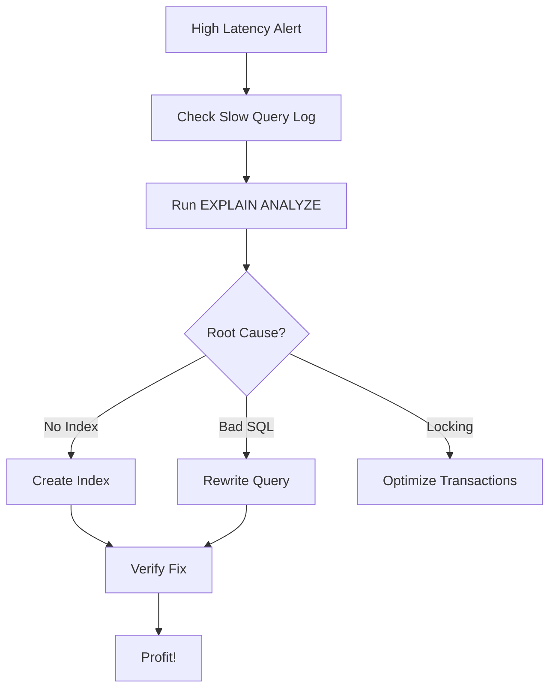

# 🐌 Slow Query Debugging: The Detective Work
> **Objective:** Master the step-by-step process of identifying, diagnosing, and fixing slow SQL queries in a production environment | **Language:** Hinglish | **Standard:** 2026 Expert Framework

---

## 🧭 1. Beginner-Friendly Hinglish Explanation
Slow Query Debugging ka matlab hai "Database ki 'Slow' queries ko dhoondhna aur unhe theek karna".

- **The Problem:** Site slow ho gayi hai. CPU 100% hai. Developer ko pata nahi ki kaunsi query zimmedar hai.
- **The Solution:** Humein "Detective" banna padega. 
- **The Steps:** 
  1. **Identify:** Sabse pehle wo query dhoondho jo slow hai (Slow Query Log).
  2. **Diagnose:** `EXPLAIN` use karke dekho wo kyun slow hai (Full Scan? Lock?).
  3. **Fix:** Index lagao ya query ko rewrite karo.
- **Intuition:** Ye ek "Traffic Jam" ki tarah hai. Aap pehle ye dekhte hain ki jam kahan hai (Identify), phir dekhte hain ki kyun hai—accident hua ya road narrow hai (Diagnose), aur phir rasta saaf karte hain (Fix).

---

## 🧠 2. Deep Technical Explanation
### 1. The Identification Tools:
- **Slow Query Log:** A file where the DB records every query that takes longer than `X` seconds (e.g., `long_query_time = 1.0`).
- **Performance Schema (MySQL) / pg_stat_statements (Postgres):** Real-time tables that show which queries are consuming the most CPU/Time.

### 2. Diagnosis with EXPLAIN ANALYZE:
Don't just guess. Run the query with `EXPLAIN ANALYZE`. Look for:
- **High Disk I/O:** Reading too much from disk.
- **Temporary File Creation:** The query was so big it had to write to disk to finish sorting.
- **Lock Wait:** The query is fast, but it was waiting for another transaction to finish.

### 3. The 3 Pillars of Fixing:
- **Hardware:** More RAM/CPU (Expensive, temporary fix).
- **Indexing:** Adding missing shortcuts (Cheap, effective).
- **Query Rewrite:** Changing the logic (Permanent fix).

---

## 🏗️ 3. Database Diagrams (The Debugging Loop)


---

## 💻 4. Query Execution Examples (Postgres Detection)
```sql
-- 1. Finding the top 5 slowest queries in Postgres
-- (Needs pg_stat_statements extension enabled)
SELECT query, calls, total_exec_time, mean_exec_time
FROM pg_stat_statements
ORDER BY total_exec_time DESC
LIMIT 5;

-- 2. Finding queries currently running and how long they've been running
SELECT pid, now() - query_start AS duration, query, state
FROM pg_stat_activity
WHERE state != 'idle'
ORDER BY duration DESC;
```

---

## 🌍 5. Real-World Production Examples
- **Incident Response:** A developer deployed a new feature without an index. The `pg_stat_activity` showed 100 queries "Waiting". The SRE team killed the queries and added the index.
- **Monthly Maintenance:** Reviewing the Slow Query Log every month to proactively fix queries before they cause a crash.

---

## ❌ 6. Failure Cases
- **The "Observer Effect":** Running `EXPLAIN ANALYZE` on a query that is already killing the DB can actually make it worse. **Fix: Use a Read Replica or Staging DB.**
- **Heisenbugs:** A query that is slow on Production but fast on Local. **Fix: Check if Production has 'Data Skew' or different Index Statistics.**
- **Killing the wrong process:** Accidentally killing the "Auto-vacuum" process instead of the slow query.

---

## 🛠️ 7. Debugging Guide
| Tool | command | Purpose |
| :--- | :--- | :--- |
| **Postgres** | `pg_stat_statements` | Cumulative stats of all queries. |
| **MySQL** | `pt-query-digest` | Tool to analyze slow logs. |
| **Cloud** | `CloudWatch / Datadog` | Visual dashboards for DB performance. |

---

## ⚖️ 8. Tradeoffs
- **Real-time Monitoring (High overhead)** vs **Log-based Monitoring (Lower overhead / Delayed).**

---

## 🛡️ 9. Security Concerns
- **Slow Query Log Exposure:** These logs often contain raw data (emails, names) in the `WHERE` clauses. **Fix: Encrypt logs or use 'Parameterized' logging.**

---

## 📈 10. Scaling Challenges
- **Massive Log Files:** In a high-traffic DB, the Slow Query Log can grow to 100GB in a day. **Fix: Log only a 'sample' of queries or set a higher time threshold.**

---

## ✅ 11. Best Practices
- **Enable `pg_stat_statements` on every production DB.**
- **Set a reasonable `long_query_time` (e.g., 200ms).**
- **Always use placeholders (`$1`, `?`)** so similar queries are grouped together in stats.
- **Check for "Lock Contention"** if queries are slow but CPU is low.

---

## ⚠️ 13. Common Mistakes
- **Fixing a query on Local without production-sized data.**
- **Forgetting to check the "Buffer Cache Hit Ratio".**

---

## 📝 14. Interview Questions
1. "How do you find the slowest queries in a database?"
2. "A query is fast in Staging but slow in Production. What could be the reason?"
3. "What is the difference between planning time and execution time?"

---

## 🚀 15. Latest 2026 Production Database Patterns
- **Automated Query Indexing:** (Azure SQL / AWS Aurora) The DB monitors slow queries and *automatically* creates and tests indexes for you in the background.
- **Distributed Tracing (OpenTelemetry):** Linking a slow SQL query back to the exact API request and User ID in your backend logs.
漫
