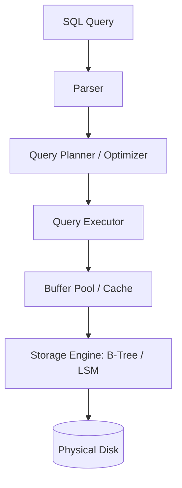

# ⚙️ Database Internals: Overview and Roadmap
> **Note:** This section focuses on the high-level architecture of database engines. For deep dives into storage, caching, and logging, please see the [06_Storage_and_Internals](../06_Storage_and_Internals/) module.

## 🧭 1. What are Database Internals?
Database Internals refers to the code and logic that sits between your SQL query and the actual bits on the disk. It involves:
- **The Parser:** Understanding what you want.
- **The Optimizer:** Finding the fastest way to get it.
- **The Executor:** Running the plan.
- **The Storage Engine:** Writing to the physical files.

## 🧠 2. The Internal Stack

## 🏗️ 3. Key Concepts to Explore
1. **Query Life Cycle:** How a string of text becomes a result set.
2. **Access Methods:** Sequential Scans vs. Index Scans.
3. **Internal Data Formats:** Slotted pages and row layouts.
4. **Statistics:** How the database knows a table has 1 million rows.

For detailed technical guides, explore the sister module: **[Module 06: Storage and Internals](../06_Storage_and_Internals/)**.
