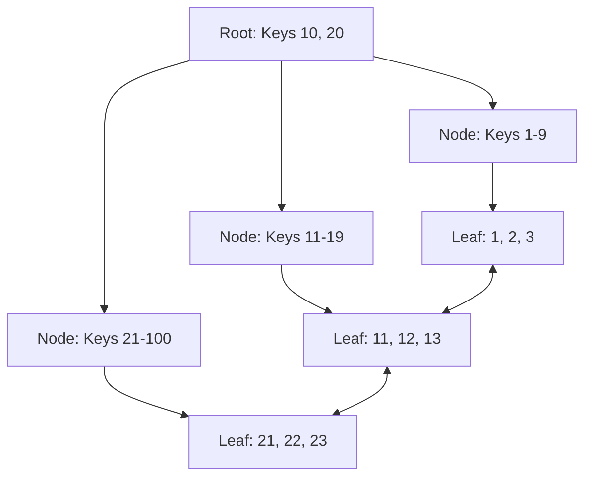

# 🌳 B-Tree Internals: The Engine of Indexing
> **Objective:** Deep dive into the mathematical and physical structure of B-Trees and B+Trees that power database indexing | **Language:** Hinglish | **Standard:** 2026 Expert Framework

---

## 🧭 1. Beginner-Friendly Hinglish Explanation
B-Tree Internals ka matlab hai "Database ke index ka asli dimaag (Structure)".

- **The Problem:** Agar humein 1 crore records mein se 1 dhoondhna hai, toh hum 'Search' kaise karein ki wo instant ho? Linear search (1, 2, 3...) toh saalon lega.
- **The Solution:** Humein data ko "Tree" (Ped) ki tarah sajana hoga. Par ye normal tree nahi hai, ye ek **Balance Tree (B-Tree)** hai.
- **Why B-Tree?**
  - Iska har node (Dabba) 8KB ka hota hai (Page size).
  - Ek hi node mein 100-200 pointers ho sakte hain.
  - Ye hamesha "Balanced" rehta hai (Sabse upar se sabse niche tak ka rasta barabar hota hai).
- **Intuition:** Ye ek "Multi-story building" ki tarah hai. Ground floor par directories hain jo batati hain ki kaunsa item kis floor par hai. Phir us floor par ja kar aap dhoondhte hain ki wo kis room mein hai.

---

## 🧠 2. Deep Technical Explanation
### 1. B-Tree vs B+Tree (The Industry Choice):
Almost all databases use **B+Tree** instead of a standard B-Tree.
- **B-Tree:** Data can be in the middle nodes.
- **B+Tree (Better):** Data is **only** in the leaf nodes. Middle nodes only have "Keys" (Pointers).
- **Leaf Linking:** In B+Tree, all leaf nodes are connected to each other (Linked List). This makes **Range Scans** (e.g., `WHERE price > 100`) super fast because you don't have to go back to the top of the tree.

### 2. The Fan-out:
A B-Tree node can have hundreds of children.
- If a node has 100 children, a 3-level tree can store $100^3 = 1,000,000$ (1 million) records.
- This means finding any record takes only **3 Disk I/O** operations.

### 3. Page Splits and Merges:
- **Split:** When a node becomes full (8KB full), the DB splits it into two and moves the middle key up to the parent.
- **Merge:** When many rows are deleted and a node is too empty, the DB merges it with a neighbor to save space.

---

## 🏗️ 3. Database Diagrams (The B+Tree Architecture)


---

## 💻 4. Query Execution Examples (Internals Analysis)
```sql
-- 1. Seeing index metadata (Postgres)
SELECT * FROM bt_metap('users_pkey');
-- Shows root page number, level of the tree, etc.

-- 2. Seeing items inside an index page
SELECT * FROM bt_page_items('users_pkey', 1);
-- Shows the actual keys and pointers stored in the index node.
```

---

## 🌍 5. Real-World Production Examples
- **Postgres/MySQL/Oracle:** Everything from Primary Keys to secondary indexes is a B+Tree.
- **File Systems:** NTFS and Ext4 use B-Trees to manage file locations on your hard drive.

---

## ❌ 6. Failure Cases
- **B-Tree Fragmentation:** Constant updates/deletes leave "Holes" in the tree nodes. The tree becomes 10 levels deep but mostly empty. **Fix: REINDEX.**
- **Index Corruption:** A bit flips on the disk, and the tree pointer now points to "Garbage". The query returns the wrong data.
- **Random Inserts (UUIDs):** Causes massive page splits because data is inserted in the middle of the tree instead of at the end.

---

## 🛠️ 7. Debugging Guide
| Problem | Reason | Solution |
| :--- | :--- | :--- |
| **Index is larger than table** | Bloat | The index nodes are nearly empty. Run `REINDEX`. |
| **Search is slow** | Deep Tree | Check the tree height. If it's $>5$, you have a massive table or fragmented index. |

---

## ⚖️ 8. Tradeoffs
- **B+Tree (Fast reads / Slow massive writes)** vs **LSM-Tree (Fast massive writes / Slow reads).**

---

## 🛡️ 9. Security Concerns
- **Index Inference:** By observing how long a B-Tree search takes, an attacker can guess if a key is "near" another key, revealing data order.

---

## 📈 10. Scaling Challenges
- **Lock Contention:** During a "Page Split", the parent nodes must be locked. On a high-traffic DB with many writes, this causes a "Livelock" where threads wait for the tree to reorganize.

---

## ✅ 11. Best Practices
- **Use Sequential IDs** to minimize page splits.
- **Keep index columns small** (Avoid indexing long strings directly; use a hash or prefix).
- **Monitor index fragmentation** using `pgstatindex` (Postgres).

---

## ⚠️ 13. Common Mistakes
- **Indexing columns that change constantly.**
- **Assuming B-Trees are only for "Equality" (=) searches.**

---

## 📝 14. Interview Questions
1. "Why is a B+Tree better than a Binary Search Tree (BST) for databases?" (Disk I/O and Block size).
2. "What is a 'Page Split' in a B-Tree?"
3. "How does the 'Fan-out' factor affect the tree height?"

---

## 🚀 15. Latest 2026 Production Database Patterns
- **B-Tree Pre-fetching:** Modern CPUs reading the "Next" branch of the tree into the L1 cache before the code even requests it.
- **Latch-free B-Trees:** Using **Compare-and-Swap (CAS)** instead of Mutex locks to allow multiple threads to update the tree simultaneously without stopping each other.
漫
