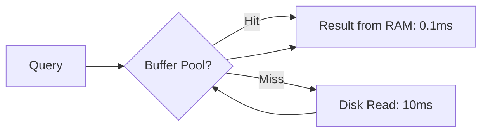

# 🧠 Buffer Pool and Cache: The Database's Memory
> **Objective:** Master how databases use RAM to cache disk pages and why the Buffer Pool is the most critical setting for performance | **Language:** Hinglish | **Standard:** 2026 Expert Framework

---

## 🧭 1. Beginner-Friendly Hinglish Explanation
Buffer Pool ka matlab hai "Database ka internal RAM storage".

- **The Problem:** Disk (HDD/SSD) bohot slow hoti hai. Agar database har query ke liye disk par jayega, toh site 1990s jaisi slow chalegi.
- **The Solution:** Database RAM ka ek bada hissa reserve kar leta hai jise **Buffer Pool** kehte hain. Jab bhi koi page read hota hai, wo RAM mein save ho jata hai.
- **How it works:** 
  - **Read:** Pehle RAM mein dekho (**Cache Hit**). Mil gaya toh instant result. Nahi mila toh disk se lao (**Cache Miss**) aur RAM mein rakho.
  - **Write:** Seedha RAM mein badlo (**Dirty Page**) aur piche se background mein disk par save karo.
- **Intuition:** Ye "Kitchen Cabinet" ki tarah hai. Aap baar-baar grocery store (Disk) nahi jate. Aap thoda saaman cabinet (RAM) mein rakhte hain takki jaldi khana bana saken.

---

## 🧠 2. Deep Technical Explanation
### 1. Buffer Pool Management:
The Buffer Pool is a large chunk of memory divided into **Pages** (matching the disk page size).
- **LRU Algorithm:** "Least Recently Used". Jab RAM bhar jata hai, toh database un pages ko hata deta hai jo sabse purane hain aur kisi ne nahi dekhe.

### 2. Dirty Pages:
A page that has been modified in RAM but not yet written to disk.
- **Flushing:** The background process of writing dirty pages to disk.
- **Checkpointing:** A periodic event where all dirty pages are flushed to ensure durability.

### 3. Critical Metric: Cache Hit Ratio
`Cache Hit Ratio = (Requests from RAM / Total Requests) * 100`.
- **Target:** 95% to 99% for production systems.

---

## 🏗️ 3. Database Diagrams (The Cache Flow)


---

## 💻 4. Query Execution Examples (Tuning)
```sql
-- 1. Checking InnoDB Buffer Pool Size (MySQL)
SHOW VARIABLES LIKE 'innodb_buffer_pool_size';
-- Rule of thumb: Set to 60-80% of total Server RAM.

-- 2. Checking Buffer Pool Stats (Postgres)
SELECT 
  sum(heap_blks_hit) AS hit, 
  sum(heap_blks_read) AS miss
FROM pg_statio_user_tables;
```

---

## 🌍 5. Real-World Production Examples
- **SaaS App:** A popular app was slow. Profiling showed 50% Cache Hit Ratio. After increasing the Buffer Pool from 1GB to 8GB, the site became $10x$ faster.
- **Redis:** A database that is *only* a Buffer Pool (everything in RAM).

---

## ❌ 6. Failure Cases
- **Buffer Pool Warming:** Jab database restart hota hai, RAM khali hota hai. Pehli 10 minute queries slow chalti hain kyunki sab kuch disk se lana padta hai. **Fix: Use 'Buffer Pool Dumping/Restoring' on restart.**
- **Swapping:** If the Buffer Pool size is larger than physical RAM, the OS will start using disk as RAM. This is a performance death sentence.
- **Write-Intensive Slowdown:** Too many "Dirty Pages" means the DB has to stop everything and flush to disk to avoid losing data.

---

## 🛠️ 7. Debugging Guide
| Problem | Diagnostic | Solution |
| :--- | :--- | :--- |
| **High CPU & Disk I/O** | Cache Misses | Increase the Buffer Pool size. |
| **DB Crashes on Start** | Memory Allocation | Check if OS has enough free RAM for the requested pool size. |

---

## ⚖️ 8. Tradeoffs
- **Large Buffer Pool (Fast / High Memory cost)** vs **Small Buffer Pool (Slow / Saves RAM for App).**

---

## 🛡️ 9. Security Concerns
- **Cold Boot Attacks:** If an attacker gets access to a RAM dump of a running database, they can see sensitive data in plain text that was cached in the Buffer Pool.

---

## 📈 10. Scaling Challenges
- **Vertical Scaling Only:** You can't share a Buffer Pool across multiple servers. You have to buy a bigger server. **Fix: Use 'Read Replicas' to distribute the load.**

---

## ✅ 11. Best Practices
- **Allocate 75% of server RAM to the Buffer Pool** if it's a dedicated DB server.
- **Monitor the Hit Ratio daily.**
- **Use "Multiple Buffer Pool Instances"** (MySQL) to reduce lock contention on many-core CPUs.

---

## ⚠️ 13. Common Mistakes
- **Assuming the OS cache is enough.** (The DB's own Buffer Pool is much more intelligent).
- **Changing the size without a restart** (In some older DB versions).

---

## 📝 14. Interview Questions
1. "What is a Dirty Page?"
2. "Explain the LRU eviction policy."
3. "How do you calculate the Cache Hit Ratio and what is a good value?"

---

## 🚀 15. Latest 2026 Production Database Patterns
- **Tiered Memory:** Using high-speed **NVMe (Intel Optane)** as a "Level 2" Buffer Pool to extend RAM capacity to terabytes at low cost.
- **Smart Prefetching:** AI algorithms that predict which data you will need next and load it into the Buffer Pool *before* you even ask for it.
漫
