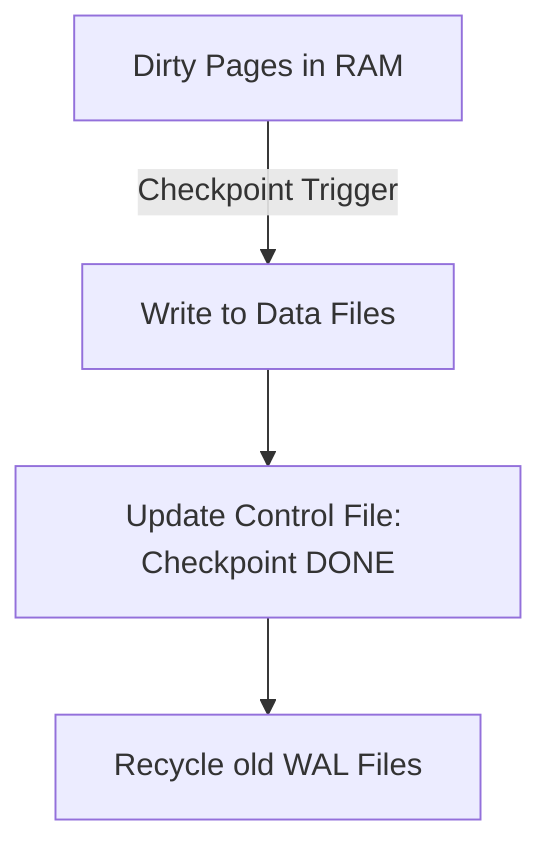

# 🏁 Checkpointing: Syncing RAM and Disk
> **Objective:** Understand how databases periodically synchronize memory with disk to ensure durability and manage log file sizes | **Language:** Hinglish | **Standard:** 2026 Expert Framework

---

## 🧭 1. Beginner-Friendly Hinglish Explanation
Checkpointing ka matlab hai "RAM ke data ko permanently disk par save karne ka milestone".

- **The Problem:** Database fast hone ke liye data pehle RAM (Buffer Pool) mein change karta hai. Is data ko "Dirty Pages" kehte hain. Par agar server crash hua, toh RAM ka data udd jayega (Durability issue). Bhale hi humare paas WAL (Diary) hai, par pure din ki diary ko restart par padhna bohot slow hoga.
- **The Solution:** Har thodi der mein (e.g., 5-30 min), database ek "Checkpoint" banata hai.
- **What happens in a Checkpoint?** 
  - Database saare "Dirty Pages" ko RAM se uthakar asli "Data Files" mein save kar deta hai.
  - Phir wo Diary (WAL) mein mark laga deta hai: "Yahan tak sab sahi hai".
- **Intuition:** Ye ek video game ke "Save Point" jaisa hai. Agar aap mar gaye (Crash), toh aap game puri tarah shuru se nahi karte, balki aakhri "Save Point" se shuru karte hain.

---

## 🧠 2. Deep Technical Explanation
### 1. The Checkpointing Process:
1. Identify all **Dirty Pages** in the Buffer Pool.
2. Sort them to make disk writing efficient (Sequential I/O).
3. Write them to the data files.
4. Update the **Control File** with the latest Checkpoint LSN (Log Sequence Number).
5. Recycle/Delete the old WAL files that are no longer needed for recovery.

### 2. Types of Checkpoints:
- **Sharp Checkpoint:** Writes everything immediately (Causes performance spikes).
- **Fuzzy Checkpoint:** Spreads the writing over time to avoid slowing down the DB (Standard in modern DBs like Postgres).

### 3. Triggers for Checkpoint:
- Time-based (e.g., Every 5 minutes).
- Volume-based (e.g., When WAL reaches 1GB).
- Manual command (`CHECKPOINT`).

---

## 🏗️ 3. Database Diagrams (The Checkpoint Milestone)


---

## 💻 4. Query Execution Examples (Postgres)
```sql
-- 1. Checking checkpoint settings
SHOW checkpoint_timeout; -- default 5 min
SHOW max_wal_size; -- default 1GB

-- 2. Manually trigger a checkpoint
CHECKPOINT;

-- 3. Monitoring checkpoint performance
SELECT * FROM pg_stat_bgwriter;
-- Look for 'checkpoints_timed' vs 'checkpoints_req'
```

---

## 🌍 5. Real-World Production Examples
- **High-traffic site:** During peak hours, checkpoints were happening every 30 seconds because the WAL was filling up too fast. This caused "I/O Spikes". **Fix: Increase `max_wal_size` to 10GB.**
- **Fast Recovery:** By having frequent checkpoints, a DB that crashed took only 2 minutes to reboot instead of 20 minutes.

---

## ❌ 6. Failure Cases
- **I/O Storms:** A checkpoint starts writing 10GB of data at once, making the website non-responsive for 5 seconds. **Fix: Use 'Spread Checkpointing' (checkpoint_completion_target).**
- **Disk Saturation:** The disk is already 100% busy with queries, and a checkpoint starts, causing the DB to freeze.
- **Control File Corruption:** If the file that stores the checkpoint location is corrupted, the DB won't know where to start recovery.

---

## 🛠️ 7. Debugging Guide
| Symptom | Reason | Solution |
| :--- | :--- | :--- |
| **Recovery is very slow** | Infrequent checkpoints | Decrease `checkpoint_timeout`. |
| **Periodic performance drops** | Aggressive checkpointing | Increase `checkpoint_completion_target` to spread the work. |

---

## ⚖️ 8. Tradeoffs
- **Frequent Checkpoints (Fast Recovery / High I/O overhead)** vs **Infrequent Checkpoints (Slow Recovery / Low I/O overhead).**

---

## 🛡️ 9. Security Concerns
- **Data Flush Privacy:** During a checkpoint, data is moved from RAM to Disk. If the disk is not encrypted, this is when "Secrets" become physically persistent.

---

## 📈 10. Scaling Challenges
- **Large Buffer Pools:** If your RAM is 512GB, a checkpoint might have to write 100GB of dirty pages. This requires extremely high-speed storage.

---

## ✅ 11. Best Practices
- **Monitor `pg_stat_bgwriter` regularly.**
- **Set `checkpoint_completion_target` to 0.9** to spread writes over 90% of the checkpoint interval.
- **Ensure your data and WAL are on separate fast disks.**

---

## ⚠️ 13. Common Mistakes
- **Running manual `CHECKPOINT` commands on a production server during peak hours.**
- **Setting `max_wal_size` too small.**

---

## 📝 14. Interview Questions
1. "What is a Checkpoint and why is it needed?"
2. "Explain 'Fuzzy' vs 'Sharp' checkpointing."
3. "How does the size of the WAL log affect the checkpoint frequency?"

---

## 🚀 15. Latest 2026 Production Database Patterns
- **Continuous Checkpointing:** Modern cloud databases (like **Aurora**) that continuously stream changes to a distributed storage layer, eliminating the need for traditional heavy checkpoints.
- **NVMe-aware Checkpointing:** Using hardware-level "Write Streams" to tell the SSD which data is part of a checkpoint, allowing the disk to optimize internal garbage collection.
漫
