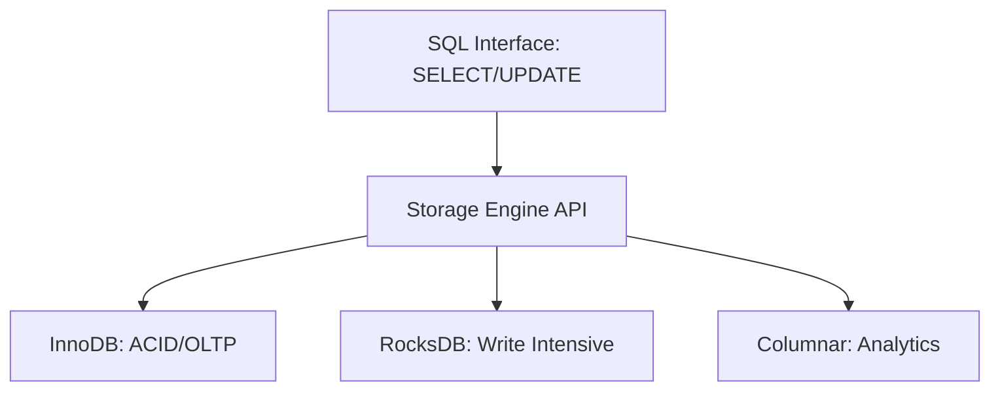

# ⚙️ Database Storage Engines: The Engine Under the Hood
> **Objective:** Understand how storage engines manage data on disk and why choosing the right engine (like InnoDB vs MyISAM) matters | **Language:** Hinglish | **Standard:** 2026 Expert Framework

---

## 🧭 1. Beginner-Friendly Hinglish Explanation
Database Storage Engine ka matlab hai "Database ka Engine".

- **The Idea:** SQL ek car ke steering wheel jaisa hai (Jo aap chala rahe hain). Par piche asli kaam "Engine" karta hai jo decide karta hai ki "Data disk par kaise save hoga" aur "Transactions kaise handle honge".
- **The Core Parts:** 
  1. **InnoDB (Modern Standard):** Ye Transactions (ACID) support karta hai aur row-level locking deta hai. Safe aur fast hai.
  2. **MyISAM (Old/Fast for Reads):** Isme transactions nahi hote, pura table lock hota hai. (Ab log kam use karte hain).
  3. **RocksDB (LSM Tree):** Writing ke liye super fast.
- **Intuition:** Storage engine decide karta hai ki aapki DB ek "Family Car" (Safe/InnoDB) hogi ya "Racing Car" (Fast but risky/MyISAM).

---

## 🧠 2. Deep Technical Explanation
### 1. What is a Storage Engine?
It is the software component that the DBMS uses to create, read, update, and delete data from a database. 
- A single DBMS (like MySQL) can support **Pluggable Storage Engines**.

### 2. InnoDB (The Industry Standard):
- **Clustered Indexing:** Stores data inside the Primary Key B+Tree.
- **MVCC Support:** Handles concurrency without locking readers.
- **Crash Recovery:** Uses **Write-Ahead Logging (WAL)** to ensure data isn't lost during power failure.

### 3. Columnar Engines (ClickHouse/Parquet):
Instead of storing rows together (`ID, Name, Age`), they store columns together (`IDs together, Names together`).
- **Best for:** Analytics and Big Data where you only need 2 columns out of 100.

---

## 🏗️ 3. Database Diagrams (Pluggable Architecture)


---

## 💻 4. Query Execution Examples (MySQL)
```sql
-- 1. Checking which engines are available
SHOW ENGINES;

-- 2. Creating a table with a specific engine
CREATE TABLE high_speed_logs (
    id INT,
    log_text TEXT
) ENGINE=RocksDB; -- Optimized for heavy writes

-- 3. Changing engine for an existing table
ALTER TABLE users ENGINE=InnoDB;
```

---

## 🌍 5. Real-World Production Examples
- **MySQL:** $99\%$ of people use **InnoDB** for standard apps.
- **LSM-Tree Engines:** Used in NoSQL databases like **Cassandra** to handle millions of writes per second.
- **In-Memory Engines:** Used for real-time leaderboards.

---

## ❌ 6. Failure Cases
- **Wrong Engine Choice:** Using MyISAM for a banking app (Data will get corrupted on crash!).
- **Engine Lock-in:** Moving data from an InnoDB table to a Columnar engine is not just an `ALTER` command; it requires a full data migration.

---

## 🛠️ 7. Debugging Guide
| Engine | Best For | Risk |
| :--- | :--- | :--- |
| **InnoDB** | Everything (OLTP) | Heavy CPU usage for locking. |
| **MyISAM** | Read-only static data | Table-level locking; no crash recovery. |
| **Memory** | Temp tables | Data lost on reboot. |

---

## ⚖️ 8. Tradeoffs
- **Transactions (InnoDB/Safe)** vs **Write Speed (LSM/RocksDB)** vs **Analytical Speed (Columnar).**

---

## 🛡️ 9. Security Concerns
- **Engine-level Encryption:** Some engines (like InnoDB) support "Transparent Data Encryption" (TDE) where data is encrypted on disk automatically.

---

## 📈 10. Scaling Challenges
- **Large Writes:** InnoDB can struggle with extremely high write throughput because of its B+Tree structure. **Fix: Switch to an LSM-based engine like RocksDB.**

---

## ✅ 11. Best Practices
- **Use InnoDB as the default for $99\%$ of use cases.**
- **Don't mix multiple engines** in a single database unless you have a very good reason (it complicates backups).
- **Monitor engine-specific metrics** (e.g., InnoDB Buffer Pool hit ratio).

---

## ⚠️ 13. Common Mistakes
- **Using an engine that doesn't support Foreign Keys** (e.g., MyISAM).
- **Not tuning the Buffer Pool** for the specific engine.

---

## 📝 14. Interview Questions
1. "Difference between InnoDB and MyISAM?"
2. "What is a Pluggable Storage Engine architecture?"
3. "When would you use a Columnar storage engine?"

---

## 🚀 15. Latest 2026 Production Database Patterns
- **Cloud-Native Engines:** (Amazon Aurora) The engine is split into a "Compute layer" and a "Storage layer", allowing the storage to scale independently.
- **Universal Engines:** New engines like **DuckDB** that can run inside the browser or a mobile app with full analytical power.
漫
