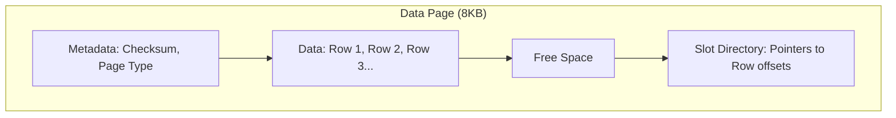

# 💾 How Databases Store Data: Rows, Blocks, and Files
> **Objective:** Understand the physical structure of data on disk—from individual rows to 8KB pages and data files | **Language:** Hinglish | **Standard:** 2026 Expert Framework

---

## 🧭 1. Beginner-Friendly Hinglish Explanation
Databases Data kaise save karte hain ka matlab hai "Disk par data ka asli structure".

- **The Problem:** Disk (HDD/SSD) "Tables" nahi samajhti. Wo sirf Bytes aur Blocks samajhti hai. Database ko table ke data ko "Serial" karke files mein rakhna padta hai.
- **The Solution:** Data ko chote-chote dheron mein banta jata hai jise **Pages** (ya Blocks) kehte hain.
- **The Hierarchy:** 
  1. **Row:** Ek entry (e.g., User Sameer).
  2. **Page:** ~8KB ka block. Isme 50-100 rows ho sakti hain. **Database disk se pura page uthata hai, ek row nahi.**
  3. **Extents:** 8-16 pages ka group.
  4. **Segment/Table File:** Puri table ka data.
- **Intuition:** Ye ek "Library" ki tarah hai. 
  - **Row** ek page hai book ka. 
  - **Page** ek puri book hai. 
  - **Extent** ek shelf hai.
  - **File** ek pura room hai.
  Database jab bhi kuch dhoondhta hai, wo puri "Book" (Page) uthakar lata hai.

---

## 🧠 2. Deep Technical Explanation
### 1. The Page (The Unit of I/O):
Almost all RDBMS (Postgres, SQL Server, MySQL) use an **8KB fixed-size page**.
- Why? Because it matches the OS block size and makes reading from disk efficient.
- Inside a page: Header (Metadata) + Row Data + Free Space + Slot Directory (Pointers to rows).

### 2. Row Formats:
- **Fixed-length:** `INT` takes 4 bytes, `CHAR(10)` takes 10 bytes. Easy to find.
- **Variable-length:** `VARCHAR` takes only what is needed. Harder to find; needs an offset pointer.

### 3. Row Overflow (TOAST):
What if a single row is bigger than 8KB (e.g., a long blog post)?
- The DB stores a pointer in the main page and moves the actual large data to a separate "Overflow" area.

---

## 🏗️ 3. Database Diagrams (The Page Layout)


---

## 💻 4. Query Execution Examples (Postgres Page Analysis)
```sql
-- 1. Installing extension to see page data
CREATE EXTENSION pageinspect;

-- 2. Looking at the raw data in a page
SELECT * FROM heap_page_items(get_raw_page('users', 0));
-- This shows row offsets, lengths, and internal flags (t_xmin, t_xmax).
```

---

## 🌍 5. Real-World Production Examples
- **Postgres:** Uses a "Heap" file where pages are filled as data comes in.
- **SQLite:** Uses a single file to store everything, with its own internal B-Tree page management.

---

## ❌ 6. Failure Cases
- **Page Fragmentation:** Many deletes leave "Gaps" in pages. The DB file size doesn't decrease even if data is deleted. **Fix: VACUUM / Rebuild Index.**
- **Disk Latency:** If your pages are scattered all over the disk (Random I/O), the DB becomes slow. **Fix: Use SSDs or Defragment.**
- **Partial Page Write (Torn Page):** System crashes while writing a page. Half is old, half is new. **Fix: Use Write-Ahead Logging (WAL) or Double-write buffer.**

---

## 🛠️ 7. Debugging Guide
| Problem | Reason | Solution |
| :--- | :--- | :--- |
| **Small table is huge on disk** | Bloat / Dead rows | Run `VACUUM FULL` or `OPTIMIZE TABLE`. |
| **High I/O wait** | Too many pages read | Check if your "Page Cache" (Buffer Pool) is large enough. |

---

## ⚖ {8. Tradeoffs
- **Row-Store (Best for OLTP/Updates)** vs **Column-Store (Best for Analytics/Big Data).**

---

## 🛡️ 9. Security Concerns
- **Slack Space Data:** When a row is deleted, its bytes are still on the disk in the "Free Space" of a page until overwritten. Forensics tools can recover this "Ghost Data".

---

## 📈 10. Scaling Challenges
- **Page Contention:** Multiple CPUs trying to update the same 8KB page at once. **Fix: Partitioning or smaller page sizes (uncommon).**

---

## ✅ 11. Best Practices
- **Use Sequential IDs** to ensure new rows are added to the end of the same page (Appends).
- **Avoid very large rows** (Keep blobs/images in S3, not DB).
- **Monitor your database file size growth.**

---

## ⚠️ 13. Common Mistakes
- **Thinking that `DELETE` instantly shrinks the file size.**
- **Using random UUIDs as PK** (This causes "Page Splits" and fragmentation).

---

## 📝 14. Interview Questions
1. "What is a Page in a database and what is its standard size?"
2. "How does a database handle a row that is larger than the page size?" (TOAST/Overflow).
3. "Explain the Slot Directory inside a database page."

---

## 🚀 15. Latest 2026 Production Database Patterns
- **Non-Volatile Memory (NVMe) Optimization:** Modern DBs (like ScyllaDB) bypassing the OS kernel and talk directly to NVMe controllers to read pages in nanoseconds.
- **Object-Storage Backends:** Databases like **Neon** or **Snowflake** that store pages as files on S3 instead of local disks, allowing for infinite scaling.
漫
