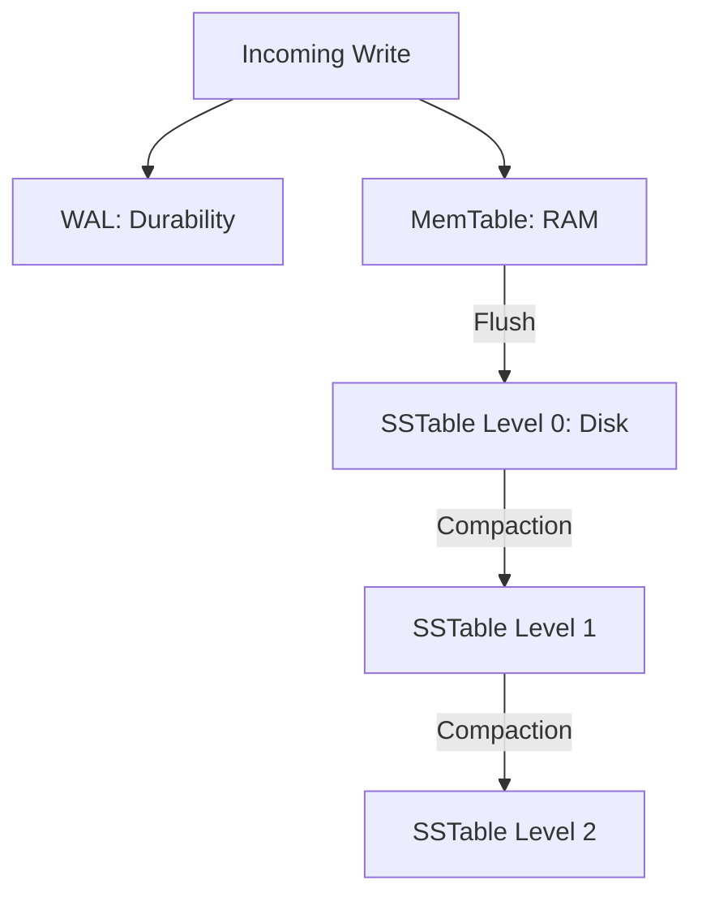

# 🧱 LSM Trees Internals: Optimized for Writes
> **Objective:** Master the Log-Structured Merge-Tree (LSM Tree) architecture used by high-throughput NoSQL databases and modern storage engines | **Language:** Hinglish | **Standard:** 2026 Expert Framework

---

## 🧭 1. Beginner-Friendly Hinglish Explanation
LSM Trees ka matlab hai "Likhne (Writes) ke liye sabse fast structure".

- **The Problem:** B-Trees (Standard DBs) mein jab hum kuch likhte hain, toh DB ko disk par 'Random' jagah dhoondhni padti hai. Disk ke liye 'Random Write' bohot slow hota hai.
- **The Solution:** LSM Tree data ko pehle RAM mein save karta hai (**MemTable**). Jab RAM bhar jata hai, toh wo pura ka pura dher ek saath disk par chipka deta hai (**SSTable**). Disk ke liye ye 'Sequential Write' bohot fast hota hai.
- **The Catch:** Data disk par bikhra hua hai (Multiple files). Isliye 'Read' karte waqt humein kai files check karni pad sakti hain (Slow read).
- **The Fix:** Piche se ek background process in files ko aapas mein "Merge" karta rehta hai (**Compaction**).
- **Intuition:** Ye "Inbox" ki tarah hai. Aap saari chitthiyaan ek dher mein dalte jate hain (Fast Write). Phir baad mein aaram se baith kar unhe folders mein arrange karte hain (Compaction).

---

## 🧠 2. Deep Technical Explanation
### 1. The Components:
- **MemTable:** An in-memory sorted structure (like a Skip List). All writes go here first.
- **WAL (Write-Ahead Log):** To ensure durability if RAM crashes.
- **SSTable (Sorted String Table):** Immutable files on disk containing sorted data.
- **Bloom Filter:** A probabilistic data structure that tells us "This key DEFINITELY isn't in this file", saving us from reading every file.

### 2. Compaction (The Secret Sauce):
- **Leveled Compaction:** Organizes SSTables into levels (L0, L1, L2). Data moves to higher levels as it gets older.
- **Size-Tiered Compaction:** Merges files of similar sizes.

### 3. Read Path:
1. Check MemTable.
2. Check Bloom Filter of SSTables.
3. If Bloom Filter says "Maybe", read the SSTable index and fetch data.

---

## 🏗️ 3. Database Diagrams (The LSM Pipeline)


---

## 💻 4. Query Execution Examples (NoSQL Context)
```sql
-- LSM Trees are usually in NoSQL DBs like Cassandra/RocksDB
-- There is no specific SQL for internals, but you can tune it:
-- Example (Cassandra):
ALTER TABLE users WITH compaction = {
  'class': 'LeveledCompactionStrategy',
  'sstable_size_in_mb': 160
};
```

---

## 🌍 5. Real-World Production Examples
- **RocksDB:** Used as the storage engine for Meta (Facebook), LinkedIn, and even some SQL DBs like MyRocks.
- **Cassandra / ScyllaDB:** Designed for massive write throughput (billions of events per day).
- **Bigtable (Google):** The original LSM tree implementation.

---

## ❌ 6. Failure Cases
- **Write Amplification:** To update one row, the DB might have to read and rewrite it 5 times during different compaction cycles. This can kill SSD lifespan.
- **Space Amplification:** Deleted data isn't actually removed until compaction happens. Your disk might show 100GB used for only 10GB of real data.
- **Compaction Lag:** Writes are coming in so fast that the background merger can't keep up. The DB runs out of disk space or becomes un-readable.

---

## 🛠️ 7. Debugging Guide
| Problem | Reason | Solution |
| :--- | :--- | :--- |
| **Reads are very slow** | Too many SSTables | Trigger a manual compaction or check Bloom Filter settings. |
| **High Disk I/O but low writes** | Write Amplification | Switch compaction strategy (e.g., from Leveled to Size-Tiered). |

---

## ⚖️ 8. Tradeoffs
- **LSM (Extreme Write speed / High Disk space / Complex Reads)** vs **B-Tree (Balanced / Low Disk space / Fast Reads).**

---

## 🛡️ 9. Security Concerns
- **Ghost Data:** Deleted data persists in old SSTables until they are merged. An attacker with physical access can read data that was "deleted" days ago.

---

## 📈 10. Scaling Challenges
- **CPU Spikes:** Compaction is a CPU-heavy process. A database can suddenly become slow because it decided to merge 50GB of files right now.

---

## ✅ 11. Best Practices
- **Use LSM for write-heavy workloads** (Logs, Metrics, IoT data).
- **Use Bloom Filters** to speed up reads.
- **Ensure you have $30-50\%$ free disk space** for compaction to work smoothly.

---

## ⚠️ 13. Common Mistakes
- **Using LSM for a database that only does reads.**
- **Setting MemTable size too small** (causes too many tiny files on disk).

---

## 📝 14. Interview Questions
1. "How does an LSM Tree handle Deletes?" (Tombstones).
2. "What is a Bloom Filter and why is it essential for LSM Trees?"
3. "Explain Write Amplification."

---

## 🚀 15. Latest 2026 Production Database Patterns
- **Tiered Storage:** LSM trees moving the oldest levels (L5, L6) to cold storage like **S3** automatically to save costs.
- **Hardware-Accelerated Compaction:** Using **FPGA** or specialized chips to handle the merging of files without using the main CPU.
漫
