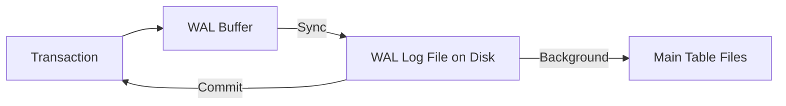

# 📝 WAL (Write-Ahead Logging): The Safety Net
> **Objective:** Understand how databases ensure data durability and crash recovery using logs before writing to the main data files | **Language:** Hinglish | **Standard:** 2026 Expert Framework

---

## 🧭 1. Beginner-Friendly Hinglish Explanation
WAL (Write-Ahead Logging) ka matlab hai "Data badalne se pehle uska hisab-kitab Diary mein likhna".

- **The Problem:** Database data badalne ke liye "Pages" use karta hai (8KB blocks). Disk par 8KB likhna slow hota hai aur crash ke waqt data aadh-adhura save ho sakta hai.
- **The Solution:** Database asli table badalne se pehle ek chhoti si "Diary" (Log file) mein entry karta hai: "Sameer ka balance 100 se 200 kar do".
- **Why WAL?** 
  - Diary (Log) mein likhna super fast hota hai kyunki hum sirf "Aakhri line" mein add kar rahe hain (Append-only).
  - Agar system crash ho gaya, toh database restart hone par Diary padhta hai aur sab kuch sahi kar deta hai.
- **Intuition:** Ye ek "Journal" ki tarah hai. Aap pehle rough diary mein likhte hain ki aaj kya kharcha hua, aur phir baad mein aaram se final accounts book (Main Data File) update karte hain.

---

## 🧠 2. Deep Technical Explanation
### 1. How it works:
When a transaction is committed:
1. The changes are recorded in the **WAL Buffer** (RAM).
2. The WAL Buffer is flushed to the **WAL Log File** on disk (Sequential I/O).
3. The transaction is marked as "Success" to the user.
4. **Later**, the actual data pages in the main table are updated (Random I/O).

### 2. Durability Guarantee:
Since the WAL is on disk, even if the "Dirty Pages" in RAM are lost during a crash, the database can **REDO** the actions from the log.

### 3. Log Sequence Number (LSN):
Every log entry has a unique ID (LSN). It helps the database know which changes have already been written to the data files and which are still only in the log.

---

## 🏗️ 3. Database Diagrams (The WAL Flow)


---

## 💻 4. Query Execution Examples (Postgres)
```sql
-- 1. Checking the current WAL location
SHOW wal_level; -- 'replica' is standard for replication.

-- 2. Forcing a log switch (advanced)
SELECT pg_switch_wal();

-- 3. Viewing WAL directory (on terminal)
-- ls /var/lib/postgresql/data/pg_wal
```

---

## 🌍 5. Real-World Production Examples
- **Crash Recovery:** A server loses power. On reboot, Postgres reads the WAL files from the last "Checkpoint" and re-applies all changes. Zero data loss.
- **Replication:** Databases send their WAL files to "Slave/Replica" servers. The Replica reads the WAL and applies the same changes.

---

## ❌ 6. Failure Cases
- **Disk Full (WAL):** If the WAL disk is full, the database will stop accepting ANY write queries (even if the main data disk is empty).
- **Corrupted WAL:** If the log file itself is corrupted, recovery becomes impossible. **Fix: Use Hardware RAID and checksums.**
- **Log Lag:** If the background process (Checkpointer) is too slow, the WAL files can grow to hundreds of GBs.

---

## 🛠️ 7. Debugging Guide
| Symptom | Reason | Solution |
| :--- | :--- | :--- |
| **High Disk Latency** | Slow Log Disk | Move WAL to a separate physical disk (preferably NVMe). |
| **Recovery takes too long** | Large WAL gap | Increase the frequency of **Checkpoints**. |

---

## ⚖️ 8. Tradeoffs
- **Synchronous WAL (Safe / Slower writes)** vs **Asynchronous WAL (Risky / Super fast writes).**

---

## 🛡️ 9. Security Concerns
- **Data Leaks in Logs:** Since WAL contains every change, an attacker who steals a WAL file can reconstruct the history of all data, including deleted rows.

---

## 📈 10. Scaling Challenges
- **WAL Throughput:** In a database doing 100,000 writes/sec, the WAL disk can become the #1 bottleneck. **Fix: Group Commit (batching multiple transactions into one WAL write).**

---

## ✅ 11. Best Practices
- **Put WAL files on a separate, high-speed disk.**
- **Monitor WAL disk space religiously.**
- **Tune `max_wal_size` and `checkpoint_timeout`** based on your traffic.

---

## ⚠️ 13. Common Mistakes
- **Disabling WAL for speed.** (Only do this for temporary data, never for user data).
- **Ignoring "Checkpoint" warnings** in the logs.

---

## 📝 14. Interview Questions
1. "Why is appending to a log faster than updating a data page?" (Sequential vs Random I/O).
2. "How does WAL help in crash recovery?"
3. "What happens to the WAL log after the data is finally written to the main table?" (It is recycled or deleted).

---

## 🚀 15. Latest 2026 Production Database Patterns
- **Remote WAL Logging:** Modern databases sending WAL entries to a remote cloud service (like Amazon S3 or a specialized Log Service) *before* committing, ensuring 100% durability even if the entire server room explodes.
- **Zero-Copy Logging:** Using direct memory access (DMA) to move logs from RAM to disk without passing through the CPU.
漫
