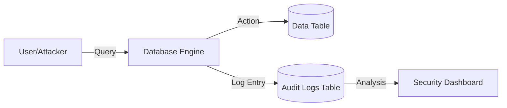

# 📋 Auditing and Compliance: Tracking Every Change
> **Objective:** Master how to log and review database activities to meet regulatory requirements and detect suspicious behavior | **Language:** Hinglish | **Standard:** 2026 Expert Framework

---

## 🧭 1. Beginner-Friendly Hinglish Explanation
Auditing aur Compliance ka matlab hai "Database ki 'CCTV Footage' rakhna aur rules follow karna".

- **The Problem:** Database mein kisi ne "Salary" badal di. Kaise pata chalega ki kisne badli? Aur kab? Bina record ke kisi ko pakadna impossible hai.
- **The Solution:** Auditing. Har ek important action (Login, Update, Delete) ka record rakho.
- **Compliance:** Ye kuch "Government Rules" hain (e.g., GDPR, SOC2) jo kehte hain ki aapko user ka data kaise handle karna hai.
- **Intuition:** Auditing ek "Bank Statement" ki tarah hai. Har transaction ke piche ek proof hona chahiye ki wo kab aur kaise hua.

---

## 🧠 2. Deep Technical Explanation
### 1. What to Audit?
- **Authentication Events:** Logins, failed attempts, logouts.
- **Data Access:** Who read sensitive tables?
- **Schema Changes (DDL):** Who dropped that table?
- **Data Changes (DML):** Old value vs New value.

### 2. Implementation Methods:
- **Database Triggers:** Creating an `audit_log` table and using triggers to populate it.
- **Native Auditing:** Built-in features like `pgAudit` (Postgres) or `Audit Plugin` (MySQL).
- **Log Scraping:** Reading the database error/general logs and sending them to ELK (Elasticsearch, Logstash, Kibana).

### 3. Compliance Frameworks:
- **SOC2:** Focuses on Security, Availability, and Privacy.
- **HIPAA:** Healthcare data security.
- **PCI-DSS:** Credit card data security.

---

## 🏗️ 3. Database Diagrams (The Audit Chain)


---

## 💻 4. Query Execution Examples (Trigger-based Auditing)
```sql
-- 1. Create the Audit Table
CREATE TABLE audit_log (
    id SERIAL PRIMARY KEY,
    table_name TEXT,
    action TEXT,
    old_data JSONB,
    new_data JSONB,
    changed_by TEXT,
    changed_at TIMESTAMP DEFAULT NOW()
);

-- 2. Trigger Function to log changes
CREATE OR REPLACE FUNCTION process_audit() RETURNS TRIGGER AS $$
BEGIN
    INSERT INTO audit_log(table_name, action, old_data, new_data, changed_by)
    VALUES (TG_TABLE_NAME, TG_OP, to_jsonb(OLD), to_jsonb(NEW), current_user);
    RETURN NEW;
END;
$$ LANGUAGE plpgsql;

-- 3. Attach to a sensitive table
CREATE TRIGGER tr_audit_users
AFTER UPDATE OR DELETE ON users
FOR EACH ROW EXECUTE FUNCTION process_audit();
```

---

## 🌍 5. Real-World Production Examples
- **Fintech Startup:** They must provide an audit trail of every balance change to the RBI/SEC regulators every year.
- **Forensics:** After a hack, the security team uses `pgAudit` logs to see that an intern's compromised account was used to download the entire `customers` table.

---

## ❌ 6. Failure Cases
- **Logging Everything:** Log files fill up the disk in 1 hour because you logged every single `SELECT` on a high-traffic table.
- **Circular Audit:** Auditing the `audit_log` table itself (Infinite loop!).
- **Tampering:** An admin deletes their own "Malicious" entry from the audit log. **Fix: Send logs to a separate "WORM" (Write-Once-Read-Many) storage.**

---

## 🛠️ 7. Debugging Guide
| Problem | Reason | Solution |
| :--- | :--- | :--- |
| **Audit table is too big** | High-volume table | Log only specific columns (e.g., `salary`, `email`) instead of the whole row. |
| **Who did it?** | Shared DB user | Stop using a single `app_user` for everything; use "Session Variables" to pass the real User ID to the DB. |

---

## ⚖️ 8. Tradeoffs
- **Deep Auditing (High Security / Performance penalty)** vs **Minimal Auditing (Low Security / Faster).**

---

## 🛡️ 9. Security Concerns
- **Log Injection:** An attacker providing a name like `Admin - SUCCESS` to make the log look like they didn't fail.
- **Privacy Leak:** The audit log itself might contain sensitive data (e.g., old password hashes). **Fix: Mask sensitive fields in the audit function.**

---

## 📈 10. Scaling Challenges
- **The "Audit Bottleneck":** Writing a log for every write query doubles the I/O load. **Fix: Use Asynchronous logging (e.g., sending logs to Kafka).**

---

## ✅ 11. Best Practices
- **Store audit logs in a separate database or external service.**
- **Log the "Context"** (User ID, IP Address, Timestamp, Application Name).
- **Automate the review process** with alerts for suspicious actions (e.g., "500 deletes in 1 second").
- **Maintain logs for the required duration** (e.g., 7 years for financial data).

---

## ⚠️ 13. Common Mistakes
- **Storing audit logs on the same disk as data.**
- **Not auditing "Failed Login" attempts.**

---

## 📝 14. Interview Questions
1. "How would you implement auditing in a database that doesn't have it built-in?"
2. "What are the performance implications of auditing every query?"
3. "How do you ensure an Admin cannot delete their own audit trail?"

---

## 🚀 15. Latest 2026 Production Database Patterns
- **Immutable Audit Trails:** Using **Blockchain** or "Ledger Databases" (like **Amazon QLDB**) to store audit logs that are mathematically impossible to change or delete.
- **AI Audit Analysis:** AI agents that continuously scan audit logs to detect "Insider Threats" or "Anomalous Behavior" without human intervention.
漫
