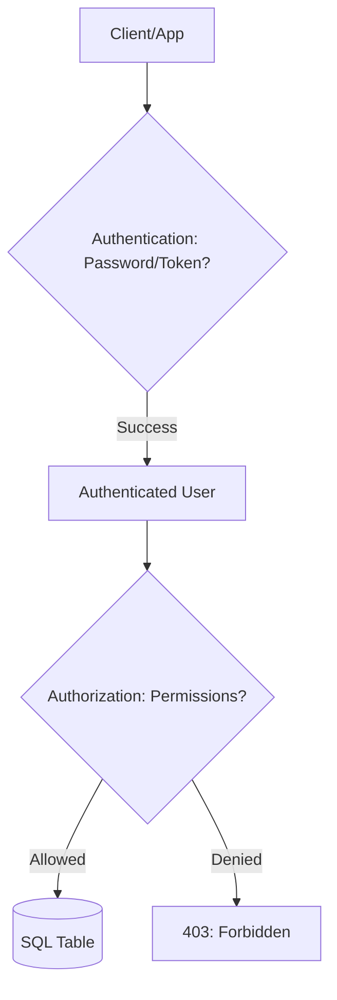

# 🔐 Authentication and Authorization: Securing the Gate
> **Objective:** Master how to manage users, roles, and permissions to ensure only authorized entities can access or modify data | **Language:** Hinglish | **Standard:** 2026 Expert Framework

---

## 🧭 1. Beginner-Friendly Hinglish Explanation
Authentication aur Authorization ka matlab hai "Kaun ho aap? (Identity)" aur "Kya kar sakte ho? (Power)".

- **Authentication (AuthN):** "Pehchan". Database ye check karta hai ki aap wahi hain jo aap claim kar rahe hain. (e.g., Username + Password check karna).
- **Authorization (AuthZ):** "Ijazat". Identity confirm hone ke baad, database ye check karta hai ki aapko `SELECT` karne ki ijazat hai ya `DELETE` karne ki?
- **RBAC (Role-Based Access Control):** Sabko alag-alag permission dene ke bajaye, hum "Roles" banate hain (e.g., `Intern`, `Manager`, `Admin`). Phir user ko role assign kar dete hain.
- **Intuition:** Authentication ek "ID Card" dikhane jaisa hai. Authorization ye check karna hai ki aap us ID card se "Server Room" mein ja sakte hain ya sirf "Cafeteria" mein.

---

## 🧠 2. Deep Technical Explanation
### 1. The Principle of Least Privilege (PoLP):
A user should only have the minimum permissions necessary to perform their job.
- **Bad:** Giving the `Admin` role to a reporting tool.
- **Good:** Creating a `read_only_reporter` role.

### 2. Privilege Types:
- **Object Privileges:** Access to specific tables, views, or procedures (SELECT, INSERT, UPDATE, DELETE).
- **System Privileges:** Ability to perform administrative tasks (CREATE TABLE, DROP DATABASE, BACKUP).

### 3. Granting & Revoking:
- `GRANT`: Give permission.
- `REVOKE`: Take away permission.
- `WITH GRANT OPTION`: Allows the user to give their permission to others (Dangerous!).

---

## 🏗️ 3. Database Diagrams (The Security Layer)


---

## 💻 4. Query Execution Examples (Postgres/MySQL)
```sql
-- 1. Create a Role (Postgres)
CREATE ROLE analytics_team;

-- 2. Grant permissions to the role
GRANT SELECT ON ALL TABLES IN SCHEMA public TO analytics_team;

-- 3. Create a User and assign the role
CREATE USER sameer WITH PASSWORD 'secure_pass_123';
GRANT analytics_team TO sameer;

-- 4. Revoking permissions
REVOKE DELETE ON orders FROM sameer;
```

---

## 🌍 5. Real-World Production Examples
- **Reporting Dashboard:** Uses a user with `SELECT` only permission to prevent accidental data deletion.
- **Application Backend:** Uses a specific `app_user` role that has `CRUD` on tables but cannot `DROP` them.
- **Compliance:** Using "Row-Level Security" (RLS) to ensure a Manager can only see employees in *their* department.

---

## ❌ 6. Failure Cases
- **Using 'Root' or 'Postgres' user for App:** If the app is hacked, the attacker has full control of the entire database server.
- **Publicly Accessible DB:** Exposing the DB port (5432/3306) to the internet without a firewall or VPC.
- **Hardcoded Credentials:** Storing DB passwords in plain text in the source code. **Fix: Use Environment Variables or Secret Managers.**

---

## 🛠️ 7. Debugging Guide
| Problem | Reason | Solution |
| :--- | :--- | :--- |
| **Permission Denied** | Missing Grant | Check the specific table and action. Run `GRANT SELECT ON table TO user`. |
| **Too many connections** | App user mismanaged | Ensure the app is using a connection pool with the correct credentials. |

---

## ⚖️ 8. Tradeoffs
- **Granular Permissions (Very safe / Complex to manage)** vs **Simplified Roles (Easy to manage / Slightly less safe).**

---

## 🛡️ 9. Security Concerns
- **Privilege Escalation:** A user with a low-level role finding a way to gain Admin permissions.
- **Brute Force:** Trying thousands of passwords to log into the DB user account. **Fix: Use 'IP Whitelisting' and 'IAM Auth'.**

---

## 📈 10. Scaling Challenges
- **Role Sync:** Managing thousands of users across 10 different database clusters. **Fix: Use LDAP or Active Directory integration.**

---

## ✅ 11. Best Practices
- **Never use the 'admin' user for daily app tasks.**
- **Use Roles instead of individual user permissions.**
- **Rotate passwords regularly.**
- **Enable Row-Level Security (RLS) for multi-tenant apps.**

---

## ⚠️ 13. Common Mistakes
- **Granting `ALL PRIVILEGES` to everyone.**
- **Forgetting to revoke permissions for employees who left the company.**

---

## 📝 14. Interview Questions
1. "Difference between Authentication and Authorization?"
2. "What is the Principle of Least Privilege?"
3. "How would you secure a database from unauthorized access?"

---

## 🚀 15. Latest 2026 Production Database Patterns
- **IAM Authentication:** Using AWS/Azure Identity tokens instead of passwords to log into the database. (No more passwords in config files!).
- **Zero-Trust Database Access:** Every single query is verified for identity and intent, even if it comes from the internal network.
漫
