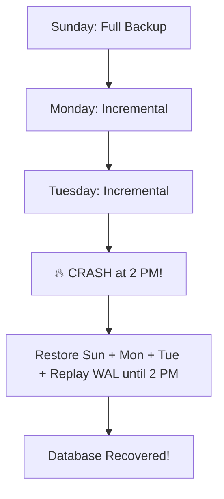

# 💾 Backup and Recovery: The Insurance Policy
> **Objective:** Master the strategies for backing up data and restoring it after failure to minimize downtime and data loss | **Language:** Hinglish | **Standard:** 2026 Expert Framework

---

## 🧭 1. Beginner-Friendly Hinglish Explanation
Backup aur Recovery ka matlab hai "Data ka bima (Insurance) aur use wapas pana".

- **The Problem:** Database crash ho sakta hai, disk kharab ho sakti hai, ya koi galti se `DROP DATABASE` chala sakta hai.
- **The Solution:** Humein data ki copies bana kar rakhni chahiye.
- **The 3 Main Types:** 
  1. **Full Backup:** Puri table ka ek snapshot (e.g., Every Sunday).
  2. **Incremental/Differential:** Sirf wahi data jo pichle backup ke baad badla hai. (Saves space).
  3. **Point-in-Time Recovery (PITR):** WAL logs ko use karke database ko "Theek us second" par wapas le jana jab galti hui thi.
- **Intuition:** Backup ek "Old Photo" ki tarah hai. Recovery us photo ko wapas frame mein lagana hai. PITR ek "Time Machine" ki tarah hai jo aapko past mein le jati hai.

---

## 🧠 2. Deep Technical Explanation
### 1. RPO and RTO:
- **RPO (Recovery Point Objective):** Kitna data loss hum bardasht kar sakte hain? (e.g., "Humein 5 min purana data milna chahiye").
- **RTO (Recovery Time Objective):** Kitni jaldi database wapas online hona chahiye? (e.g., "1 ghante mein site chalni chahiye").

### 2. Logical vs Physical Backup:
- **Logical (`mysqldump`, `pg_dump`):** Data ko SQL commands mein export karna. (Portable, slow for large DBs).
- **Physical (File copy):** Disk ke 8KB pages ko sidha copy karna. (Super fast, DB engine dependent).

### 3. Point-in-Time Recovery (PITR):
By combining a Full Backup with WAL (Write-Ahead Logs), you can replay the logs to reach any specific timestamp.

---

## 🏗️ 3. Database Diagrams (The Backup Strategy)


---

## 💻 4. Query Execution Examples (Postgres/MySQL)
```bash
# 1. Logical Backup (Postgres)
pg_dump -U username dbname > backup.sql

# 2. Restore from Logical Backup
psql -U username dbname < backup.sql

# 3. MySQL Full Backup
mysqldump -u root -p --all-databases > alldbs.sql
```

---

## 🌍 5. Real-World Production Examples
- **GitLab Incident (2017):** They accidentally deleted 300GB of production data. They discovered that out of 5 backup methods, NONE worked. **Lesson: A backup is only as good as its last RESTORE test.**
- **AWS RDS:** Automatically handles daily backups and 35-day PITR for you.

---

## ❌ 6. Failure Cases
- **The Un-tested Backup:** You have 100 backups, but when you try to restore, the files are corrupted.
- **Off-site Backup Failure:** Backing up to the same disk where the database is. If the disk dies, both DB and Backup are gone. **Fix: Store backups in S3 or another region.**
- **Stale Backups:** Your backup is 24 hours old, so you lose an entire day's worth of orders.

---

## 🛠️ 7. Debugging Guide
| Tool | Action | Goal |
| :--- | :--- | :--- |
| **Check Integrity** | `sha256sum` | Verify that the backup file hasn't been changed. |
| **Test Restore** | Weekly Cron | Automatically restore the backup to a "Staging" server once a week. |

---

## ⚖️ 8. Tradeoffs
- **Logical (Small/Flexible/Slow)** vs **Physical (Large/Fast/Rigid).**

---

## 🛡️ 9. Security Concerns
- **Backup Encryption:** Backups must be encrypted. An unencrypted backup is a "Gold Mine" for hackers.
- **Access Control:** Only the SRE/DBA team should be able to access the backup storage.

---

## 📈 10. Scaling Challenges
- **The "Huge DB" Problem:** Backing up a 100TB database. **Fix: Use 'Storage Snapshots' (EBS/ZFS) instead of file-level backups.**

---

## ✅ 11. Best Practices
- **The 3-2-1 Rule:** 3 copies of data, on 2 different media, with 1 copy off-site.
- **Automate your backups.**
- **TEST RESTORATION REGULARLY.** (A backup that can't be restored is not a backup).
- **Encrypt and compress backups.**

---

## ⚠️ 13. Common Mistakes
- **Assuming that "Replication" is a backup.** (If you delete a row on Master, it's deleted on Replica too. Backup is a "Past State").
- **Not backing up the WAL logs.**

---

## 📝 14. Interview Questions
1. "Difference between RPO and RTO?"
2. "How would you recover a database to 10:05 AM today?" (PITR).
3. "Logical vs Physical Backups: When to use which?"

---

## 🚀 15. Latest 2026 Production Database Patterns
- **Zero-Downtime Backups:** Using "Copy-on-Write" snapshots to take a backup of a live, high-traffic database without slowing it down.
- **Immutable Backups:** Storing backups in an "S3 Object Lock" bucket where they cannot be deleted or changed even by an Admin (Protects against Ransomware).
漫
