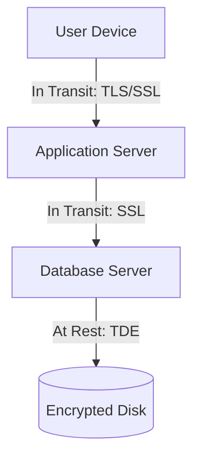

# 🔐 Data Encryption: Protecting Privacy
> **Objective:** Master the techniques of encrypting data at rest and in transit to comply with security standards like GDPR and HIPAA | **Language:** Hinglish | **Standard:** 2026 Expert Framework

---

## 🧭 1. Beginner-Friendly Hinglish Explanation
Data Encryption ka matlab hai "Data ko ek aisi secret language mein badalna jise koi bin chabi ke na padh sake".

- **The Problem:** Agar koi aapka database server chura le, ya data network par travel karte waqt koi "Hacker" beech mein use intercept kar le, toh aapka sara secret data leak ho jayega.
- **The Solution:** Data ko encrypt karo.
- **The 2 Main Types:** 
  1. **Encryption in Transit:** Jab data "Browser se Server" ja raha hai. (e.g., HTTPS/SSL).
  2. **Encryption at Rest:** Jab data "Disk par save" hai. (e.g., TDE - Transparent Data Encryption).
- **Intuition:** Encryption ek "Digital Safe" ki tarah hai. Aapka data safe ke andar hai. Bhale hi koi safe utha kar le jaye, jab tak uske paas "Chabi" (Key) nahi hai, wo data nahi dekh sakta.

---

## 🧠 2. Deep Technical Explanation
### 1. Symmetrical vs Asymmetrical:
- **Symmetric:** Same key for both encrypting and decrypting. (Fast, used for large data).
- **Asymmetric:** Public key to encrypt, Private key to decrypt. (Secure, used for establishing connections).

### 2. TDE (Transparent Data Encryption):
The database engine automatically encrypts data pages before writing them to disk and decrypts them when reading. The application doesn't even know it's happening.

### 3. Hashing vs Encryption:
- **Encryption:** Two-way. You can get the original data back with a key.
- **Hashing (Passwords):** One-way. You can't get the original password back. You only compare the "Hash". (e.g., bcrypt, Argon2).

---

## 🏗️ 3. Database Diagrams (The Encryption Layers)


---

## 💻 4. Query Execution Examples
```sql
-- 1. Enabling SSL/TLS Connection (Client side)
-- mysql -u sameer -p --ssl-mode=REQUIRED

-- 2. Hashing a password (Application side logic)
-- const hashed = await bcrypt.hash(password, 12);

-- 3. Encrypting a specific column (Postgres pgcrypto)
INSERT INTO sensitive_data (user_id, secret) 
VALUES (1, pgp_sym_encrypt('Secret Message', 'my_key'));

-- 4. Decrypting
SELECT pgp_sym_decrypt(secret, 'my_key') FROM sensitive_data;
```

---

## 🌍 5. Real-World Production Examples
- **Banking:** Every credit card number is encrypted at rest using AES-256.
- **Healthcare:** HIPAA regulations require all patient records to be encrypted.
- **Compliance:** GDPR mandates "Pseudonymization" and encryption of personal data.

---

## ❌ 6. Failure Cases
- **Key Loss:** Losing the encryption key means your data is lost forever. There is no "Forgot Password" for database encryption keys.
- **Hardcoded Keys:** Putting the encryption key in your `settings.json` or Git repository. **Fix: Use AWS KMS or HashiCorp Vault.**
- **Weak Algorithms:** Using MD5 or SHA1 (which are broken). **Fix: Use SHA-256 or Argon2.**

---

## 🛠️ 7. Debugging Guide
| Problem | Reason | Solution |
| :--- | :--- | :--- |
| **Performance Drop** | CPU overhead | Use Hardware-accelerated encryption (AES-NI) on your CPU. |
| **SSL Handshake Error** | Expired Certificate | Renew your SSL/TLS certificates for the DB connection. |

---

## ⚖️ 8. Tradeoffs
- **Full Encryption (Super secure / High CPU cost / Hard to search)** vs **No Encryption (Risky / Fast).** You cannot use standard indexes on encrypted columns.

---

## 🛡️ 9. Security Concerns
- **Side-Channel Attacks:** An attacker measuring how long the decryption takes to guess the key.
- **Searchable Encryption:** If you need to search an encrypted column (like `SELECT * WHERE email = '...'`), you need special techniques like "Deterministic Encryption".

---

## 📈 10. Scaling Challenges
- **Key Rotation:** Changing the key for a 10TB database without stopping the service.

---

## ✅ 11. Best Practices
- **Encrypt everything in transit (SSL/TLS).**
- **Encrypt PII (Personally Identifiable Information) at rest.**
- **Never store passwords as plain text or encrypted.** Always **HASH** them.
- **Use a dedicated Key Management Service (KMS).**

---

## ⚠️ 13. Common Mistakes
- **Using a single key for all users.**
- **Not encrypting Backups.** (An attacker can steal the backup file!).

---

## 📝 14. Interview Questions
1. "Difference between Encryption at Rest and Encryption in Transit?"
2. "Why should you hash passwords instead of encrypting them?"
3. "What is TDE and how does it work?"

---

## 🚀 15. Latest 2026 Production Database Patterns
- **Homomorphic Encryption:** Performing calculations (like `SUM`) on encrypted data without ever decrypting it. (The DB knows the sum, but doesn't know the individual numbers!).
- **Confidential Computing:** Running the database inside a "Secure Enclave" (like Intel SGX) where even the server admin can't see the RAM data.
漫
