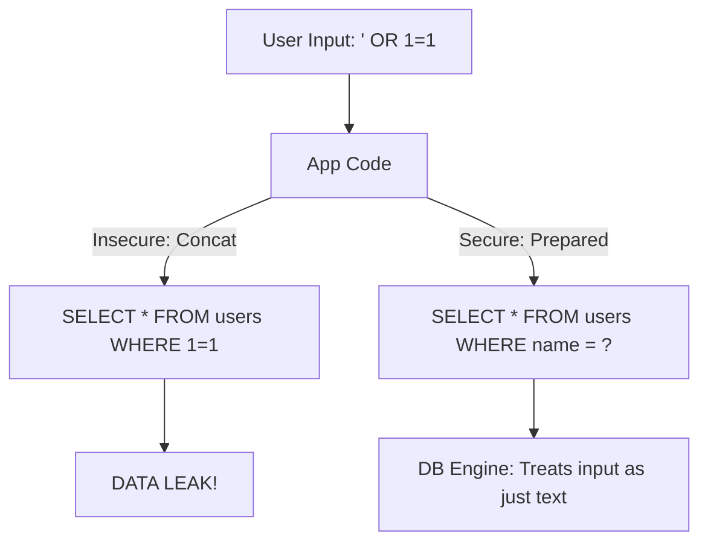

# 🛡️ SQL Injection Prevention: Coding Securely
> **Objective:** Master how to identify and prevent SQL Injection—the #1 vulnerability in database-driven applications | **Language:** Hinglish | **Standard:** 2026 Expert Framework

---

## 🧭 1. Beginner-Friendly Hinglish Explanation
SQL Injection ka matlab hai "User ke input ke zariye database ko cheat karna".

- **The Problem:** Socho aapne login ke liye query likhi: `SELECT * FROM users WHERE name = '` + user_input + `'`. Agar user apna naam `' OR 1=1 --` daal de, toh query ban jayegi `SELECT * FROM users WHERE name = '' OR 1=1 --'`. Iska matlab password check hi nahi hoga aur user login ho jayega!
- **The Solution:** Kabhi bhi user input ko query string ke saath "Chipkao" (Concatenate) mat.
- **The Best Tool:** **Prepared Statements** (Parameterized Queries).
- **Intuition:** Ye ek "Form" bharne jaisa hai. Aap pura letter nahi likhte, aap sirf khaali boxes bharte hain. Database ko pehle se pata hai ki box mein sirf "Naam" aana chahiye, "SQL Code" nahi.

---

## 🧠 2. Deep Technical Explanation
### 1. Types of SQL Injection:
- **In-band (Classic):** Attacker sees results on the screen.
- **Inferential (Blind):** Attacker observes the response time or generic errors to guess data.
- **Out-of-band:** Attacker makes the DB send data to their own server.

### 2. Prepared Statements (The Savior):
The SQL query is sent to the DB **first** with placeholders (`?` or `$1`). The DB parses and optimizes the query. **Later**, the data is sent. The data is treated strictly as a string, never as code.

### 3. Escaping:
Turning dangerous characters like `'` into `\'`. (Better than nothing, but not as safe as Prepared Statements).

---

## 🏗️ 3. Database Diagrams (The Injection Wall)


---

## 💻 4. Query Execution Examples (Node.js/Python)
```javascript
// ❌ Dangerous (SQL Injection prone)
const query = `SELECT * FROM users WHERE id = ${req.body.id}`;
db.query(query);

// ✅ Secure (Prepared Statement)
const query = "SELECT * FROM users WHERE id = ?";
db.execute(query, [req.body.id]); 

// The DB gets the query once, and the data separately.
```

---

## 🌍 5. Real-World Production Examples
- **The 2015 TalkTalk Hack:** Over 150,000 customers' data was stolen because of a simple SQL injection in a legacy form.
- **ORM (Prisma/Sequelize):** Most modern ORMs use Prepared Statements by default, protecting you automatically.

---

## ❌ 6. Failure Cases
- **Dynamic Table Names:** You can't use `?` for table names (e.g., `SELECT * FROM ?`). If you let users choose a table name, you must use a "Whitelisting" approach.
- **Stored Procedures:** If a stored procedure uses `EXECUTE` with string concatenation inside, it's still vulnerable.
- **Blind Injection:** Even if you don't show errors, an attacker can use `SLEEP(10)` to see if a condition is true.

---

## 🛠️ 7. Debugging Guide
| Risk | Detection | Fix |
| :--- | :--- | :--- |
| **User Input in SQL** | Code review for `+` or `${}` in SQL | Replace with placeholders `?`. |
| **Error Messages** | Check if DB errors are shown to users | Turn off "Display Errors" in production. |

---

## ⚖️ 8. Tradeoffs
- **Prepared Statements (High Security / Slightly more code)** vs **Manual Concatenation (High Risk / Faster to type).**

---

## 🛡️ 9. Security Concerns
- **Second-Order Injection:** Data is saved safely, but later it's used in another insecure query elsewhere in the app.

---

## 📈 10. Scaling Challenges
- **Prepared Statement Cache:** Reusing statements is fast, but if you have 10,000 unique queries, the DB's memory for prepared statements might fill up.

---

## ✅ 11. Best Practices
- **Use an ORM or a Query Builder** that handles parameters.
- **Validate and Sanitize** input on the frontend and backend.
- **Use a Web Application Firewall (WAF)** like Cloudflare to block common injection patterns.
- **Follow the Principle of Least Privilege** (The DB user should not have permission to `DROP` tables).

---

## ⚠️ 13. Common Mistakes
- **Assuming `mysql_real_escape_string` is enough.** (It's not, Prepared Statements are the standard).
- **Thinking that NoSQL (MongoDB) is immune.** (They have NoSQL Injection!).

---

## 📝 14. Interview Questions
1. "How does a Prepared Statement prevent SQL Injection?"
2. "What is Blind SQL Injection?"
3. "Can you use placeholders for Table or Column names?" (No).

---

## 🚀 15. Latest 2026 Production Database Patterns
- **Static Analysis in CI/CD:** Tools that automatically scan your code for potential SQL injections before it ever reaches production.
- **Database Proxy Security:** Proxies like **ProxySQL** or **PgBouncer** that can intercept and block malicious-looking queries before they hit the DB engine.
漫
