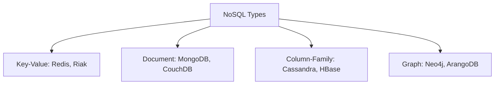

# 🍃 NoSQL Databases: Overview and Classification
> **Note:** This section introduces the concept of Non-Relational databases. For detailed guides on Key-Value, Document, Columnar, and Graph stores, please see the [08_NoSQL_Databases](../08_NoSQL_Databases/) module.

## 🧭 1. What is NoSQL?
NoSQL ("Not Only SQL") refers to database systems that do not use the traditional table/row structure of relational databases. They are designed for:
- **High Velocity:** Fast writes for real-time data.
- **High Variety:** Handling JSON, Graphs, and unstructured text.
- **Horizontal Scale:** Running across hundreds of servers.

## 🧠 2. The Four Pillars of NoSQL

## 🏗️ 3. When to choose NoSQL?
1. **Dynamic Schema:** When your data structure changes frequently.
2. **Big Data:** When you have petabytes of data that won't fit on one server.
3. **Availability > Consistency:** When you need the database to stay up even if some nodes fail (CAP Theorem).

For detailed technical guides, explore the sister module: **[Module 08: NoSQL Databases](../08_NoSQL_Databases/)**.
