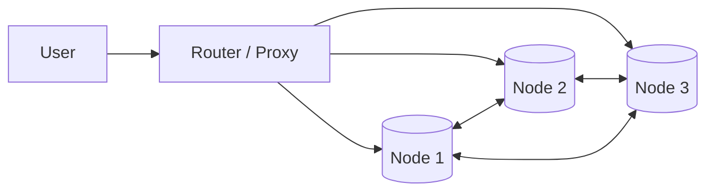

# 🌐 Distributed Databases: Foundations
> **Note:** This section introduces the core principles of distributed computing in databases. For deep dives into Replication, Sharding, and CAP Theorem, please see the [09_Distributed_Databases](../09_Distributed_Databases/) module.

## 🧭 1. What are Distributed Databases?
A distributed database consists of two or more nodes located in different physical locations (servers/regions) that work together as a single system.

## 🧠 2. Core Challenges
1. **Network Reliability:** The network between nodes will eventually fail.
2. **Consistency:** Ensuring every user sees the same data at the same time.
3. **Partial Failure:** One server dies, but the rest must keep running.

## 🏗️ 3. The Shared-Nothing Architecture
Most modern distributed databases (like CockroachDB or Cassandra) use a **Shared-Nothing** architecture where every node has its own CPU, RAM, and Disk, and they communicate via message passing.

For detailed technical guides, explore the sister module: **[Module 09: Distributed Databases](../09_Distributed_Databases/)**.
