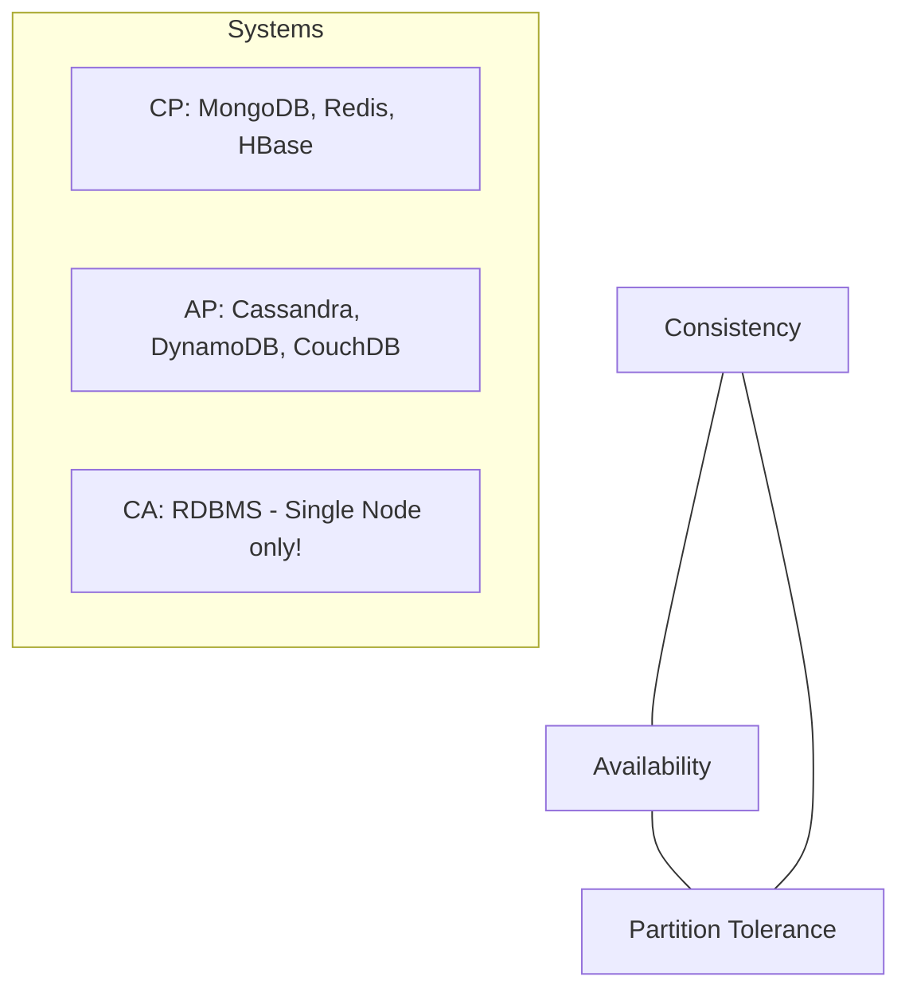

# 🌐 CAP Theorem: The Law of Distributed Systems
> **Objective:** Understand the fundamental trade-off between Consistency, Availability, and Partition Tolerance in distributed databases | **Language:** Hinglish | **Standard:** 2026 Expert Framework

---

## 🧭 1. Beginner-Friendly Hinglish Explanation
CAP Theorem ka matlab hai "Distributed systems ka sabse bada kanoon (Law)".

- **The Idea:** Jab aapka database ek se zyada servers par chalta hai, toh aap ye 3 cheezein chahte hain:
  1. **C (Consistency):** Sabko hamesha latest data dikhe.
  2. **A (Availability):** Database hamesha chalta rahe, bhale hi koi server down ho.
  3. **P (Partition Tolerance):** Agar servers ke beech ka connection (Network) toot jaye, toh bhi system kaam kare.
- **The Rule:** CAP Theorem kehta hai ki aap in 3 mein se sirf **2** hi choose kar sakte hain. Aap teeno ek saath 100% kabhi nahi paa sakte.
- **Intuition:** Ye "College Life" jaisa hai. Aapke paas teen cheezein hain: "Good Grades", "Enough Sleep", aur "Social Life". Aap sirf 2 hi dhang se handle kar sakte hain.

---

## 🧠 2. Deep Technical Explanation
### 1. Consistency (C):
Every read receives the most recent write or an error.
- **CP Systems:** (Consistency + Partition Tolerance). If the network breaks, the DB stops working (becomes unavailable) to ensure no one reads old data. (e.g., HBase, MongoDB).

### 2. Availability (A):
Every request receives a (non-error) response, without the guarantee that it contains the most recent write.
- **AP Systems:** (Availability + Partition Tolerance). If the network breaks, the DB keeps working, but different servers might show different data (Eventual Consistency). (e.g., Cassandra, DynamoDB).

### 3. Partition Tolerance (P):
The system continues to operate despite an arbitrary number of messages being dropped or delayed by the network between nodes.
- **The Reality:** In a distributed system, **P is mandatory**. Network will fail. So the real choice is between **CP** and **AP**.

---

## 🏗️ 3. Database Diagrams (The CAP Triangle)


---

## 💻 4. Query Execution Examples (Consistency Choice)
```sql
-- In NoSQL DBs like Cassandra (AP), you can choose your level:

-- 1. High Availability (ANY)
SELECT * FROM users USING CONSISTENCY ANY; -- Super fast, might be old data.

-- 2. High Consistency (QUORUM)
SELECT * FROM users USING CONSISTENCY QUORUM; -- Slower, but most nodes must agree.
```

---

## 🌍 5. Real-World Production Examples
- **Banking (CP):** If the network between two bank branches is down, they will stop processing ATM withdrawals to ensure you don't spend more than you have.
- **Social Media (AP):** If the network is down, you might see an old "Like" count on a post. It's okay. The priority is that the app keeps running.

---

## ❌ 6. Failure Cases
- **PACELC Theorem:** An extension of CAP. It says "If there is a Partition (P), choose between Availability (A) and Consistency (C); Else (E), choose between Latency (L) and Consistency (C)".
- **Network Split:** Half of the servers think the price is $10, the other half thinks it's $12. If the system is AP, users get different prices.

---

## 🛠️ 7. Debugging Guide
| Problem | Reason | Solution |
| :--- | :--- | :--- |
| **System is down during network glitch** | You chose a CP system | Switch to an AP system if 100% consistency is not mandatory. |
| **Users seeing old data** | Eventual Consistency (AP) | Increase the "Read Consistency" level in your query. |

---

## ⚖️ 8. Tradeoffs
- **CP (Safe/Legal/Strict)** vs **AP (Fast/Global/Flexible).**

---

## 🛡️ 9. Security Concerns
- **Consistency Attacks:** Attackers intentionally causing network partitions to exploit "Eventual Consistency" gaps (e.g., Double-spending in an AP system).

---

## 📈 10. Scaling Challenges
- **Strong Consistency at Global Scale:** Trying to make a server in New York and a server in Tokyo perfectly consistent. The speed of light becomes the limit (Latency).

---

## ✅ 11. Best Practices
- **Understand your business needs first.** (Do you need 100% accuracy or 100% uptime?).
- **Use AP for high-traffic public features** (Likes, Comments).
- **Use CP for critical financial or identity data.**
- **Monitor "Replication Lag"** to see how "Eventually Consistent" you really are.

---

## ⚠️ 13. Common Mistakes
- **Thinking you can have CA (Consistency + Availability) in a multi-node system.** (You can't. If the network fails, you must choose C or A).
- **Assuming all NoSQL databases are the same.**

---

## 📝 14. Interview Questions
1. "Explain the CAP Theorem with a real-life example."
2. "Why is Partition Tolerance mandatory for distributed systems?"
3. "Can a database be both CP and AP at different times?" (Yes, many modern DBs allow per-query settings).

---

## 🚀 15. Latest 2026 Production Database Patterns
- **Tunable Consistency:** Databases like **CosmosDB** or **Cassandra** that allow you to pick 5 different levels of consistency (Strong, Bounded Staleness, Session, Consistent Prefix, Eventual).
- **TrueTime (Spanner):** Google's way of "Breaking" CAP by using high-precision atomic clocks to achieve global consistency with high availability.
漫
