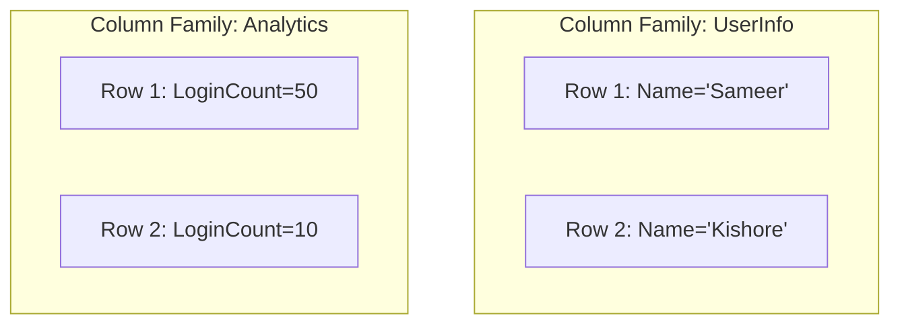

# 📊 Column-Family Stores: Massive Scale Analytics
> **Objective:** Master the concept of Wide-Column (Column-Family) databases like Cassandra used for petabyte-scale data and high-availability systems | **Language:** Hinglish | **Standard:** 2026 Expert Framework

---

## 🧭 1. Beginner-Friendly Hinglish Explanation
Column-Family Stores ka matlab hai "Data ko Columns ke groups mein save karna".

- **The Problem:** SQL database mein agar aapke paas 100 columns hain, aur aap sirf "Email" aur "Name" dhoondhna chahte hain, toh database ko puri row padhni padti hai. 1 billion rows ke liye ye bohot slow hai.
- **The Solution:** Column-Family stores data ko columns ke hisab se save karte hain. Saare "Emails" ek saath disk par honge, aur saare "Names" ek saath.
- **Why use it?** 
  - **Massive Write Speed:** Ye likhne (Writes) mein bohot fast hote hain (LSM Trees use karte hain).
  - **High Availability:** Ye kabhi down nahi hote. Data multiple servers par copy hota hai.
- **Intuition:** SQL ek "Horizontal" approach hai (Row-by-row). Column-Family ek "Vertical" approach hai. Ye tab use hota hai jab aapke paas "Big Data" ho (Terabytes/Petabytes).

---

## 🧠 2. Deep Technical Explanation
### 1. Data Model:
It uses a multidimensional map: `(RowKey, ColumnFamily, ColumnQualifier, Timestamp) -> Value`.
- **Row Key:** Unique ID for the row.
- **Column Family:** A group of related columns (e.g., `ProfileInfo`, `Financials`).
- **Timestamp:** Every version of data is saved with a timestamp.

### 2. Distributed Architecture (No Master):
Databases like **Cassandra** use a "Ring" architecture. Every node is equal. If 3 servers die, the system still works perfectly.

### 3. Sparse Data:
Unlike SQL, you don't waste space for NULL values. If a row doesn't have a column, nothing is stored on disk for it.

---

## 🏗️ 3. Database Diagrams (The Columnar Layout)


---

## 💻 4. Query Execution Examples (CQL - Cassandra Query Language)
```sql
-- 1. Creating a Keyspace (Like a Database)
CREATE KEYSPACE my_app WITH replication = {'class': 'SimpleStrategy', 'replication_factor': 3};

-- 2. Creating a Table
CREATE TABLE users (
    user_id UUID PRIMARY KEY,
    name text,
    emails set<text>, -- Support for collections!
    last_login timestamp
);

-- 3. Inserting data (Instant write)
INSERT INTO users (user_id, name) VALUES (uuid(), 'Sameer');
```

---

## 🌍 5. Real-World Production Examples
- **Instagram:** Uses Cassandra to store the "Activity Feed" and "Likes" for millions of users.
- **Apple:** Uses over 160,000 Cassandra nodes to store iCloud and Siri data.
- **Netflix:** Uses it for viewing history and recommendation data.

---

## ❌ 6. Failure Cases
- **No Joins:** You cannot join tables in Cassandra. You MUST design your tables based on your queries (**Query-driven Design**). If you need a new query, you often create a new table.
- **Tombstones:** When you delete data, it's not removed immediately; a "Tombstone" is placed. If you have too many deletes, queries become slow as the DB scans through tombstones.
- **Eventual Consistency:** User A updates their profile, but User B sees the old profile for a few milliseconds.

---

## 🛠️ 7. Debugging Guide
| Problem | Reason | Solution |
| :--- | :--- | :--- |
| **Data is out of sync** | Network partition | Use `NODETOOL REPAIR` to sync data across nodes. |
| **High Latency** | Bad Partition Key | Change your Partition Key so data is spread evenly across servers (Avoid 'Hotspots'). |

---

## ⚖️ 8. Tradeoffs
- **Scale (Infinite / High Availability)** vs **Flexibility (No Joins / Strict Querying).**

---

## 🛡️ 9. Security Concerns
- **Replication Leak:** Data is copied across many servers. If one server is insecure, the whole data set is at risk.
- **Default Superuser:** Many Cassandra installs forget to change the default `cassandra/cassandra` credentials.

---

## 📈 10. Scaling Challenges
- **Adding Capacity:** When you add more nodes, the DB has to "Stream" data to the new nodes, which can use a lot of network bandwidth.

---

## ✅ 11. Best Practices
- **Design for your queries, not for your data.** (Table-per-Query).
- **Keep partitions small** (Aim for < 100MB per partition).
- **Use meaningful Replication Factors** (usually 3).
- **Avoid frequent deletes.**

---

## ⚠️ 13. Common Mistakes
- **Trying to use Cassandra like MySQL.**
- **Using a high-cardinality column** (like Timestamp) as a partition key.

---

## 📝 14. Interview Questions
1. "How does Cassandra handle high availability without a Master node?"
2. "What is a Partition Key and why is it important?"
3. "Explain 'Tombstones' in Column-Family databases."

---

## 🚀 15. Latest 2026 Production Database Patterns
- **ScyllaDB:** A C++ rewrite of Cassandra that is $10x$ faster by using every CPU core independently (Shared-nothing architecture).
- **Serverless Wide-column:** AWS Keyspaces which provides a Cassandra-compatible API without managing any servers.
漫
