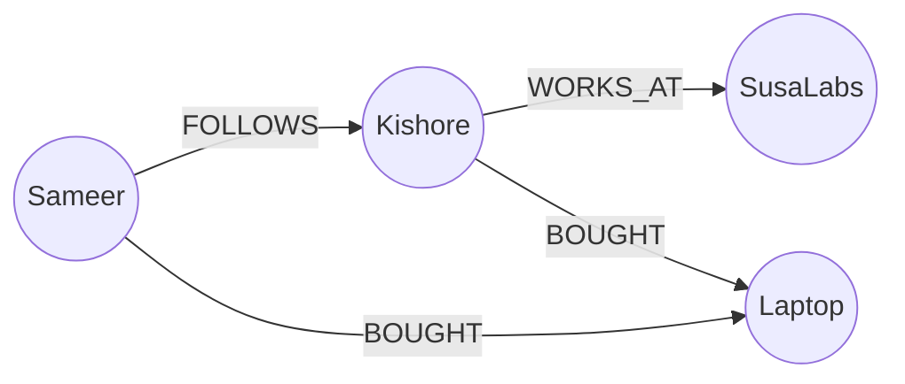

# 🕸️ Graph Databases: Mapping the Connections
> **Objective:** Master the concept of Graph databases (like Neo4j) used for highly connected data, recommendation engines, and social networks | **Language:** Hinglish | **Standard:** 2026 Expert Framework

---

## 🧭 1. Beginner-Friendly Hinglish Explanation
Graph Databases ka matlab hai "Rishton (Connections) ka database".

- **The Problem:** SQL database mein agar aapko "Mere doston ke doston ke doston" (3 levels of friendship) dhoondhna hai, toh aapko 3-4 Joins karne padenge. 1 crore users ke liye ye query hang ho jayegi.
- **The Solution:** Graph DB data ko "Nodes" (Objects) aur "Edges" (Relationships) ki tarah save karta hai. Rishte (Connections) pehle se hi "Physical" hote hain, isliye dhoondhna instant hota hai.
- **Why use it?** 
  - **Connections:** Jab "Rishta" (Relationship) data se zyada important ho.
  - **Pattern Matching:** Fraud dhoondhna (e.g., Ye 5 log ek hi phone number use kar rahe hain).
- **Intuition:** SQL ek "Address Book" hai. Graph DB ek "Facebook Friend Map" hai jahan sab ek dusre se lakiron (Edges) se jude hain.

---

## 🧠 2. Deep Technical Explanation
### 1. Nodes, Edges, and Properties:
- **Node (Vertex):** An entity (e.g., Person, Place, Product).
- **Edge (Relationship):** How two nodes are connected (e.g., "FOLLOWS", "WORKS_AT"). Edges can have **Direction** (A follows B).
- **Properties:** Key-value pairs inside nodes or edges (e.g., Person's Name, Relationship's StartDate).

### 2. Index-free Adjacency:
This is the "Secret Sauce". Every node stores a direct memory pointer to its neighbors. Finding a neighbor doesn't require an index lookup. This makes traversing deep graphs $O(1)$ per step!

### 3. Graph Traversal:
The process of "Walking" through the graph. (e.g., Start at Person A -> Follow Edges -> Find all Products they bought).

---

## 🏗️ 3. Database Diagrams (The Graph Structure)


---

## 💻 4. Query Execution Examples (Cypher - Neo4j)
```cypher
// 1. Create a Relationship
CREATE (p:Person {name: "Sameer"})-[:FOLLOWS]->(k:Person {name: "Kishore"})

// 2. Find "Friends of Friends"
MATCH (me:Person {name: "Sameer"})-[:FOLLOWS*2]->(fof:Person)
RETURN fof.name

// 3. Recommendation Query (People who bought X also bought Y)
MATCH (p:Person)-[:BOUGHT]->(prod:Product {name: "Laptop"})
MATCH (p)-[:BOUGHT]->(other:Product)
WHERE other.name <> "Laptop"
RETURN other.name, count(*) AS strength
ORDER BY strength DESC
```

---

## 🌍 5. Real-World Production Examples
- **LinkedIn:** Powering the "1st, 2nd, 3rd degree connection" feature.
- **Fraud Detection:** Banks use graphs to see if multiple credit cards are linked to the same suspicious address or IP.
- **Supply Chain:** Mapping how a single component failure affects 1000 different products.

---

## ❌ 6. Failure Cases
- **Super Nodes:** A node with millions of edges (like a celebrity with 100M followers). Accessing this node can slow down the system. **Fix: Use 'Relationship Grouping'.**
- **Querying Everything:** Running a query that traverses the "Entire Graph" (like "Find all people in the world") will crash the server.
- **Data Model Overkill:** Using a Graph DB for simple CRUD (like a Todo list). It's slower and more complex than SQL for simple data.

---

## 🛠️ 7. Debugging Guide
| Problem | Reason | Solution |
| :--- | :--- | :--- |
| **Query hangs** | Infinite Loop / Large Traversal | Limit the depth of the search (e.g., `[:FOLLOWS*1..3]`). |
| **Memory Error** | Cache miss | Graph DBs need a lot of RAM to keep the "Relationship Map" in memory. Increase the Heap size. |

---

## ⚖️ 8. Tradeoffs
- **Relationship Performance (Extreme)** vs **Aggregation/Massive Scan Performance (Slow).**

---

## 🛡️ 9. Security Concerns
- **Traversal-based Privacy Leak:** If a user can query "Friends of Friends", they might see data of people they aren't directly connected to.

---

## 📈 10. Scaling Challenges
- **Sharding a Graph:** How do you split a single connected graph across 10 servers without breaking the edges? This is one of the hardest problems in computer science. **Fix: Use 'Federated Graphs' or 'Scale-up' hardware.**

---

## ✅ 11. Best Practices
- **Use Graph DBs when relationships are the main focus.**
- **Avoid deep traversals (more than 5 levels) in real-time queries.**
- **Use meaningful labels and relationship types.**
- **Index the 'Starting Nodes'** (e.g., Index the `username` so you can find the start of the traversal quickly).

---

## ⚠️ 13. Common Mistakes
- **Trying to use a Graph DB like a Relational DB.**
- **Forgetting that every edge takes disk space and memory.**

---

## 📝 14. Interview Questions
1. "What is Index-free Adjacency?"
2. "How would you model a social network in a Graph Database?"
3. "When should you NOT use a Graph Database?"

---

## 🚀 15. Latest 2026 Production Database Patterns
- **Knowledge Graphs for AI:** Using Graph DBs to store facts and relationships that LLMs (like GPT-4) can use to provide accurate answers (RAG - Retrieval Augmented Generation).
- **Graph Neural Networks (GNNs):** Running Machine Learning directly on the graph structure to predict new relationships or detect anomalies.
漫
