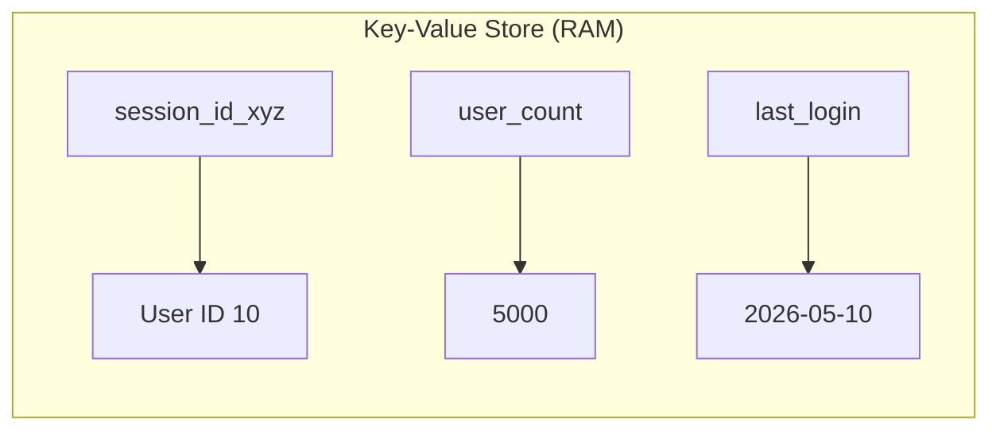

# 🔑 Key-Value Stores: The Speed Kings
> **Objective:** Master the concept of Key-Value databases (like Redis) used for high-speed caching, session management, and real-time data | **Language:** Hinglish | **Standard:** 2026 Expert Framework

---

## 🧭 1. Beginner-Friendly Hinglish Explanation
Key-Value Stores ka matlab hai "Sabse simple aur fast database".

- **The Idea:** Ye ek "Dictionary" ki tarah hai. Aapke paas ek **Key** (e.g., `user:101:name`) hoti hai aur uski ek **Value** (e.g., `Sameer`).
- **The Power:** Ye databases aksar data ko **RAM** mein rakhte hain (In-memory), isliye ye SQL se $1000x$ fast ho sakte hain.
- **Why use it?** 
  - **Caching:** Baar-baar same data dhoondhne ke bajaye, use RAM mein save kar lo.
  - **Sessions:** User login info ko fast access karna.
  - **Leaderboards:** Real-time ranks dikhana.
- **Intuition:** Ye ek "Sticky Note" ki tarah hai. Aap pura register nahi kholte, aapne bas "Note" par ek naam likha aur fridge par chipka diya takki turant dikh jaye.

---

## 🧠 2. Deep Technical Explanation
### 1. Data Model:
The database treats data as a single opaque blob. It doesn't care what's inside the value (though modern stores like Redis support Strings, Lists, Sets, and Hashes).
- **Key:** A unique identifier (String).
- **Value:** The data (String, JSON, Binary).

### 2. Time Complexity:
Lookups are $O(1)$ (Constant time). No matter if you have 100 rows or 100 million, the time to find a key is the same.

### 3. Persistence:
Since most K-V stores are in RAM, they can lose data on restart.
- **Snapshots (RDB):** Saving the whole DB to disk every few minutes.
- **Append-only file (AOF):** Logging every write to disk.

---

## 🏗️ 3. Database Diagrams (The Flat Map)


---

## 💻 4. Query Execution Examples (Redis)
```bash
# 1. Setting a value
SET user:101:name "Sameer"

# 2. Getting a value (Instant)
GET user:101:name

# 3. Setting an expiry (TTL - Time to Live)
SET session:abc "logged_in" EX 3600 
# Session will automatically delete after 1 hour!

# 4. Atomic Increment (Perfect for counters)
INCR user_hits
```

---

## 🌍 5. Real-World Production Examples
- **Twitter:** Uses Key-Value stores to cache the "Timeline" of every user.
- **E-commerce:** "Flash Sales" use Redis to handle the massive burst of traffic when a sale starts.
- **Gaming:** Managing real-time player states and world coordinates.

---

## ❌ 6. Failure Cases
- **Memory Exhaustion:** If you keep adding keys and forget to delete them, the RAM will fill up, and the DB will crash or start deleting old keys (**Eviction**).
- **Cache Stampede:** The cache expires, and 100,000 users all hit the SQL database at the same second to refresh it, crashing the SQL DB. **Fix: Use 'Locking' or 'Probabilistic Expiry'.**
- **Cold Cache:** Restarting the server and having zero data in RAM, making the app slow until the cache is "warmed up".

---

## 🛠️ 7. Debugging Guide
| Problem | Reason | Solution |
| :--- | :--- | :--- |
| **Data not found** | TTL Expired | Check if you set the expiration time too short. |
| **High Latency** | Large Values | Don't store 10MB JSONs as values in Redis. Keep them small. |

---

## ⚖️ 8. Tradeoffs
- **In-Memory (Extreme Speed / Risky / Expensive RAM)** vs **Disk-Based (Slower / Safer / Cheap Disk).**

---

## 🛡️ 9. Security Concerns
- **Plain-text over Network:** By default, Redis traffic is not encrypted. Anyone on the same network can see your keys. **Fix: Use 'TLS' and 'Password Auth'.**
- **Command Injection:** If you let users control the key name, they might run a command like `FLUSHALL` to delete your whole database.

---

## 📈 10. Scaling Challenges
- **Clustering:** Splitting keys across multiple RAM servers. If you need to join keys from two different servers, it's very slow.

---

## ✅ 11. Best Practices
- **Use meaningful key names** (e.g., `object:id:field`).
- **Always set a TTL (Expiry)** for temporary data like sessions or cache.
- **Monitor memory usage** constantly.
- **Use 'Pipelining'** to send multiple commands at once and save network time.

---

## ⚠️ 13. Common Mistakes
- **Using a Key-Value store as your ONLY database.** (It's a cache, not a primary source of truth for critical data).
- **Storing too much data in one key.**

---

## 📝 14. Interview Questions
1. "Why is Redis so much faster than MySQL?"
2. "What is TTL and why is it important for caching?"
3. "Explain the difference between RDB and AOF persistence in Redis."

---

## 🚀 15. Latest 2026 Production Database Patterns
- **Serverless Redis:** Databases like **Upstash** where you don't manage servers; you just pay for the number of requests.
- **Redis Stack:** Modern Redis versions that support JSON, Search, and Graph features on top of the simple key-value store.
漫
