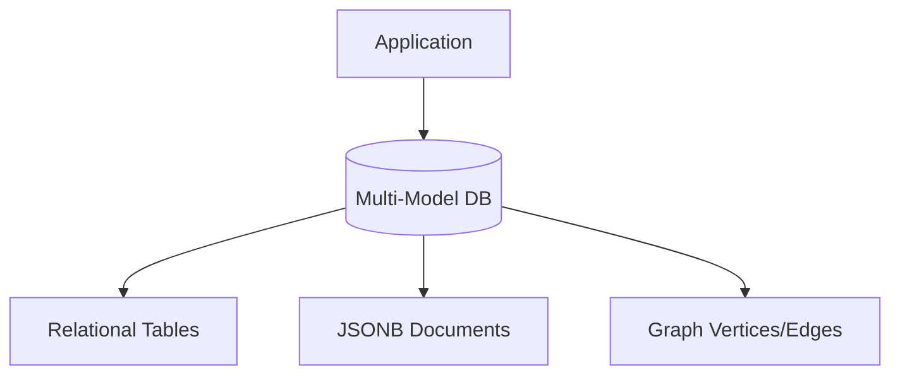

# 📐 Data Modeling and Schema Design: Modern Trends
> **Note:** This section discusses the evolution of data modeling. For fundamental relational design, normalization, and ER diagrams, please see the [02_Relational_Database_Design](../02_Relational_Database_Design/) module.

## 🧭 1. The Evolution of Modeling
In 2026, data modeling is no longer just about "Third Normal Form (3NF)". We now use a mix of:
- **Relational Modeling:** For financial and core business data.
- **Document Modeling:** For flexible, JSON-based user metadata.
- **Graph Modeling:** For social networks and recommendation engines.

## 🧠 2. The Multi-Model Approach
Most modern databases (like PostgreSQL or SurrealDB) allow you to use multiple models in a single database.

## 🏗️ 3. Design Principles for 2026
1. **Design for Scale:** Always consider how a table will grow to 1 Billion rows.
2. **Denormalize for Speed:** If joining is too slow, duplicate the data.
3. **Type Safety:** Use schema-level constraints to prevent bad data.

For fundamental guides, explore the sister module: **[Module 02: Relational Database Design](../02_Relational_Database_Design/)**.
漫
