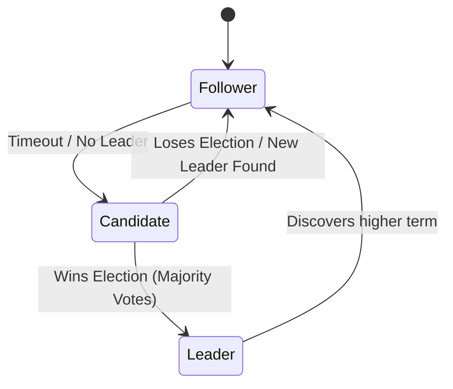

# 🤝 Consensus Algorithms: Paxos and Raft
> **Objective:** Master the complex algorithms used to achieve agreement across multiple database nodes in a distributed system | **Language:** Hinglish | **Standard:** 2026 Expert Framework

---

## 🧭 1. Beginner-Friendly Hinglish Explanation
Consensus Algorithms ka matlab hai "Multiple servers ke beech 'Ek Raay' (Agreement) banana".

- **The Problem:** Socho aapke paas 5 servers hain. "Server A" kehta hai balance 100 hai, par "Server B" kehta hai 110 hai. Kise sahi mana jaye? Agar servers aapas mein agree nahi karenge, toh data kharab (Inconsistent) ho jayega.
- **The Solution:** Consensus Algorithms (Paxos aur Raft). Ye ensure karte hain ki bhale hi kuch servers down hon, baki bache hue servers ek "Majority" (Quorum) banayein aur ek hi value par agree karein.
- **The Algorithms:** 
  1. **Paxos:** Purana aur bohot complex (Samajhna mushkil hai).
  2. **Raft:** Naya aur "Understandable". Ye "Leader" chunne (Election) par focus karta hai.
- **Intuition:** Ye ek "Parliament" jaisa hai. Kai log hain, par jab tak majority "Haan" nahi bolti, koi law pass nahi hota. Aur ek "Prime Minister" (Leader) hota hai jo proceedings ko lead karta hai.

---

## 🧠 2. Deep Technical Explanation
### 1. The Core Concept: Quorum
To reach consensus in a cluster of $N$ nodes, you need agreement from at least $(N/2) + 1$ nodes.
- If you have 3 nodes, you need 2.
- If you have 5 nodes, you need 3.
- This allows the system to remain functional even if $(N-1)/2$ nodes fail.

### 2. Raft Algorithm (The Leader Approach):
- **Leader Election:** If the current leader fails, nodes start an election to pick a new one.
- **Log Replication:** Only the Leader can accept writes. It sends the log to followers and waits for a majority to acknowledge before committing.
- **Safety:** Raft ensures that if a log entry is committed, it will be present in all future leaders.

### 3. Paxos:
Uses "Proposers", "Acceptors", and "Learners". It is more flexible but much harder to implement correctly.

---

## 🏗️ 3. Database Diagrams (The Raft Election)


---

## 💻 4. Query Execution Examples (Internal State)
```javascript
// Pseudo-code for Raft Leader handling a request
function handleWrite(data) {
  if (!isLeader) return forwardToLeader(data);
  
  const entry = { term: currentTerm, data: data };
  appendLocalLog(entry);
  
  // Replicate to followers
  let acks = 1;
  for (let follower of followers) {
    if (sendAppendEntries(follower, entry)) {
      acks++;
    }
  }
  
  if (acks >= majorityCount) {
    commitEntry(entry);
    return "SUCCESS";
  } else {
    return "FAILURE: No Majority";
  }
}
```

---

## 🌍 5. Real-World Production Examples
- **etcd / Kubernetes:** Uses **Raft** to store all the configuration and state of the entire cluster.
- **Google Spanner:** Uses **Paxos** for synchronous replication across regions.
- **CockroachDB:** Uses **Raft** for range-based consensus.

---

## ❌ 6. Failure Cases
- **Split Brain (Network Partition):** Two leaders in the same cluster. Raft prevents this by requiring a majority for every action. A minority partition cannot commit anything.
- **Election Cycles:** Two candidates start elections at the exact same time and keep splitting the votes, so no one becomes leader. **Fix: Use 'Randomized Timeouts'.**
- **Livelock:** Nodes are so busy electing leaders that they never process any real data.

---

## 🛠️ 7. Debugging Guide
| Problem | Reason | Solution |
| :--- | :--- | :--- |
| **Cluster is Read-only** | No Majority | Check if more than 50% of nodes are down. Bring them back up. |
| **High Latency** | Slow Followers | The leader waits for the majority. If some followers are slow, they delay the commit. |

---

## ⚖️ 8. Tradeoffs
- **Consensus (Strong Consistency / High Reliability)** vs **Asynchronous Replication (High Speed / Eventual Consistency).**

---

## 🛡️ 9. Security Concerns
- **Byzantine Failures:** A node that is not just down, but "Lying" or "Malicious". Standard Paxos/Raft cannot handle this. **Fix: Use 'Byzantine Fault Tolerance' (BFT) algorithms like in Blockchains.**

---

## 📈 10. Scaling Challenges
- **The Quorum Bottleneck:** As you add more nodes (e.g., from 5 to 50), the communication overhead to reach consensus increases drastically. This is why consensus clusters are usually small (3, 5, or 7 nodes).

---

## ✅ 11. Best Practices
- **Use an odd number of nodes** (3, 5, 7) to avoid "Split Vote" ties.
- **Use established libraries** (like `etcd/raft`) instead of writing your own consensus code.
- **Monitor election counts**; frequent elections mean network instability.

---

## ⚠️ 13. Common Mistakes
- **Using an even number of nodes.**
- **Assuming Raft makes the DB "Infinite Scale".** (It only makes it "Highly Available").

---

## 📝 14. Interview Questions
1. "Why do we use an odd number of nodes in a Raft cluster?"
2. "What is the role of a 'Leader' in the Raft algorithm?"
3. "Difference between Paxos and Raft?"

---

## 🚀 15. Latest 2026 Production Database Patterns
- **Multi-Raft:** Splitting a large database into many small "Ranges", each with its own Raft cluster (Used by TiDB and CockroachDB to scale infinitely).
- **RDMA-optimized Consensus:** Using specialized network hardware to replicate logs between servers without involving the CPU, achieving sub-microsecond consensus.
漫
