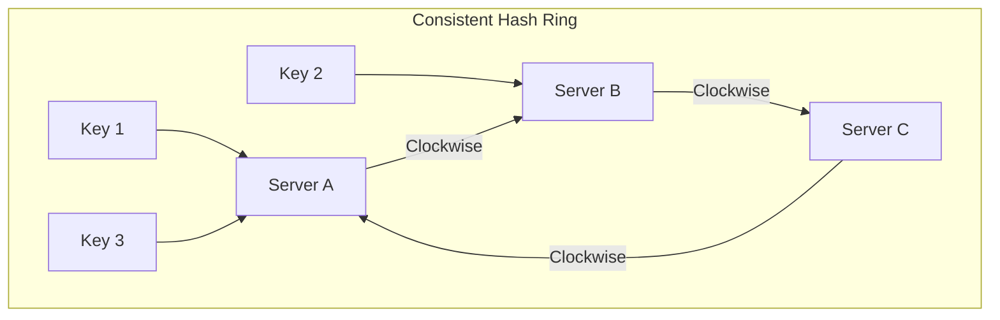

# 🎡 Consistent Hashing: Scaling Shards Dynamically
> **Objective:** Master the algorithmic technique used to distribute data across a changing number of servers with minimal data movement | **Language:** Hinglish | **Standard:** 2026 Expert Framework

---

## 🧭 1. Beginner-Friendly Hinglish Explanation
Consistent Hashing ka matlab hai "Data ko servers mein aise bantna ki server add/remove karte waqt zyada halchal na ho".

- **The Problem:** Maan lo aapke paas 3 servers hain aur aap data distribute karne ke liye `Hash(ID) % 3` use kar rahe ho. Agar aapne ek 4th server add kiya, toh formula `Hash(ID) % 4` ho jayega. Isse purana sara data "Galat" server par dikhne lagega aur aapko lagbhag sara data move karna padega.
- **The Solution:** Consistent Hashing. 
- **How it works:** Socho ki saare servers aur sara data ek "Circle" (Ring) par baithe hain. Har data apne "Clockwise" (ghadi ki disha mein) sabse pehle aane wale server par save hota hai.
- **Why it's cool?** Agar aap ek naya server add karte ho, toh sirf uske "piche" wala thoda sa data hi move hoga. Baki sara data wahi rahega jahan wo tha.
- **Intuition:** Ye ek "Musical Chairs" jaisa hai, par chairs fix nahi hain. Agar ek naya bacha (Server) circle mein aata hai, toh sirf uske aas-paas ke bache hi thoda khisakte hain, pura group nahi.

---

## 🧠 2. Deep Technical Explanation
### 1. The Hash Ring:
Both the **Nodes** (Servers) and the **Keys** (Data) are hashed into the same range (e.g., $0$ to $2^{32}-1$). This range is viewed as a circular ring.

### 2. Assignment:
A key is stored on the first node it encounters when moving clockwise around the ring.

### 3. Virtual Nodes (VNodes):
If you have only 3 servers, they might be far apart on the ring, making the data distribution uneven.
- **Solution:** Every physical server is mapped to 100-200 "Virtual Nodes" scattered all over the ring. This ensures that even if one server is slightly different, the data distribution remains balanced.

### 4. Benefits:
- **Minimizes Data Movement:** Only $1/N$ data needs to be moved when a node is added/removed.
- **Horizontal Scalability:** Easy to add new capacity.

---

## 🏗️ 3. Database Diagrams (The Ring Architecture)


---

## 💻 4. Query Execution Examples (Internal Logic)
```javascript
// Pseudo-code for Consistent Hashing
const ring = new Map(); // Store hash -> node mapping

function addNode(node) {
  for (let i = 0; i < VIRTUAL_NODES; i++) {
    const hash = createHash(node.id + i);
    ring.set(hash, node);
  }
}

function getNodeForKey(key) {
  const keyHash = createHash(key);
  // Find the first node hash >= keyHash in the ring
  const targetHash = findNextClockwise(ring, keyHash);
  return ring.get(targetHash);
}
```

---

## 🌍 5. Real-World Production Examples
- **Amazon DynamoDB:** The pioneer of using Consistent Hashing for massive scale.
- **Apache Cassandra:** Uses a "Token Ring" based on consistent hashing to decide which node stores which partition.
- **Akamai CDN:** Distributes web content across thousands of edge servers using this technique.

---

## ❌ 6. Failure Cases
- **Cascading Failures:** If one node dies, all its data moves to the next node. If that node can't handle the extra load, it also dies, and so on. **Fix: Use 'Replication' so data is stored on 3 nodes instead of 1.**
- **Uneven Distribution:** If the hash function is bad, one node might get $80\%$ of the data. **Fix: Use more Virtual Nodes.**

---

## 🛠️ 7. Debugging Guide
| Problem | Reason | Solution |
| :--- | :--- | :--- |
| **Hotspot on one node** | Poor hash distribution | Increase the number of Virtual Nodes (VNodes). |
| **Slow lookups in ring** | Ring size is too large | Use a "Sorted Map" or "Binary Search" to find the next node on the ring quickly. |

---

## ⚖️ 8. Tradeoffs
- **Consistent Hashing (Balanced / Scalable)** vs **Simple Hashing (Easy to code / Disaster on scale).**

---

## 🛡️ 9. Security Concerns
- **Targeted Key Attacks:** An attacker might try to find keys that all hash to the same server to perform a DoS attack on that specific node.

---

## 📈 10. Scaling Challenges
- **Data Re-distribution:** Even if only $1/N$ data moves, moving 1TB of data over the network still takes time and uses CPU.

---

## ✅ 11. Best Practices
- **Use at least 100-200 Virtual Nodes per physical server.**
- **Use a high-quality hash function** like **MurmurHash** or **Ketama**.
- **Always replicate data** to the next $N$ nodes on the ring for high availability.

---

## ⚠️ 13. Common Mistakes
- **Using `Hash % N` for any system that needs to scale.**
- **Not handling the "Wraparound" case** (when a key hash is greater than all node hashes).

---

## 📝 14. Interview Questions
1. "What is the main problem solved by Consistent Hashing?"
2. "Explain the concept of Virtual Nodes."
3. "How much data needs to be moved when a new node is added to a ring of 10 nodes?" (Answer: ~10%).

---

## 🚀 15. Latest 2026 Production Database Patterns
- **Maglev Hashing:** A variation developed by Google for their load balancers that provides even better distribution and faster lookups than standard consistent hashing.
- **Rendezvous Hashing:** (Highest Random Weight hashing) An alternative to consistent hashing that is easier to implement for certain distributed caching scenarios.
漫
