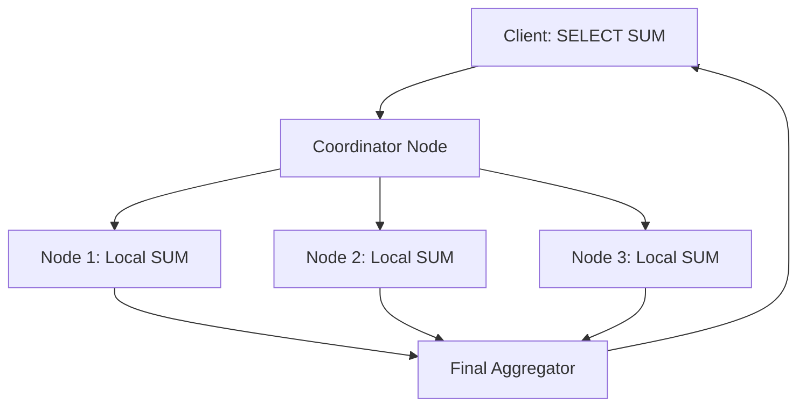

# ⚡ Distributed Query Execution: Parallelism at Scale
> **Objective:** Master how a single SQL query is broken down and executed across multiple servers to handle massive datasets | **Language:** Hinglish | **Standard:** 2026 Expert Framework

---

## 🧭 1. Beginner-Friendly Hinglish Explanation
Distributed Query Execution ka matlab hai "Ek query ko tukdon mein todkar kai servers par ek saath chalana".

- **The Problem:** Aapke paas 100TB data hai jo 10 servers par banta hua hai. Agar aapne `SUM(sales)` pucha, toh ek server akela ye kaam nahi kar sakta.
- **The Solution:** 
  1. Ek "Coordinator" node query ko padhta hai.
  2. Wo har server ko bolta hai "Apne hisse ka SUM nikalo".
  3. Saare servers parallel mein apna kaam karte hain.
  4. Coordinator saare results ko ek saath jodta hai aur aapko final answer deta hai.
- **Intuition:** Ye "Group Homework" jaisa hai. 100 pages ki assignment hai. Har dost ko 10-10 pages de diye gaye. Sabne apna kaam kiya, aur last mein sabne pages ko ek saath bind kar diya.

---

## 🧠 2. Deep Technical Explanation
### 1. The Query Plan Tree:
A distributed query is turned into a DAG (Directed Acyclic Graph).
- **Exchange Operators (Shuffle):** The most expensive part. Data moving between nodes to perform Joins or Group Bys.
- **Broadcast Join:** Sending a small table to all nodes to join with a large distributed table.
- **Shuffle Join:** Redistributing both tables across nodes based on the join key.

### 2. Map-Reduce Influence:
Modern distributed engines (like Presto/Trino/Spark) use a similar pattern:
- **Map Phase:** Local processing on each node.
- **Reduce/Aggregate Phase:** Combining partial results.

### 3. Data Locality:
The engine tries to move the **Query to the Data**, not the Data to the Query.

---

## 🏗️ 3. Database Diagrams (The Parallel Flow)


---

## 💻 4. Query Execution Examples (Distributed Logic)
```sql
-- Query: Find top customers across a 10-node cluster
SELECT customer_id, SUM(amount) 
FROM orders 
GROUP BY customer_id 
ORDER BY SUM(amount) DESC 
LIMIT 10;

-- How it's executed:
-- 1. Each node: SUMs orders grouped by customer_id for its own data.
-- 2. Nodes: Shuffle data so all records of 'customer_id=X' end up on the same node.
-- 3. Each node: Finalizes the SUM for its assigned IDs.
-- 4. Coordinator: Collects top results, sorts them, and returns top 10.
```

---

## 🌍 5. Real-World Production Examples
- **Facebook (Presto/Trino):** Running queries across 300PB of data in seconds using 1000s of servers.
- **Google BigQuery:** Fully serverless distributed execution engine.
- **Apache Spark:** Used for heavy ETL and machine learning on distributed data.

---

## ❌ 6. Failure Cases
- **Data Skew:** One node has $90\%$ of the data for a specific Join key. That node becomes the bottleneck (Straggler), and the whole query waits for it.
- **Network Congestion:** Moving Terabytes of data during a "Shuffle" saturates the data center network.
- **Node Failure:** If 1 node out of 100 dies mid-query, the whole query might fail. **Fix: Use 'Checkpoints' or 'Speculative Execution'.**

---

## 🛠️ 7. Debugging Guide
| Symptom | Reason | Solution |
| :--- | :--- | :--- |
| **Query is stuck at 99%** | Data Skew | Change the join key or add "Salting" to distribute the skewed keys. |
| **Out of Memory on Coordinator** | Too much data for final sort | Use `LIMIT` or filter more data on the worker nodes first. |

---

## ⚖️ 8. Tradeoffs
- **Massive Parallelism (Fast for Big Data)** vs **Network Latency (High overhead for small data).**

---

## 🛡️ 9. Security Concerns
- **Distributed Identity:** Ensuring that the worker nodes only process data that the requesting user is authorized to see.

---

## 📈 10. Scaling Challenges
- **The "N-to-N" Shuffle:** If 1000 nodes send data to each other, you have $1000^2$ (1 Million) connections. This crashes many network switches.

---

## ✅ 11. Best Practices
- **Filter as much as possible on the worker nodes (Predicate Pushdown).**
- **Avoid Joins between two massive distributed tables if possible.**
- **Use 'Partitioning' to help the engine find data faster.**
- **Monitor 'Shuffle' metrics.**

---

## ⚠️ 13. Common Mistakes
- **Running a query that fetches 1 billion rows back to the client.**
- **Ignoring the costs of cross-node data movement.**

---

## 📝 14. Interview Questions
1. "What is a 'Shuffle' in distributed query execution?"
2. "Explain 'Data Locality'."
3. "How do you handle a 'Straggler' node in a large cluster?"

---

## 🚀 15. Latest 2026 Production Database Patterns
- **Vectorized Execution:** Processing data in "Batches" using SIMD instructions on the CPU to achieve $10x$ speed on each node.
- **Wasm-based Workers:** Running query tasks in WebAssembly for ultra-fast startup and isolated execution on worker nodes.
漫
