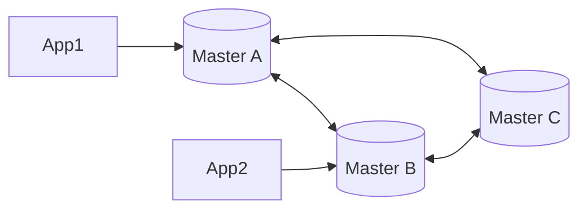

# 👑 Multi-Master Replication: Writing Everywhere
> **Objective:** Master the complex world of Multi-Master database architectures where any node can accept read and write requests | **Language:** Hinglish | **Standard:** 2026 Expert Framework

---

## 🧭 1. Beginner-Friendly Hinglish Explanation
Multi-Master Replication ka matlab hai "Database ke saare servers 'Boss' (Master) hain".

- **The Problem:** Master-Slave mein sirf ek hi server likhne (Write) ka kaam kar sakta tha. Agar Master down hua, toh writes band. Aur agar write traffic bohot zyada hai, toh 1 server handle nahi kar sakta.
- **The Solution:** Multi-Master. Isme aap kisi bhi server par `INSERT` ya `UPDATE` kar sakte hain, aur wo baaki sabko inform kar dega.
- **The Challenge:** "Conflict". Agar do log ek hi record ko do alag servers par ek hi time par badal dein, toh kise sahi mana jaye?
- **Intuition:** Ye ek "Group Project" jaisa hai jahan har student ke paas edit karne ki ijazat hai. Par agar do log ek hi paragraph badal dein, toh unhe "Merge" karna padega.

---

## 🧠 2. Deep Technical Explanation
### 1. Conflict Resolution:
This is the hardest part. How to decide who wins?
- **LWW (Last Write Wins):** Based on the latest timestamp. (Risk: Clock drift).
- **Vector Clocks:** Logical clocks to track the order of events.
- **CRDTs (Conflict-free Replicated Data Types):** Data structures designed to be merged automatically without conflicts (e.g., Sets, Counters).

### 2. Topologies:
- **Circular:** Server A -> B -> C -> A. (High latency, risk of single point of failure).
- **Mesh/Peer-to-Peer:** Every server talks to every other server. (Complex network).
- **Active-Active:** Two masters in different data centers for global speed.

### 3. Latency:
Multi-master can be "Asynchronous" (faster but more conflicts) or "Synchronous" (slower but safer).

---

## 🏗️ 3. Database Diagrams (The Peer-to-Peer Ring)


---

## 💻 4. Query Execution Examples (Galera/BDR)
```sql
-- 1. Using Galera Cluster for MySQL (Multi-Master)
-- Configuration usually happens in .cnf files
-- wsrep_cluster_address="gcomm://ip1,ip2,ip3"

-- 2. Checking Cluster Health
SHOW STATUS LIKE 'wsrep_cluster_size';
-- If you have 3 nodes, size should be 3.
```

---

## 🌍 5. Real-World Production Examples
- **Google Spanner:** Global multi-master with strong consistency using atomic clocks.
- **Cassandra:** Naturally multi-master (Ring architecture). Every node is equal.
- **Global Auth Systems:** Systems that need to work even if the connection between USA and India is cut.

---

## ❌ 6. Failure Cases
- **Conflict Storm:** Thousands of conflicts happening every second, making the CPU hit 100% just trying to resolve them.
- **Network Partition (Split Brain):** Two groups of masters lose connection and start acting like they are the only ones. When they reconnect, the data is a mess.
- **Increased Write Latency:** In synchronous multi-master, every write must wait for ALL masters to agree.

---

## 🛠️ 7. Debugging Guide
| Problem | Reason | Solution |
| :--- | :--- | :--- |
| **Data Mismatch** | Conflict resolution failed | Check the logical clocks or use **CRDTs** for simple counters. |
| **High Deadlock Rate** | Optimistic concurrency conflict | Try to route specific users to the same master based on their ID (**Session Affinity**). |

---

## ⚖️ 8. Tradeoffs
- **High Availability (Excellent)** vs **Write Consistency (Very Difficult/Complex).**

---

## 🛡️ 9. Security Concerns
- **Trust between Masters:** If one master is hacked, it can send "Malicious" data updates to all other masters in the cluster.

---

## 📈 10. Scaling Challenges
- **The $N^2$ Problem:** As you add more masters, the number of network connections and messages between them increases exponentially ($N \times (N-1)$).

---

## ✅ 11. Best Practices
- **Avoid Multi-Master if you can.** (It's 10x more complex than Master-Slave).
- **Use for "Disaster Recovery"** across geographical regions.
- **Use Conflict-Free types (CRDTs)** where possible.
- **Ensure clocks are synced** using NTP or PTP.

---

## ⚠️ 13. Common Mistakes
- **Thinking it's "Automatic"** and ignoring the conflict resolution logic.
- **Using it for data that is frequently updated by many users simultaneously.**

---

## 📝 14. Interview Questions
1. "What is a 'Split Brain' in a Multi-Master setup?"
2. "How do you resolve conflicts in a Multi-Master database?"
3. "What are logical clocks vs physical clocks?"

---

## 🚀 15. Latest 2026 Production Database Patterns
- **Active-Active Global Databases:** Using **Edge Computing** (Cloudflare D1 or Fly.io) to run tiny database masters in 200+ cities simultaneously, syncing only when needed.
- **BDR (Bi-Directional Replication):** A specialized Postgres extension that provides high-speed multi-master replication with advanced conflict resolution.
漫
