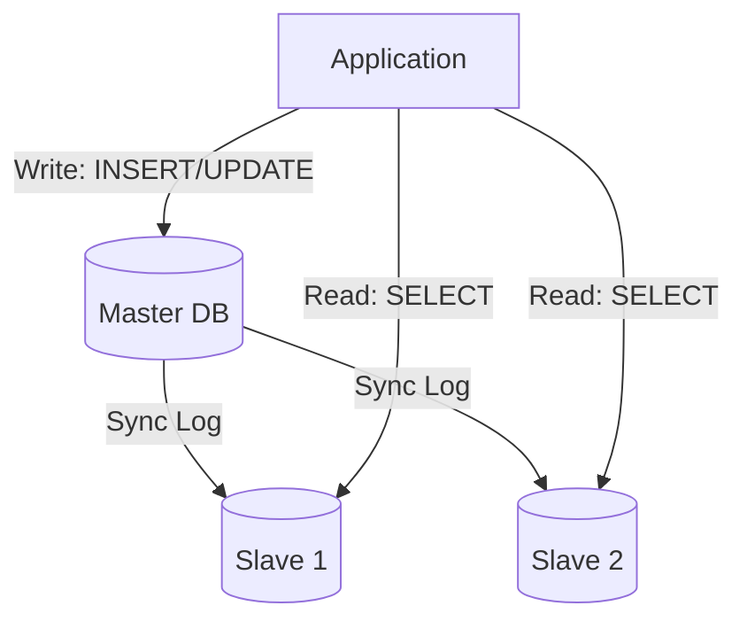

# 👯 Replication: Master-Slave Architecture
> **Objective:** Master the most common database scaling technique—creating copies of data across multiple servers for high availability and read performance | **Language:** Hinglish | **Standard:** 2026 Expert Framework

---

## 🧭 1. Beginner-Friendly Hinglish Explanation
Replication (Master-Slave) ka matlab hai "Database ki ek 'Original' copy aur kai saari 'Duplicate' copies rakhna".

- **The Problem:** Aapki site par traffic badh gaya hai. 1 hi database sabka load nahi sambhal pa raha.
- **The Solution:** Ek server ko **Master** banao aur baki servers ko **Slave (Replica)**.
- **The Roles:** 
  1. **Master:** Saare "Likhne" (Writes - Insert/Update/Delete) wale kaam Master par honge.
  2. **Slave:** Saare "Padhne" (Reads - SELECT) wale kaam Slaves par honge.
- **How it works:** Master apni "Diary" (WAL/Binlog) Slaves ko bhejta rehta hai, aur Slaves use padh kar apne aap ko update karte hain.
- **Intuition:** Master ek "Teacher" ki tarah hai jo board par likh raha hai. Slaves "Students" hain jo apne registers (Replicas) mein note kar rahe hain takki wo baad mein use padh saken.

---

## 🧠 2. Deep Technical Explanation
### 1. Synchronous vs Asynchronous:
- **Asynchronous (Standard):** Master writes to disk and immediately tells the user "Success". The copy to Slave happens in the background. (Fast, but slight risk of data loss if Master crashes before syncing).
- **Synchronous:** Master waits for at least one Slave to confirm it received the data before telling the user "Success". (Super safe, but slow).

### 2. Binary Log (Binlog):
The Master records all changes in a special file. The Slaves read this file (via an I/O thread) and apply the changes to their own data (SQL thread).

### 3. Failover:
If the Master dies, one of the Slaves is promoted to be the new Master. This is called **High Availability (HA)**.

---

## 🏗️ 3. Database Diagrams (Read-Write Splitting)


---

## 💻 4. Query Execution Examples (Configuration)
```sql
-- 1. Checking Replication Status (MySQL Master)
SHOW MASTER STATUS;

-- 2. Checking Replication Status (MySQL Slave)
SHOW SLAVE STATUS\G;
-- Look for 'Seconds_Behind_Master' to check lag!

-- 3. In Application Code (Pseudo-code)
if (query.type == 'SELECT') {
  db = connect_to_slave();
} else {
  db = connect_to_master();
}
```

---

## 🌍 5. Real-World Production Examples
- **YouTube:** Millions of people are "Reading" (Watching) videos. Replicas handle this massive read load globally.
- **E-commerce:** When you search for a product, you hit a Slave. When you place an order, you hit the Master.

---

## ❌ 6. Failure Cases
- **Replication Lag:** Master par update ho gaya, par Slave par abhi tak nahi pahuncha. User ne profile update ki, page refresh kiya, aur use puraani info dikhi. **Fix: Use 'Read-after-Write' consistency (Read from master for 5 seconds after a write).**
- **Master Crash:** If Master dies and no automatic failover is set up, the site becomes "Read-only".
- **Binary Log Bloat:** If replication is broken, the Master keeps saving logs until the disk is full.

---

## 🛠️ 7. Debugging Guide
| Problem | Diagnostic | Solution |
| :--- | :--- | :--- |
| **Slave is slow** | `Seconds_Behind_Master` > 0 | Check network latency or increase Slave's hardware. |
| **Data Mismatch** | `pt-table-checksum` (Tool) | Use tools to verify if Master and Slave are actually identical. |

---

## ⚖️ 8. Tradeoffs
- **Read Scaling (Excellent)** vs **Write Scaling (Poor - Everything still hits 1 Master).**

---

## 🛡️ 9. Security Concerns
- **Plain-text Replication:** Data traveling from Master to Slave over the network might be unencrypted. **Fix: Use SSL/TLS for replication traffic.**

---

## 📈 10. Scaling Challenges
- **Write Bottleneck:** If you have 1,000 writes/sec, the Master will eventually crash. Replication cannot fix this. **Fix: Use Sharding.**

---

## ✅ 11. Best Practices
- **Monitor Replication Lag constantly.**
- **Automate Failover** using tools like **Orchestrator** or **Patroni**.
- **Use "Read-Write Splitting"** in your application logic or a Proxy (like ProxySQL).
- **Backups should be taken from Slaves** to avoid slowing down the Master.

---

## ⚠️ 13. Common Mistakes
- **Writing to a Slave.** (Always set Slaves to `read_only = 1`).
- **Assuming Replication is a Backup.** (If you `DROP TABLE` on Master, it's dropped on Slave too!).

---

## 📝 14. Interview Questions
1. "Difference between Synchronous and Asynchronous replication?"
2. "What is Replication Lag and how do you minimize it?"
3. "How does a Slave stay in sync with the Master?" (Binlog/WAL).

---

## 🚀 15. Latest 2026 Production Database Patterns
- **Semi-Synchronous Replication:** A middle ground where the Master waits for at least one Slave to acknowledge, but doesn't wait for all of them.
- **Global Read Replicas:** Placing Slaves in different countries (New York, Mumbai, Tokyo) so local users get $10ms$ read latency.
漫
