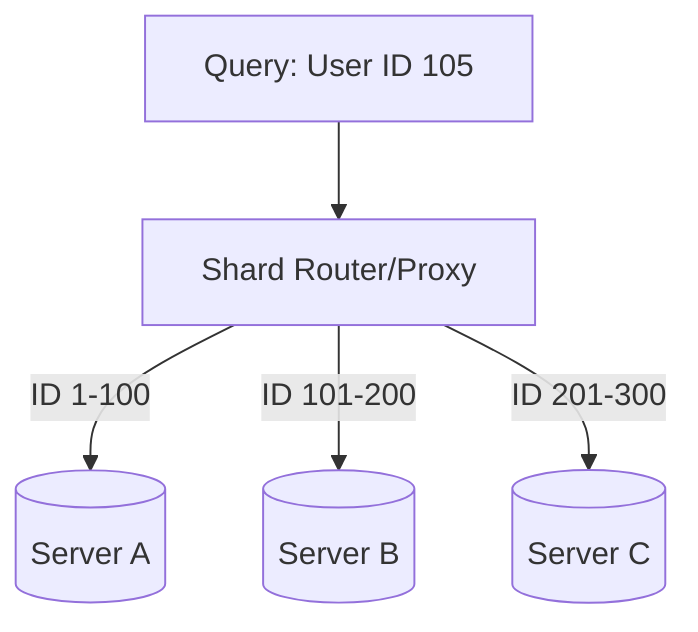

# 🧩 Sharding and Partitioning: Divide and Conquer
> **Objective:** Master the techniques of horizontal scaling—splitting massive tables into smaller pieces across multiple servers or files | **Language:** Hinglish | **Standard:** 2026 Expert Framework

---

## 🧭 1. Beginner-Friendly Hinglish Explanation
Sharding aur Partitioning ka matlab hai "Ek badi table ko chote tukdon mein todna".

- **The Problem:** Socho aapke paas ek table hai jisme 100 crore (1 Billion) rows hain. Usse dhoondhna slow hai, backup lena mushkil hai, aur wo ek server par fit nahi ho rahi.
- **The Solution:** Table ko "Tukdon" (Chunks) mein tod do.
- **The Difference:** 
  1. **Partitioning (Vertical/Horizontal):** Ye **Ek hi Server** par hota hai. Table ko 12 files mein tod do (e.g., Har month ke liye alag file). Database engine ise ek hi table ki tarah dikhayega.
  2. **Sharding (Horizontal Scaling):** Ye **Multiple Servers** par hota hai. User ID 1-1M Server A par, 1M-2M Server B par.
- **Intuition:** Partitioning ek "Big Almirah" mein drawers banane jaisa hai. Sharding "10 Almirahs" alag-alag kamron mein rakhne jaisa hai.

---

## 🧠 2. Deep Technical Explanation
### 1. Partitioning Types:
- **Range Partitioning:** Based on a range of values (e.g., `date` between Jan and Feb).
- **List Partitioning:** Based on a specific list (e.g., `country` in ['India', 'USA']).
- **Hash Partitioning:** Using a formula `Hash(id) % 4` to distribute data evenly.

### 2. Sharding Strategies:
- **Key-Based (Hash) Sharding:** Spread data evenly using a hash of the Shard Key. (Prevents Hotspots).
- **Directory-Based Sharding:** A lookup table tells you which shard has which data. (Flexible but slow lookup).
- **Geo-Sharding:** Indian users' data in India server, US users in US server.

### 3. Shard Key Selection:
The most important decision. A bad shard key (like `created_at`) can cause all new data to hit only one server (**Hot Shard**).

---

## 🏗️ 3. Database Diagrams (The Horizontal Split)


---

## 💻 4. Query Execution Examples (Postgres Partitioning)
```sql
-- 1. Create a Partitioned Table
CREATE TABLE orders (
    id INT,
    order_date DATE,
    amount DECIMAL
) PARTITION BY RANGE (order_date);

-- 2. Create specific partitions
CREATE TABLE orders_2024_01 PARTITION OF orders
    FOR VALUES FROM ('2024-01-01') TO ('2024-02-01');

CREATE TABLE orders_2024_02 PARTITION OF orders
    FOR VALUES FROM ('2024-02-01') TO ('2024-03-01');

-- 3. Querying (DB automatically picks the right partition - Partition Pruning)
SELECT * FROM orders WHERE order_date = '2024-01-15';
```

---

## 🌍 5. Real-World Production Examples
- **Instagram:** Shards its "Likes" and "Posts" tables using `user_id` as the shard key.
- **Banks:** Partitioning transaction history by "Financial Year" to make older data easier to archive.

---

## ❌ 6. Failure Cases
- **Cross-Shard Joins:** Joining a table on Shard A with a table on Shard B is $100x$ slower. **Fix: Denormalize or avoid cross-shard joins.**
- **Hot Shard:** One popular user (like a celebrity) gets all the traffic, making one server 100% busy while others are 0%.
- **Resharding Nightmares:** Moving data when you go from 4 shards to 8 shards. **Fix: Use 'Consistent Hashing'.**

---

## 🛠️ 7. Debugging Guide
| Problem | Reason | Solution |
| :--- | :--- | :--- |
| **Uneven Load** | Bad Shard Key | Choose a more "High-Cardinality" key (like `user_id` or `order_uuid`). |
| **Backups taking too long** | Massive Partitions | Break down partitions into smaller units (e.g., Weekly instead of Monthly). |

---

## ⚖️ 8. Tradeoffs
- **Sharding (Infinite Scale / High Complexity)** vs **Partitioning (Medium Scale / Low Complexity).**

---

## 🛡️ 9. Security Concerns
- **Data Locality Compliance:** Some countries (like Germany/India) require citizen data to stay within their borders. Sharding (Geo-sharding) helps achieve this.

---

## 📈 10. Scaling Challenges
- **Global Secondary Indexes:** If you shard by `user_id`, how do you find an order by `order_id`? You have to search ALL shards. **Fix: Maintain a separate "Global Index" or duplicate data.**

---

## ✅ 11. Best Practices
- **Don't shard until you have to.** (Try vertical scaling and partitioning first).
- **Choose a Shard Key that is used in $90\%$ of your queries.**
- **Keep shards roughly the same size.**
- **Automate sharding management** using tools like **Vitess** (for MySQL) or **Citus** (for Postgres).

---

## ⚠️ 13. Common Mistakes
- **Sharding by an incrementing ID or Date** (Leading to Hotspots).
- **Ignoring the cost of cross-shard transactions.**

---

## 📝 14. Interview Questions
1. "Difference between Partitioning and Sharding?"
2. "How do you handle Joins in a Sharded database?"
3. "What is a 'Hot Shard' and how do you prevent it?"

---

## 🚀 15. Latest 2026 Production Database Patterns
- **Transparent Sharding:** Databases like **TiDB** or **Citus** that handle sharding automatically, so the application thinks it's just one giant table.
- **Serverless Sharding:** Systems that automatically split and merge shards based on real-time traffic spikes without human intervention.
漫
