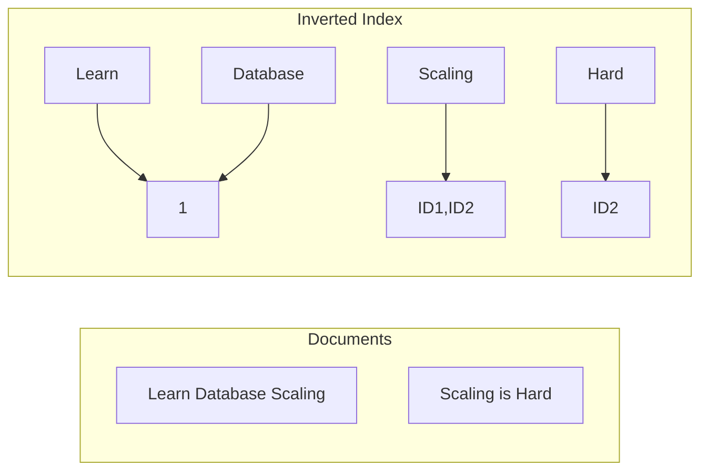

# 🔍 Full-Text Search: Searching Like Google
> **Objective:** Master the specialized techniques and data structures used to perform fast, relevant text searches across massive datasets | **Language:** Hinglish | **Standard:** 2026 Expert Framework

---

## 🧭 1. Beginner-Friendly Hinglish Explanation
Full-Text Search (FTS) ka matlab hai "Google ki tarah text ko dhoondhna".

- **The Problem:** SQL mein `LIKE '%keyword%'` bahut slow hota hai kyunki database ko har row padhni padti hai (Full Scan). Aur ye "Relevant" results nahi deta (e.g., 'Apple' search karne par 'Pineapple' bhi aa jayega).
- **The Solution:** Inverted Index.
- **How it works:** Database har word ka ek index banata hai.
  - Word: 'Database' -> Found in Document 1, 5, 10.
  - Word: 'Scaling' -> Found in Document 5, 8.
- **Key Features:** 
  1. **Stemming:** 'Running' search karne par 'Run' aur 'Ran' bhi mil jayein.
  2. **Ranking:** Sabse match hone wala result sabse upar ho (TF-IDF / BM25).
  3. **Fuzzy Search:** Typo (Mistake) hone par bhi sahi result dena (e.g., 'Gogle' -> 'Google').
- **Intuition:** Ye ek "Book Index" ki tarah hai. Aap puri book nahi padhte, aap piche ke index mein word dhoondhte hain aur sidha us page par jate hain.

---

## 🧠 2. Deep Technical Explanation
### 1. The Pipeline:
1. **Tokenization:** Breaking text into words (Tokens).
2. **Normalization:** Converting to lowercase, removing punctuation.
3. **Stop Word Removal:** Deleting common words like 'the', 'is', 'a'.
4. **Stemming / Lemmatization:** Reducing words to their root form.

### 2. Inverted Index Structure:
A mapping of **Terms** to **Posting Lists** (List of Doc IDs).
- **Dictionary:** All unique words.
- **Postings:** Where they occur.

### 3. Ranking Algorithms:
- **TF-IDF:** Term Frequency-Inverse Document Frequency.
- **BM25 (Modern Standard):** A more advanced version of TF-IDF that handles document length better.

---

## 🏗️ 3. Database Diagrams (The Inverted Index)


---

## 💻 4. Query Execution Examples (Postgres / Elasticsearch)
```sql
-- 1. Postgres Full-Text Search
-- Convert text to tsvector (Searchable format)
SELECT to_tsvector('english', 'The quick brown fox jumped over the lazy dog');

-- Search using tsquery
SELECT title 
FROM articles 
WHERE to_tsvector('english', body) @@ to_tsquery('english', 'fox & dog');

-- 2. Elasticsearch (NoSQL Search)
-- GET /articles/_search
-- { "query": { "match": { "content": "scaling database" } } }
```

---

## 🌍 5. Real-World Production Examples
- **E-commerce:** Amazon's search bar where you search for "Nike Shoes" and get ranked results with filters.
- **GitHub:** Searching through billions of lines of code.
- **News Sites:** Searching for "Elections" and getting results sorted by date and relevance.

---

## ❌ 6. Failure Cases
- **Language Complexity:** 'Stemming' works differently in English, Hindi, and Japanese. Using an English analyzer for Hindi text will give zero results.
- **Huge Index Size:** The Inverted Index can sometimes be larger than the actual data.
- **Slow Updates:** Every time you update a document, the index must be rebuilt. This makes "Real-time" search hard for massive write traffic.

---

## 🛠️ 7. Debugging Guide
| Problem | Reason | Solution |
| :--- | :--- | :--- |
| **No results found** | Stop words or Stemming | Check if your keyword was removed as a "Stop word" (like 'is'). |
| **Irrelevant results** | Bad Ranking | Tune the "Boost" factors for Title vs Body (e.g., Title match is $5x$ more important). |

---

## ⚖️ 8. Tradeoffs
- **Built-in DB Search (Postgres/MySQL)**: Easy to use / Limited features.
- **Dedicated Search Engine (Elasticsearch/Algolia)**: Powerful / Complex to sync with your main DB.

---

## 🛡️ 9. Security Concerns
- **Information Leakage via Suggestions:** "Auto-complete" can reveal sensitive data (like secret project names) if not filtered correctly.

---

## 📈 10. Scaling Challenges
- **Segment Merging:** In engines like Lucene/Elasticsearch, small index files (Segments) are constantly merged. This uses a lot of Disk I/O.

---

## ✅ 11. Best Practices
- **Use dedicated search engines** (Elasticsearch/Meilisearch) for complex UI search.
- **Use built-in FTS** (Postgres `tsvector`) for simple internal search.
- **Store only the "Searchable" fields** in the index to save space.
- **Implement 'Highlighting'** to show the user where the match occurred.

---

## ⚠️ 13. Common Mistakes
- **Using `LIKE %...%` for production search.**
- **Not using an 'Analyzer'** for the specific language of your users.

---

## 📝 14. Interview Questions
1. "What is an Inverted Index?"
2. "Difference between Stemming and Lemmatization?"
3. "How does the BM25 algorithm rank search results?"

---

## 🚀 15. Latest 2026 Production Database Patterns
- **Hybrid Search:** Combining traditional Keyword Search (BM25) with **Vector Search** (AI-based) to get the most accurate results possible.
- **Instant Search:** Using **Wasm-based search engines** that run directly in the browser for $0ms$ network latency search.
漫
