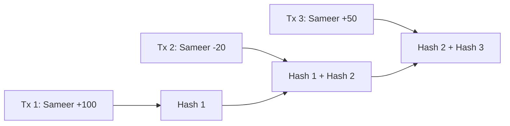

# 📓 Ledger Databases: Immutable Truth
> **Objective:** Master the concept of Ledger databases (like Amazon QLDB) used for storing transaction logs that are cryptographically verifiable and cannot be deleted or changed | **Language:** Hinglish | **Standard:** 2026 Expert Framework

---

## 🧭 1. Beginner-Friendly Hinglish Explanation
Ledger Databases ka matlab hai "Aisa database jahan kuch 'Delete' ya 'Change' nahi ho sakta".

- **The Problem:** SQL database mein koi bhi admin `UPDATE balance = 1000000` karke purana record mita sakta hai. Bina audit ke ye pakadna mushkil hai.
- **The Solution:** Ledger Database. Isme data "Immutable" hota hai. Aap sirf "Add" (Append) kar sakte hain. Agar aapko koi value badalni hai, toh aap ek "Nayi Entry" karte hain, purani wahi rehti hai.
- **The Magic:** Har entry pichli entry se "Cryptographically Linked" (Hash) hoti hai. Agar koi beech ki entry badalne ki koshish karega, toh puri chain toot jayegi (Verification fail).
- **Intuition:** Ye ek "Digital Accountant's Diary" ki tarah hai jo pen se likhi gayi hai. Aap pichle pages nahi faad sakte, aap sirf naye pages add kar sakte hain.

---

## 🧠 2. Deep Technical Explanation
### 1. The Journal (The Source of Truth):
The core of a ledger database is an append-only journal. Every transaction is serialized and appended. The journal is the "Transaction Log" that can never be modified.

### 2. Cryptographic Hashing (Merkle Trees):
Each transaction is hashed. That hash is combined with the hash of the previous transaction to create a "Chain". This is similar to Blockchain technology but managed centrally by a cloud provider.

### 3. Current State vs History:
- **Current State:** A materialized view of the latest values (for fast queries).
- **History:** The full audit trail of how the current state was reached.

---

## 🏗️ 3. Database Diagrams (The Immutable Chain)


---

## 💻 4. Query Execution Examples (Amazon QLDB / PartiQL)
```sql
-- 1. Standard Insert (Looks like SQL)
INSERT INTO AccountBalance VALUE {
    'AccountId': 'A101',
    'Balance': 500
};

-- 2. Updating (Actually appends a new version)
UPDATE AccountBalance AS a 
SET a.Balance = 450 
WHERE a.AccountId = 'A101';

-- 3. Querying History (The 'History' function)
SELECT * FROM history(AccountBalance) 
WHERE metadata.id = 'A101';
-- This shows all previous values and timestamps!
```

---

## 🌍 5. Real-World Production Examples
- **Supply Chain:** Tracking the movement of high-value goods (like diamonds or medicines) from factory to customer. No one can fake the history.
- **Banking:** Recording every single money transfer with a permanent audit trail.
- **Registration Systems:** Government records for Land Ownership or Vehicle Registration.

---

## ❌ 6. Failure Cases
- **Mistake Correction:** If you enter the wrong data, you can't delete it. You have to add a "Correction Entry". This makes the database grow forever.
- **Performance:** Cryptographic hashing adds a slight overhead to every write transaction.
- **Centralization Risk:** Unlike a Blockchain (Decentralized), a Ledger DB is controlled by one company (e.g., AWS). If they want, they could technically delete the whole DB (though not modify individual entries without detection).

---

## 🛠️ 7. Debugging Guide
| Problem | Reason | Solution |
| :--- | :--- | :--- |
| **Verification Failed** | Data Tampering | The cryptographic chain is broken. Check your internal audit logs or contact support. |
| **Query is slow** | Massive History | Query the "Current State" table instead of the "History" table for daily tasks. |

---

## ⚖️ 8. Tradeoffs
- **Trust (100% Auditability / Immutability)** vs **Flexibility (No Delete / Slow Writes).**

---

## 🛡️ 9. Security Concerns
- **Key Management:** The security of the ledger depends on the encryption keys used to sign the journal. If the keys are leaked, the "Verification" can be faked.

---

## 📈 10. Scaling Challenges
- **Journal Growth:** In a system with billions of transactions, the journal becomes Petabytes in size. Managing this "Infinite History" requires massive distributed storage.

---

## ✅ 11. Best Practices
- **Use Ledger DBs for critical financial or compliance data.**
- **Regularly perform "Verification"** to ensure no one has tampered with the journal.
- **Don't store large blobs** (images/files) in the ledger; store their "Hash" instead.

---

## ⚠️ 13. Common Mistakes
- **Using a Ledger DB for temporary data** (like a shopping cart).
- **Thinking it's a "Blockchain"** (Ledger DBs are much faster but centrally controlled).

---

## 📝 14. Interview Questions
1. "What is an Immutable Journal?"
2. "How is a Ledger Database different from a Blockchain?"
3. "What happens when you run an UPDATE command in a Ledger DB?"

---

## 🚀 15. Latest 2026 Production Database Patterns
- **Hybrid Ledgers:** Using a fast Ledger DB for internal transactions and "Anchoring" the final state hash to a public Blockchain (like Ethereum) once a day for ultimate trust.
- **Verifiable SQL:** Extensions for Postgres and MySQL that add "Ledger-like" features (cryptographic hashing) to standard relational tables.
漫
