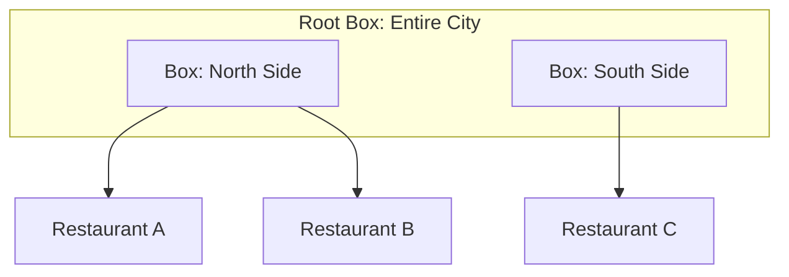

# 🗺️ Spatial and GIS Databases: Geography and Geometry
> **Objective:** Master how databases store and query geographic data (Latitude/Longitude) and geometric shapes using specialized extensions like PostGIS | **Language:** Hinglish | **Standard:** 2026 Expert Framework

---

## 🧭 1. Beginner-Friendly Hinglish Explanation
Spatial aur GIS Databases ka matlab hai "Location (Jagah) aur Maps ka data save karna".

- **The Problem:** Agar aapko dhoondhna hai "Mere 5km ke radius mein kitne Restaurants hain?", toh standard SQL query bahut slow hogi kyunki use har restaurant ke coordinates calculate karne padenge.
- **The Solution:** Spatial Indexes (e.g., R-Tree / GiST).
- **The Core Parts:** 
  1. **Geometry:** Shapes (Point, Line, Polygon).
  2. **Geography:** Real-world coordinates (Latitude, Longitude) on a curved earth.
- **Intuition:** Ye ek "Smart Map" ki tarah hai. Database ko pata hai ki kaunsi cheez kahan hai, aur wo "Bahar" ki cheezon ko turant discard kar deta hai bina calculation ke.

---

## 🧠 2. Deep Technical Explanation
### 1. Spatial Data Types:
- **Point:** A single location (GPS coordinate).
- **LineString:** A path or road.
- **Polygon:** A boundary (e.g., a city limit or a building footprint).

### 2. R-Tree Indexing:
Instead of a sorted list (B-Tree), spatial databases use **Minimum Bounding Rectangles (MBR)**. They group nearby points into small boxes, then group those boxes into larger boxes.
- To find a point, the DB only checks the boxes that overlap with the search area.

### 3. Spatial Operations:
- **ST_Distance:** Distance between two points.
- **ST_Contains:** Is this point inside this polygon?
- **ST_Intersects:** Do these two roads cross each other?

---

## 🏗️ 3. Database Diagrams (The R-Tree Box)


---

## 💻 4. Query Execution Examples (PostGIS)
```sql
-- 1. Finding restaurants within 1km of a point
SELECT name 
FROM restaurants 
WHERE ST_DWithin(
    location, 
    ST_MakePoint(77.1025, 28.7041)::geography, 
    1000
);

-- 2. Checking if a user is inside a specific "Geo-fence"
SELECT * 
FROM zones 
WHERE ST_Contains(zone_polygon, ST_MakePoint(77.1, 28.7));
```

---

## 🌍 5. Real-World Production Examples
- **Uber / Ola:** Finding the nearest driver to a user in real-time.
- **Zomato / Swiggy:** Calculating delivery distance and time.
- **Real Estate:** Filtering houses "Within this drawn area on the map".

---

## ❌ 6. Failure Cases
- **Flat Earth vs Round Earth:** Using `Geometry` (Flat) for long distances (e.g., NYC to London) gives wrong results because the earth is curved. **Fix: Use `Geography` type for real GPS data.**
- **Complex Polygons:** If a polygon has 1 million points (e.g., the exact coastline of a country), `ST_Contains` will be very slow. **Fix: Use 'Simplification' to reduce points.**
- **SRID Mismatch:** Every coordinate system has an ID (e.g., 4326 for GPS). If you join data with different SRIDs, the results will be completely wrong.

---

## 🛠️ 7. Debugging Guide
| Problem | Reason | Solution |
| :--- | :--- | :--- |
| **Spatial query is slow** | Missing GIST index | Run `CREATE INDEX idx_loc ON table USING GIST(location);`. |
| **Location is shifted** | Wrong SRID | Ensure all data is in SRID **4326** (WGS 84). |

---

## ⚖️ 8. Tradeoffs
- **Geography (Accurate / Slower math)** vs **Geometry (Faster math / Accurate only for small areas).**

---

## 🛡️ 9. Security Concerns
- **Location Privacy:** Storing exact GPS coordinates of users can be a privacy risk. **Fix: Use 'Geohashing' to store a slightly blurred location.**

---

## 📈 10. Scaling Challenges
- **Real-time Moving Objects:** Updating the location of 1 million Uber drivers every 1 second in a database is extremely hard. **Fix: Use in-memory spatial stores like 'Redis Geo' or 'Tile38'.**

---

## ✅ 11. Best Practices
- **Use PostGIS** (Postgres extension) as the gold standard for GIS.
- **Always use Spatial Indexes (GIST/SP-GIST).**
- **Simplify polygons** before saving them if they don't need high precision.
- **Stick to SRID 4326** for global applications.

---

## ⚠️ 13. Common Mistakes
- **Storing Lat/Long as two separate `FLOAT` columns.** (This makes spatial queries impossible).
- **Forgetting to transform SRIDs** when importing third-party map data.

---

## 📝 14. Interview Questions
1. "What is an R-Tree index?"
2. "Difference between Geometry and Geography types?"
3. "How would you find all points within a bounding box?"

---

## 🚀 15. Latest 2026 Production Database Patterns
- **H3 (Uber's Hexagonal Indexing):** Dividing the whole world into hexagons of different sizes to make spatial calculations much faster than traditional boxes.
- **Cloud-Native GIS (BigQuery GIS):** Running spatial queries across petabytes of satellite data using distributed SQL.
漫
