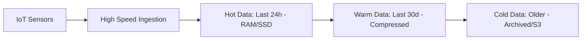

# 📈 Time-Series Databases: Tracking Every Second
> **Objective:** Master the specialized databases (like InfluxDB/TimescaleDB) designed to store and analyze timestamped data at massive speed and volume | **Language:** Hinglish | **Standard:** 2026 Expert Framework

---

## 🧭 1. Beginner-Friendly Hinglish Explanation
Time-Series Databases (TSDB) ka matlab hai "Waqt (Time) ke hisab se data save karne wala database".

- **The Problem:** Agar aap har second ek machine ka temperature save kar rahe hain, toh ek saal mein billions of rows ho jayengi. SQL database is "Massive Write" traffic aur "Time-based aggregations" (e.g., Average temperature per hour) mein slow ho jata hai.
- **The Solution:** TSDB. Ye data ko waqt ke hisab se "Group" aur "Compress" karte hain.
- **Key Features:** 
  1. **Massive Ingestion:** Lakho records per second likhna.
  2. **Data Retention:** Purana data automatically delete kar dena (e.g., 30 din baad data uda do).
  3. **Downsampling:** Har second ke data ko "Hourly Average" mein badal dena takki space bache.
- **Intuition:** Ye ek "Stock Market Graph" ki tarah hai. Aapko har ek transaction ki detail nahi chahiye, aapko ye dekhna hai ki pichle 1 ghante mein price kahan gaya.

---

## 🧠 2. Deep Technical Explanation
### 1. The Structure of a Time-Series:
- **Timestamp:** When did it happen? (The primary key).
- **Tag (Dimension):** Metadata (e.g., `host="server-1"`, `region="us-east"`).
- **Field (Metric):** The actual value (e.g., `cpu_usage=45.2`).

### 2. Storage Optimization:
TSDBs use **Delta-Delta Encoding**. Instead of saving the full number every time, they only save the "Difference" from the previous value. This reduces storage size by up to $90\%$.

### 3. Continuous Aggregates:
The database calculates averages or sums in the background while data is coming in, so when you ask for a "7-day average", it's already calculated and returns in 1ms.

---

## 🏗️ 3. Database Diagrams (The Time Stream)


---

## 💻 4. Query Execution Examples (TimescaleDB / InfluxQL)
```sql
-- 1. Using TimescaleDB (Postgres based)
-- Find average temperature in 5-minute buckets
SELECT time_bucket('5 minutes', time) AS bucket,
       AVG(temperature)
FROM sensor_data
WHERE time > NOW() - INTERVAL '1 day'
GROUP BY bucket;

-- 2. InfluxDB (Tag-based search)
-- SELECT mean("usage_user") FROM "cpu" WHERE "host"='server-1' AND time > now() - 1h GROUP BY time(1m)
```

---

## 🌍 5. Real-World Production Examples
- **DevOps Monitoring:** Prometheus/Grafana tracking CPU and RAM of thousands of servers.
- **IoT (Smart Home):** Storing temperature and electricity usage from millions of devices.
- **Financial Markets:** High-frequency trading data where every microsecond matters.

---

## ❌ 6. Failure Cases
- **High Cardinality:** If you use "Unique User ID" as a Tag, and you have 100 million users, the index will become massive and crash the DB. **Fix: Use Fields instead of Tags for high-cardinality data.**
- **Disk Saturation:** Writing millions of rows per second can kill your SSDs within months. **Fix: Use 'Batch Writes'.**
- **Fill-the-Disk:** Forgetting to set a "Retention Policy" (e.g., data stays forever until disk is 100% full).

---

## 🛠️ 7. Debugging Guide
| Problem | Reason | Solution |
| :--- | :--- | :--- |
| **Queries are slow** | No downsampling | Use "Continuous Aggregates" to pre-calculate averages. |
| **High Memory Usage** | Too many unique tags | Check your "Cardinality". Remove tags that are too unique. |

---

## ⚖️ 8. Tradeoffs
- **Write Performance (Extreme)** vs **Flexibility (No complex Joins/Transactions).**

---

## 🛡️ 9. Security Concerns
- **Data Tempering:** An attacker modifying historical logs to hide a security breach. **Fix: Use 'Append-only' storage with immutable logs.**

---

## 📈 10. Scaling Challenges
- **Time-based Partitioning:** Managing thousands of table partitions (one for each day/hour) and ensuring the query engine can find the right one quickly.

---

## ✅ 11. Best Practices
- **Use meaningful Tags** for filtering and **Fields** for data values.
- **Set Retention Policies** from day one.
- **Batch your writes** (e.g., 1000 rows in one request).
- **Use Downsampling** for old data to save disk space.

---

## ⚠️ 13. Common Mistakes
- **Using a standard SQL DB for billions of IoT events.**
- **Storing high-cardinality data as Tags.**

---

## 📝 14. Interview Questions
1. "What is Delta-Delta encoding?"
2. "Explain 'Downsampling' in a TSDB."
3. "Difference between a Tag and a Field in InfluxDB?"

---

## 🚀 15. Latest 2026 Production Database Patterns
- **Cloud-Native TSDB (Timestream):** Fully serverless time-series databases that scale to trillions of events without you managing any servers.
- **Edge TSDB:** Running tiny time-series databases (like **QuestDB**) on the IoT device itself to filter data before sending it to the cloud.
漫
