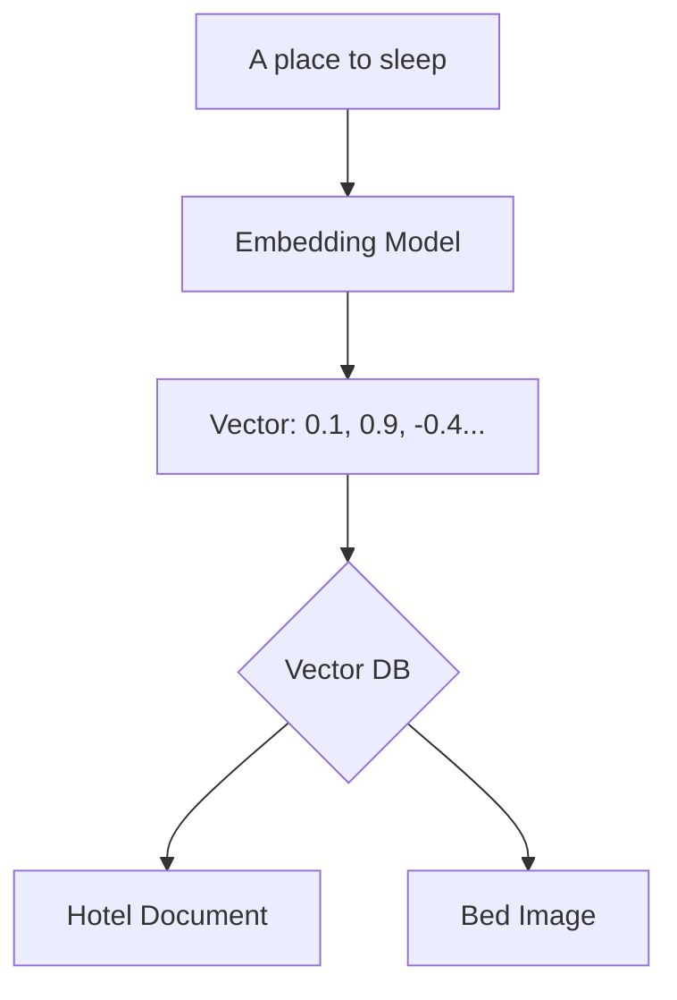

# 🤖 Vector Databases and AI: The Memory of LLMs
> **Objective:** Master the concept of Vector embeddings and specialized databases like Pinecone/Milvus used to power AI applications and semantic search | **Language:** Hinglish | **Standard:** 2026 Expert Framework

---

## 🧭 1. Beginner-Friendly Hinglish Explanation
Vector Databases ka matlab hai "AI ke liye data save karne ka tareeka".

- **The Problem:** Traditional databases "Words" aur "Numbers" samajhte hain. Par AI "Meaning" (Matlab) samajhta hai. Agar aap search karein "A place to sleep", toh SQL ko "Bed" ya "Hotel" nahi milega kyunki words alag hain.
- **The Solution:** Data ko "Vector" (Numbers ki ek lambi list) mein badal do. Is list mein data ka "Meaning" chhupa hota hai.
- **How it works:** 
  1. **Embedding:** Ek AI model (e.g., OpenAI) text ko 1536 numbers mein badal deta hai.
  2. **Vector DB:** Ye in numbers ko save karta hai.
  3. **Similarity Search:** "Place to sleep" ke numbers "Hotel" ke numbers ke bahut paas (Close) honge. Database unhe turant dhoondh lega.
- **Intuition:** Ye ek "3D Map" ki tarah hai. Milte-julte matlab wale words ek hi jagah par baithe hain. "King" aur "Queen" paas honge, par "Apple" aur "Car" door honge.

---

## 🧠 2. Deep Technical Explanation
### 1. Vector Embeddings:
A vector is an array of floating-point numbers. Each dimension represents a feature of the data (often abstract).
- **Dimension:** The number of values in the vector (e.g., 768 or 1536).

### 2. Distance Metrics:
How to tell if two vectors are similar?
- **Cosine Similarity:** Measures the angle between two vectors (Standard for text).
- **Euclidean Distance (L2):** Measures the straight-line distance between points.
- **Dot Product:** Measures the alignment and magnitude.

### 3. ANN (Approximate Nearest Neighbor) Search:
Searching through billions of vectors is slow. Vector DBs use **ANN** to find "Good enough" matches quickly using algorithms like:
- **HNSW (Hierarchical Navigable Small World):** A graph-based index.
- **IVF (Inverted File Index):** Dividing vectors into clusters.

---

## 🏗️ 3. Database Diagrams (The Vector Space)


---

## 💻 4. Query Execution Examples (Pinecone / pgvector)
```sql
-- 1. Using pgvector in Postgres
-- Create a table with a vector column (3 dimensions for example)
CREATE TABLE items (id serial PRIMARY KEY, embedding vector(3));

-- Insert data
INSERT INTO items (embedding) VALUES ('[1,1,1]'), ('[1.2,1.1,0.9]'), ('[10,10,10]');

-- Search for similar items (Cosine Distance)
SELECT * FROM items ORDER BY embedding <=> '[1,1,1]' LIMIT 2;
-- This will return the first two items because they are mathematically 'close'.
```

---

## 🌍 5. Real-World Production Examples
- **ChatGPT (RAG):** When you ask ChatGPT about your specific PDF, it uses a Vector DB to find the most relevant paragraphs from that PDF to answer you.
- **Image Search:** Searching for "A sunset over mountains" and finding visually similar images.
- **Recommendation Systems:** Spotify finding songs with similar "Musical Vectors".

---

## ❌ 6. Failure Cases
- **Dimensionality Mismatch:** Trying to search a 1536-dimension vector in a database configured for 768 dimensions.
- **The "Curse of Dimensionality":** As dimensions increase, all points start looking "equally far" from each other, making search less accurate.
- **Cost:** High-performance Vector DBs (like Pinecone) can be expensive compared to SQL.

---

## 🛠️ 7. Debugging Guide
| Problem | Reason | Solution |
| :--- | :--- | :--- |
| **Search results are bad** | Poor Embedding Model | Change your embedding model (e.g., from `text-ada-002` to `text-embedding-3-small`). |
| **Search is slow** | Missing Index | Create an **HNSW** index on the vector column. |

---

## ⚖️ 8. Tradeoffs
- **Exact Search (100% Accurate / Very Slow)** vs **ANN Search (95% Accurate / Instant).**

---

## 🛡️ 9. Security Concerns
- **Prompt Injection via Vector Data:** Malicious text in the Vector DB can trick the LLM when it retrieves it during RAG.
- **Sensitive Embeddings:** Even if you delete the raw text, an attacker might "Reverse Engineer" the vector to get the original meaning back.

---

## 📈 10. Scaling Challenges
- **RAM Usage:** Indexing algorithms like HNSW need to keep most of the graph in RAM for speed. 1 Billion vectors can take hundreds of GBs of RAM.

---

## ✅ 11. Best Practices
- **Use pgvector** if you already use Postgres and have < 1M vectors.
- **Use dedicated Vector DBs** (Pinecone/Milvus/Weaviate) for high-scale AI apps.
- **Choose the right Distance Metric** (Cosine is usually best for text).
- **Chunk your text correctly** (don't embed a whole book into one vector).

---

## ⚠️ 13. Common Mistakes
- **Embedding huge chunks of text** (Meaning gets lost).
- **Not using an index for production-scale vectors.**

---

## 📝 14. Interview Questions
1. "What is a Vector Embedding?"
2. "How does HNSW speed up vector search?"
3. "Difference between Cosine Similarity and Euclidean Distance?"

---

## 🚀 15. Latest 2026 Production Database Patterns
- **Multi-modal Vectors:** Storing text, images, and audio in the same vector space so you can search for a "Sound" using a "Text" query.
- **On-disk ANN Indexes:** New algorithms that allow searching billions of vectors using SSDs instead of expensive RAM.
漫
