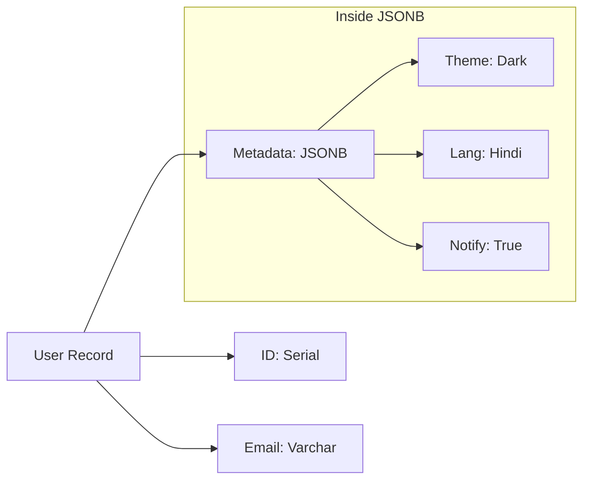

# 📦 JSONB and NoSQL in Postgres: The Hybrid King
> **Objective:** Master the ability to handle unstructured data within a relational database using JSONB, achieving MongoDB-like flexibility with PostgreSQL reliability | **Language:** Hinglish | **Standard:** 2026 Expert Framework

---

## 🧭 1. Beginner-Friendly Hinglish Explanation
JSONB and NoSQL in Postgres ka matlab hai "Postgres ko MongoDB ki tarah use karna".

- **The Problem:** Kabhi-kabhi aapko nahi pata hota ki data ka structure kya hoga (e.g., User Preferences, Metadata). Agar aap dher saari tables banayenge, toh Join karne mein site slow ho jayegi.
- **The Solution:** **JSONB** (JSON Binary).
  - Ye data ko binary format mein save karta hai.
  - Iska matlab aap JSON ke andar ki fields ko "Index" kar sakte hain aur fast search kar sakte hain.
- **Intuition:** Ye ek "Almari" (Table) ke andar ek "Khula Box" (JSONB column) rakhne jaisa hai. Almari ke rules fixed hain, par box ke andar aap kuch bhi daal sakte hain.

---

## 🧠 2. Deep Technical Explanation

### 1. JSON vs JSONB:
- **JSON:** Stores data exactly as text. Fast to insert, but **SLOW** to query (must parse text every time).
- **JSONB:** Stores data in a decomposed binary format. Slightly slower to insert, but **SUPER FAST** to query and index.

### 2. Operators to Know:
- `->`: Get JSON object field (as JSON).
- `->>`: Get JSON object field (as TEXT).
- `@>`: Does the JSON document contain this key/value? (Indexable).
- `?`: Does the key exist?

### 3. GIN (Generalized Inverted Index):
The secret to JSONB performance. It creates an index entry for every key and value inside the JSON document.

---

## 🏗️ 3. Database Diagrams (Hybrid Modeling)


---

## 💻 4. Query Execution Examples (JSONB Mastery)
```sql
-- 1. Create a Hybrid Table
CREATE TABLE products (
    id SERIAL PRIMARY KEY,
    name TEXT NOT NULL,
    attributes JSONB
);

-- 2. Insert Data
INSERT INTO products (name, attributes) 
VALUES ('iPhone 15', '{"color": "Blue", "storage": "256GB", "battery": "95%"}');

-- 3. Querying specific fields
SELECT name, attributes->>'color' as color 
FROM products 
WHERE attributes->>'storage' = '256GB';

-- 4. Searching with Containment (@>)
-- This is where GIN indexes shine!
CREATE INDEX idx_product_attr ON products USING GIN (attributes);

SELECT * FROM products 
WHERE attributes @> '{"color": "Blue"}';
```

---

## 🌍 5. Real-World Production Examples
- **Stripe/Payment Gateways:** Storing raw API responses from banks in a `raw_response` JSONB column for debugging later.
- **CMS Systems:** Letting users add "Custom Fields" to their pages without changing the database schema.
- **E-commerce:** Storing product-specific specs (Screen size for TVs, Fabric for clothes) in a single `specs` column.

---

## ❌ 6. Failure Cases
- **Whole-Table Scans:** If you use `->>` without a proper index, Postgres has to read and parse every JSON document in the table. **Fix: Always use `@>` with a GIN index.**
- **Massive JSON Documents:** If a single JSONB cell is 100MB, reading it will be extremely slow. **Fix: Keep JSONB objects small (under 1MB).**

---

## 🛠️ 7. Debugging Guide
| Problem | Reason | Solution |
| :--- | :--- | :--- |
| **"Operator does not exist"** | Using `->` instead of `->>` | `->` returns a JSON object, `->>` returns text. Use `->>` for comparisons. |
| **Index not being used** | Wrong operator | GIN indexes work with `@>`, not usually with `->>`. |

---

## ⚖️ 8. Tradeoffs
- **Hybrid (Flexibility / One DB)** vs **Pure NoSQL (Massive scale / Distributed features of Mongo).**

---

## ✅ 11. Best Practices
- **Use JSONB for 99% of use cases.**
- **Index the fields you query most.**
- **Use `JSONB_SET` for partial updates** instead of rewriting the whole document.
- **Add Check Constraints** to ensure the JSON structure follows some basic rules.

漫
---

## 📝 14. Interview Questions
1. "When should you use JSONB instead of regular relational columns?"
2. "Explain the difference between `->` and `->>` operators."
3. "How do you index a JSONB column in Postgres?"

---

## 🚀 15. Latest 2026 Production Database Patterns
- **JSON Schema Validation:** Using Postgres functions to validate that a JSONB column follows a specific schema before insertion.
- **Generated Columns:** Extracting a frequently used JSONB field into its own "Virtual" column for $10x$ faster indexing and queries.
漫
