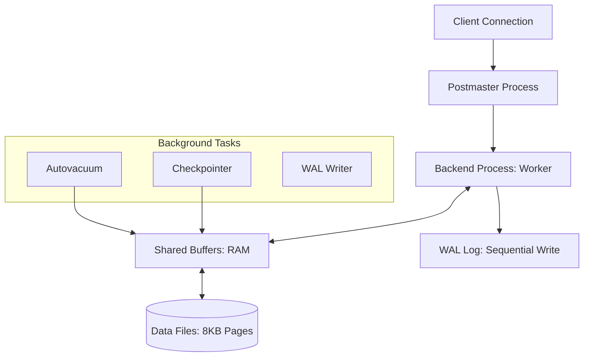

# 🐘 PostgreSQL Architecture: The World's Most Advanced Open Source DB
> **Objective:** Master the internal architecture of PostgreSQL, from process models to storage layers, to build high-performance systems | **Language:** Hinglish | **Standard:** 2026 Expert Framework

---

## 🧭 1. Beginner-Friendly Hinglish Explanation
PostgreSQL Architecture ka matlab hai "Postgres ke bonnet ke niche (Under the hood) kya ho raha hai".

- **The Philosophy:** Postgres ek **Object-Relational** database hai. Iska matlab ye sirf tables nahi, balki complex objects, custom types, aur functions ko bhi handle karta hai.
- **The Process Model:** Jab aap Postgres se connect karte hain, toh ek naya "Process" (thread nahi) banta hai. Ye isse bahut stable banata hai—agar ek query crash ho jaye, toh pura database down nahi hota.
- **The Memory:** Postgres apne data ko "Shared Buffers" (RAM) mein rakhta hai takki disk par baar-baar na jana pade.
- **Intuition:** Ye ek "Badi Factory" jaisa hai jahan har worker (Process) ka apna cabin hai, par sab ek hi bade Godown (Shared Buffers) se data uthate hain.

---

## 🧠 2. Deep Technical Explanation
### 1. The Process Hierarchy:
- **Postmaster (Parent Process):** The boss. It listens for connections and forks child processes.
- **Backend Process:** Handles a single client connection.
- **Background Workers:** Automatic tasks like Autovacuum, Checkpointer, and WAL Writer.

### 2. Memory Structure:
- **Shared Memory:**
  - **Shared Buffers:** Caches data blocks from disk.
  - **WAL Buffer:** Temporarily stores Write-Ahead Log records.
- **Local Memory (Per Process):**
  - **work_mem:** Memory used for complex sorts and joins.
  - **maintenance_work_mem:** Memory for VACUUM and Index creation.

### 3. The File System:
Data is stored in the `base` directory as $1GB$ "Segments" (Pages). Each page is $8KB$ by default.

---

## 🏗️ 3. Database Diagrams (The Internal Workflow)


---

## 💻 4. Query Execution Examples (Monitoring Internals)
```sql
-- 1. Checking active processes
SELECT pid, user, state, query 
FROM pg_stat_activity;

-- 2. Viewing Buffer Cache hits
-- (Requires pg_buffercache extension)
SELECT count(*) AS cached_pages 
FROM pg_buffercache 
WHERE relfilenode = (SELECT relfilenode FROM pg_class WHERE relname = 'users');

-- 3. Monitoring WAL activity
SELECT pg_current_wal_lsn(), pg_current_wal_insert_lsn();
```

---

## 🌍 5. Real-World Production Examples
- **Stability:** Financial institutions choose Postgres because its process-based model is more resilient to memory corruption than thread-based databases.
- **Extensibility:** Companies like **Instagram** and **Notion** use Postgres because they can add custom extensions like `PostGIS` (Spatial) or `Timescale` (Time-series) without migrating.

---

## ❌ 6. Failure Cases
- **Connection Spikes:** Since every connection is a full process, having 5000+ connections can kill your RAM. **Fix: Use PgBouncer (Connection Pooler).**
- **OOM Killer:** If Postgres uses more RAM than available, Linux might kill the Postmaster process. **Fix: Tune `shared_buffers` and `work_mem` correctly.**

---

## 🛠️ 7. Debugging Guide
| Problem | Reason | Solution |
| :--- | :--- | :--- |
| **High CPU usage** | Too many active processes | Check `pg_stat_activity` and kill long-running queries. |
| **Slow Writes** | Checkpoint contention | Increase `checkpoint_timeout` and `max_wal_size`. |

---

## ⚖️ 8. Tradeoffs
- **Process Model (Stability / High RAM usage)** vs **Thread Model (MySQL) (Low RAM / Risk of shared memory issues).**

---

## 🛡️ 9. Security Concerns
- **pg_hba.conf:** This file controls who can connect to the database. If configured wrongly, anyone on the internet could access your data.

---

## 📈 10. Scaling Challenges
- **The 1-Connection-1-Process limit.**
- **Vacuum Bloat:** If you don't clean old row versions, the database becomes huge and slow.

---

## ✅ 11. Best Practices
- **Use a Connection Pooler (PgBouncer).**
- **Tune `shared_buffers` to $25\%$ of total RAM.**
- **Enable `autovacuum` always.**
- **Monitor the 'Cache Hit Ratio'** (should be $>99\%$).

---

## ⚠️ 13. Common Mistakes
- **Setting `work_mem` too high.** (It's per process, so $1GB$ with 100 connections = $100GB$ RAM!).
- **Manual VACUUM on big tables.** (Let autovacuum do its job).

漫
---

## 📝 14. Interview Questions
1. "Why does Postgres use processes instead of threads?"
2. "What is the role of the Shared Buffers?"
3. "Explain the relationship between WAL and Durability."

---

## 🚀 15. Latest 2026 Production Database Patterns
- **Postgres on Kubernetes:** Using operators like **CloudNativePG** to handle failover and scaling automatically.
- **Serverless Postgres:** Scaling compute and storage separately (e.g., Neon or AWS Aurora Serverless).
漫
