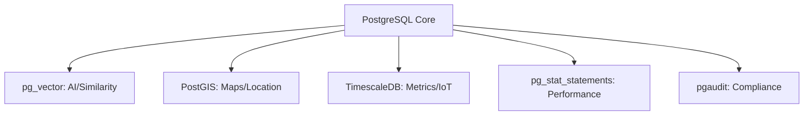

# 🔌 PostgreSQL Extensions: The Secret Sauce
> **Objective:** Master how to extend PostgreSQL's capabilities using powerful extensions like PostGIS for spatial data, TimescaleDB for time-series, and pg_vector for AI | **Language:** Hinglish | **Standard:** 2026 Expert Framework

---

## 🧭 1. Beginner-Friendly Hinglish Explanation
PostgreSQL Extensions ka matlab hai "Postgres mein naye features 'Install' karna".

- **The Problem:** Standard SQL sirf text aur numbers samajhta hai. Agar aapko "Maps" (Location) par kaam karna ho, ya "Stock Market" (Time-series) data handle karna ho, toh SQL slow ho jata hai.
- **The Solution:** Extensions.
  - **PostGIS:** Postgres ko ek Geographical DB bana deta hai.
  - **TimescaleDB:** Postgres ko high-speed Time-series DB bana deta hai.
  - **pg_vector:** Postgres ko AI (Vector) DB bana deta hai.
- **Intuition:** Ye "Smartphone Apps" jaisa hai. Phone (Postgres) basic kaam karta hai, par Apps (Extensions) se aap use Gaming console ya Professional camera bana sakte hain.

---

## 🧠 2. Deep Technical Explanation

### 1. PostGIS (Spatial Power):
- Adds types like `GEOMETRY` and `GEOGRAPHY`.
- Allows spatial queries: "Find all restaurants within $5km$ of this coordinate".
- Uses **R-Tree** indexes (GIST) for fast geometric search.

### 2. TimescaleDB (Time-Series):
- Turns normal tables into **Hypertables**.
- Automatically partitions data by time.
- Allows **Continuous Aggregations** (Pre-calculating averages/sums as data comes in).

### 3. pg_vector (The AI Link):
- Stores "Embeddings" (Vectors).
- Enables similarity search: "Find products that look like this image".
- Essential for **RAG (Retrieval-Augmented Generation)** in 2026.

---

## 🏗️ 3. Database Diagrams (The Extension Ecosystem)


---

## 💻 4. Query Execution Examples (Extension Mastery)
```sql
-- 1. Installing an extension
CREATE EXTENSION IF NOT EXISTS postgis;

-- 2. PostGIS: Find nearest points
-- "ST_DWithin" checks if distance is within 1000 meters
SELECT name FROM stores 
WHERE ST_DWithin(geom, ST_MakePoint(77.59, 12.97)::geography, 1000);

-- 3. pg_vector: Semantic Search
-- "<->" is the distance operator for vectors
SELECT * FROM items 
ORDER BY embedding <-> '[0.1, 0.2, 0.3, ...]' 
LIMIT 5;

-- 4. TimescaleDB: Convert table to Hypertable
SELECT create_hypertable('sensor_data', 'time');
```

---

## 🌍 5. Real-World Production Examples
- **Uber/Ola:** Use **PostGIS** to find the nearest driver to a passenger in real-time.
- **Fintech (Stock Trading):** Use **TimescaleDB** to store millions of price ticks per second and calculate moving averages.
- **E-commerce (Search):** Use **pg_vector** to provide "Similar Items" recommendations based on product images.

---

## ❌ 6. Failure Cases
- **Extension Version Mismatch:** Upgrading Postgres but your extensions are not compatible. **Fix: Always check extension support before a major DB upgrade.**
- **Index Overhead:** GIST/GIN indexes used by extensions take more RAM and CPU to build than standard B-tree indexes.

---

## 🛠️ 7. Debugging Guide
| Problem | Reason | Solution |
| :--- | :--- | :--- |
| **"Type not found"** | Extension not installed | Run `CREATE EXTENSION name;`. |
| **Spatial query is slow** | Missing GIST index | Add `CREATE INDEX ... USING GIST(geom);`. |

---

## ⚖️ 8. Tradeoffs
- **One Database (Simplicity / Unified Data)** vs **Specific Databases (PostGIS is great, but maybe Snowflake is better for massive spatial analytics).**

---

## ✅ 11. Best Practices
- **Only install extensions you need.** (Each one adds some overhead).
- **Use `pg_stat_statements`** for every production database to track performance.
- **Keep extensions updated.**
- **Monitor RAM usage** when using memory-intensive extensions like pg_vector.

漫
---

## 📝 14. Interview Questions
1. "What is the difference between a Geometry and a Geography type in PostGIS?"
2. "Why is TimescaleDB better than a normal Postgres table for time-series data?"
3. "How does pg_vector help in building AI applications?"

---

## 🚀 15. Latest 2026 Production Database Patterns
- **Postgres as a Vector DB:** Many companies are ditching Pinecone/Milvus and moving their AI data back to Postgres using **pg_vector** for simpler architecture.
- **Cloud Extension Management:** AWS RDS and Azure now support "Custom Extensions" allowing you to run almost anything inside their managed Postgres.
漫
