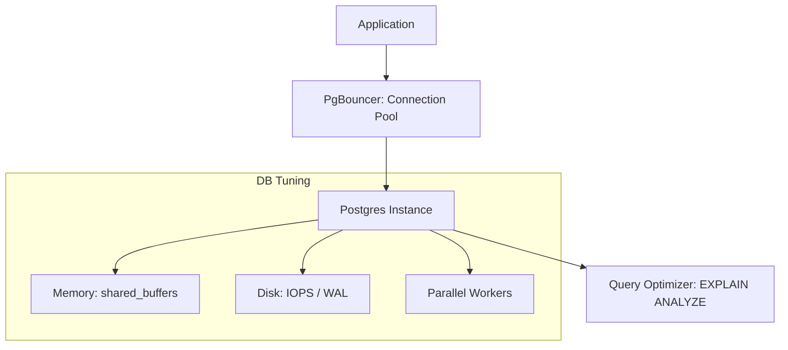

# 🏎️ PostgreSQL Performance Tuning: From Slow to Warp Speed
> **Objective:** Master the art of tuning PostgreSQL parameters, optimizing queries, and managing resources for high-throughput production environments | **Language:** Hinglish | **Standard:** 2026 Expert Framework

---

## 🧭 1. Beginner-Friendly Hinglish Explanation
PostgreSQL Performance Tuning ka matlab hai "Apne database ko fit aur fast banana".

- **The Problem:** Jab data badhta hai, toh queries slow ho jati hain. CPU 100% ho jata hai aur user ko site "Laggy" lagti hai.
- **The Solution:** Tuning.
  - **Memory Tuning:** RAM ko sahi jagah allot karna.
  - **Query Tuning:** Galti Queries ko theek karna.
  - **Index Tuning:** Sahi raaste (Indexes) banana.
- **Intuition:** Ye ek "Car Tuning" jaisa hai. Sirf accelerator (More CPU) dabane se kaam nahi chalega, aapko engine (Config) aur tires (Indexes) bhi theek karne honge.

---

## 🧠 2. Deep Technical Explanation

### 1. The 'Big 3' Config Parameters:
- **shared_buffers:** Database ki "Main RAM". Set to **$25\%$ of total RAM**.
- **work_mem:** Sorting aur Joins ke liye memory. Set to $4MB-64MB$. (Careful: It's per-operation!).
- **maintenance_work_mem:** VACUUM aur Index banane ke liye. Set higher (e.g., $1GB$).

### 2. Autovacuum Tuning:
Postgres **MVCC** use karta hai, isliye purane data (Bloat) ko clean karna zaroori hai.
- Agar autovacuum slow hai, toh database huge ho jayega.
- Tune `autovacuum_vacuum_scale_factor` to $0.01$ (clean after $1\%$ changes).

### 3. Parallelism:
Modern Postgres can use multiple CPU cores for a single query.
- Tune `max_parallel_workers_per_gather`.

---

## 🏗️ 3. Database Diagrams (The Tuning Stack)


---

## 💻 4. Query Execution Examples (Diagnostic Tools)
```sql
-- 1. Finding the heaviest queries in the last hour
-- (Requires pg_stat_statements)
SELECT query, calls, total_exec_time, mean_exec_time 
FROM pg_stat_statements 
ORDER BY total_exec_time DESC 
LIMIT 5;

-- 2. Checking for 'Index Bloat'
SELECT relname, n_dead_tup, n_live_tup 
FROM pg_stat_user_tables 
WHERE n_dead_tup > 1000;

-- 3. Testing a query's performance
EXPLAIN (ANALYZE, BUFFERS) 
SELECT * FROM orders WHERE user_id = 123;
-- Look for 'Shared Hit' vs 'Shared Read'
```

---

## 🌍 5. Real-World Production Examples
- **Write-Heavy App:** A startup was getting $10,000$ writes/sec. Their WAL was filling up the disk. **Fix: Increased `max_wal_size` and moved WAL to a faster SSD.**
- **Reporting Dashboard:** A dashboard was taking 30s to load. **Fix: Increased `work_mem` so the sort happened in RAM instead of Disk.**

---

## ❌ 6. Failure Cases
- **Over-tuning work_mem:** If you set `work_mem = 1GB` and have 100 active connections, you might need $100GB$ of RAM. If you don't have it, the **OOM Killer** will crash Postgres.
- **Disabling Autovacuum:** NEVER do this. The database will eventually crawl to a halt due to massive bloat.

---

## 🛠️ 7. Debugging Guide
| Symptom | Reason | Solution |
| :--- | :--- | :--- |
| **High CPU during idle** | Bloat / Frequent Vacuum | Tune `autovacuum` parameters. |
| **I/O Wait is high** | Swapping to disk | Increase `shared_buffers` or buy faster SSDs. |

---

## ⚖️ 8. Tradeoffs
- **High Performance (High RAM / Fast Disk)** vs **Cost (Standard Cloud Instances).**

---

## ✅ 11. Best Practices
- **Use `pg_stat_statements`** to find bad queries.
- **Run `ANALYZE`** after bulk loads to update optimizer stats.
- **Use Partitioning** for tables larger than $100GB$.
- **Set `random_page_cost = 1.1`** if using SSDs.

漫
---

## 📝 14. Interview Questions
1. "How do you optimize a Postgres query that is doing a Seq Scan?"
2. "What is `pg_stat_statements` and why is it important?"
3. "How do you calculate the correct `shared_buffers` size?"

---

## 🚀 15. Latest 2026 Production Database Patterns
- **AI Tuning Agents:** Using AI tools like **OtterTune** to automatically suggest the best Postgres configuration based on live traffic.
- **B-tree Deduplication:** Postgres 13+ automatically deduplicates B-tree indexes, making them $30\%$ smaller and faster.
漫
