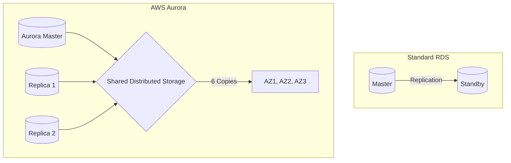

# ☁️ AWS RDS and Aurora: The Gold Standard
> **Objective:** Master the details of AWS's primary database offerings—RDS (standard) and Aurora (cloud-native)—to build scalable, production-grade applications | **Language:** Hinglish | **Standard:** 2026 Expert Framework

---

## 🧭 1. Beginner-Friendly Hinglish Explanation
AWS RDS aur Aurora ka matlab hai "Duniya ke sabse bade cloud provider ke database services".

- **AWS RDS (Relational Database Service):** Ye bilkul normal database jaisa hai (Postgres, MySQL, SQL Server) jo ek Amazon ke server par chal raha hai. Amazon sirf "Management" (Backups, Patches) karta hai.
- **AWS Aurora (Cloud-Native):** Ye Amazon ka apna "Special" database hai jo MySQL aur Postgres ke saath compatible hai. Ye $3x$ to $5x$ fast hai kyunki isne database ke storage engine ko pura badal diya hai.
- **The Key Difference:** RDS ek car hai jise Amazon maintain karta hai. Aurora ek "Fighter Jet" hai jo Amazon ne khud cloud ke liye banaya hai.
- **Intuition:** Agar aapka traffic normal hai, toh RDS lo. Agar aap "The Next Facebook" bana rahe hain jisme millions of users honge, toh Aurora lo.

---

## 🧠 2. Deep Technical Explanation
### 1. AWS RDS (Standard Managed):
- **Architecture:** One Master instance + One Standby (Multi-AZ).
- **Storage:** Standard EBS volumes (General Purpose or Provisioned IOPS).
- **Failover:** 30-60 seconds.

### 2. AWS Aurora (Distributed Storage):
- **Storage Layer:** Data is automatically split into 10GB chunks and copied 6 times across 3 different Availability Zones.
- **Log-Structured Storage:** Aurora doesn't write whole pages to disk; it only writes the **Log entries** (WAL). This is why it's so much faster.
- **Read Replicas:** You can have up to 15 read replicas, and they all share the same storage (no replication lag!).

### 3. Failover in Aurora:
Since the storage is shared, failover happens in less than 10 seconds.

---

## 🏗️ 3. Database Diagrams (Aurora vs RDS)


---

## 💻 4. Query Execution Examples (AWS Aurora Features)
```sql
-- 1. Using Aurora Serverless (Auto-scaling)
-- There is no SQL for this, but in the console, you set 'Min' and 'Max' ACUs.
-- The DB will automatically grow to 128GB RAM during a sale and shrink to 2GB at night.

-- 2. Aurora Fast Clone
-- Create a copy of a 10TB database in seconds without copying any data.
-- (Only available via AWS CLI or Console).
```

---

## 🌍 5. Real-World Production Examples
- **Samsung:** Moved 1.1 billion users' data to AWS Aurora to improve performance and reliability.
- **Capital One:** Uses Aurora for its banking transactions to ensure high availability and security.

---

## ❌ 6. Failure Cases
- **Aurora Global Database Delay:** Replicating data between USA and India still takes 100-200ms due to the speed of light.
- **High Cost on Small Apps:** Aurora has a "Minimum Cost" which might be higher than a tiny RDS instance for a personal blog.
- **Connection Limits:** Both RDS and Aurora have hard limits on connections based on instance size. **Fix: Use 'RDS Proxy'.**

---

## 🛠️ 7. Debugging Guide
| Problem | Reason | Solution |
| :--- | :--- | :--- |
| **High CPU on Aurora** | Bad Queries | Use **Performance Insights** in the AWS console to see the exact SQL causing the load. |
| **Storage Full** | Large Temp Files | Check if your queries are creating massive temporary tables during sorting. |

---

## ⚖️ 8. Tradeoffs
- **Aurora (Fast / High Availability / High Cost)** vs **RDS (Cheaper / Standard / Good for most apps).**

---

## 🛡️ 9. Security Concerns
- **RDS Proxy:** Helps prevent "Connection Attacks" by pooling connections and managing IAM authentication centrally.

---

## 📈 10. Scaling Challenges
- **Scaling Writes:** Even Aurora has only 1 Master for writing. If you hit 100k writes/sec, you might need to "Shard" across multiple Aurora clusters.

---

## ✅ 11. Best Practices
- **Use Aurora for any mission-critical production app.**
- **Enable RDS Proxy** for serverless apps (Lambda).
- **Use 'Performance Insights'** to monitor query health.
- **Always use 'Provisioned IOPS' (io1/io2)** if you have high disk activity.

---

## ⚠️ 13. Common Mistakes
- **Using a Multi-AZ standby for 'Reads'.** (Standby is passive; use Read Replicas for reads).
- **Not testing the failover process.**

---

## 📝 14. Interview Questions
1. "How is Aurora storage different from RDS storage?"
2. "What is RDS Proxy and why is it useful?"
3. "How many read replicas can you have in Aurora vs RDS?" (15 vs 5).

---

## 🚀 15. Latest 2026 Production Database Patterns
- **Aurora Serverless v2:** Instant scaling with millisecond granularity. You only pay for what you use, per second.
- **Blue/Green Deployments:** A built-in AWS feature that lets you upgrade your database version with zero downtime by creating a parallel "Green" environment.
漫
